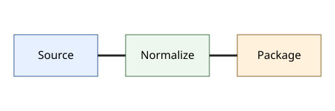
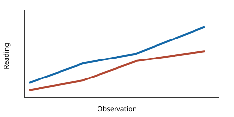

# Front Matter

Canonical Source Rich Fixture is an authored test document for deterministic ingest verification.



# Chapter I: Signals at Dawn

The observatory records a signal before sunrise. The inline relation $s = a + b$ remains attached to this sentence, beside an inline image .

> "Record the first reading," said the coordinator.

- Inspect the sensor.
- Preserve the source order.
- Mark uncertain structure for review.



| Sensor | Reading | Unit |
| --- | ---: | --- |
| Alpha | 12.5 | V |
| Beta | 7.0 | V |

```python
def calibrate(value: float) -> float:
    return value / 2
```

$$
E = mc^2
$$

<aside data-kind="editorial-note">This raw HTML note must remain recoverable.</aside>

# Chapter II: The River Crossing

The pilot compares the morning signal with the river gauge. A second expression, $r(t) = r_0 + vt$, appears in running prose.

The chart is referenced again, but it remains one physical source asset: [review the chart](#sample-trend-chart).

An image without descriptive text is deliberately included below.


The final observation includes a footnote.[^method]

[^method]: The method note belongs to Chapter II and must remain traceable.

# Appendix: Preservation Notes

The appendix is back matter. It should remain ordered after the content chapters and may be preserved or excluded by a later admission policy.
