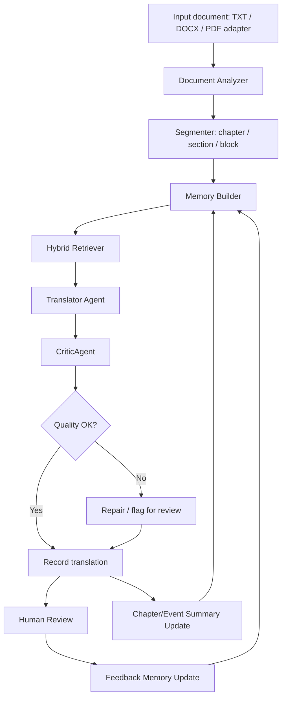

# KẾ HOẠCH NGHIÊN CỨU VÀ TRIỂN KHAI V2

## Đề tài

**Tiếng Việt:** Tiếp cận hệ tác tử trong bài toán dịch máy Anh-Việt cho văn bản dài.

**Tiếng Anh:** Agent-based approach for long-document English-Vietnamese machine translation.

## Câu chốt

Đề tài thiết kế và đánh giá một hệ thống dịch máy Anh-Việt cho văn bản dài dựa trên kiến trúc tác tử, trong đó LLM được điều phối bởi hệ thống bộ nhớ ngoài gồm 7 lớp: terminology, entity, discourse, summary, translation, feedback và QA. Hệ thống sử dụng retrieval lai giữa exact lookup và FTS/BM25, tích hợp CriticAgent hai tầng để kiểm tra chất lượng tự động, đồng thời dùng phản hồi người dùng để cập nhật tri thức dịch cho các đoạn tiếp theo.

Điểm quan trọng: codebase hiện tại chỉ là prototype/chứng cứ ban đầu. Kiến trúc nghiên cứu không bị bó buộc bởi memory hiện tại hoặc phần PDF/layout đang có.

---

## 1. Định vị đề tài

Đề tài không nghiên cứu "dịch bằng LLM" nói chung, cũng không nghiên cứu chính về PDF, OCR hay tái dựng layout. Trọng tâm là cách tổ chức một hệ thống dịch văn bản dài có trạng thái, có bộ nhớ, có truy xuất ngữ cảnh, có kiểm tra chất lượng và có vòng lặp học từ phản hồi người dùng.

Trong khóa luận, PDF chỉ nên được xem là:

- một định dạng đầu vào/đầu ra;
- một adapter minh họa;
- một phần demo nếu cần.

PDF không phải đóng góp nghiên cứu chính.

### 1.1. Vấn đề cần giải quyết

Khi dịch sách giáo khoa, tiểu thuyết hoặc tài liệu nhiều chương, lỗi thường không nằm ở một câu đơn lẻ mà nằm ở cấp tài liệu:

- thuật ngữ dịch không nhất quán;
- tên riêng, nhân vật, địa danh bị thay đổi qua các chương;
- đại từ và xưng hô không phù hợp với quan hệ nhân vật;
- phong văn thay đổi giữa các đoạn;
- đoạn sau không nhớ quyết định dịch ở đoạn trước;
- bản dịch thiếu ý, thêm ý hoặc lệch nghĩa;
- feedback của người dùng không được dùng để cải thiện các đoạn sau.

### 1.2. Câu hỏi trung tâm

Kiến trúc dịch máy dựa trên tác tử, kết hợp memory, glossary/entity control, retrieval và CriticAgent, có cải thiện tính nhất quán và chất lượng dịch Anh-Việt cho văn bản dài so với phương pháp dịch từng chunk độc lập bằng LLM hay không?

---

## 2. Vì sao không chỉ dùng một LLM đơn lẻ?

### 2.1. Giới hạn của single-LLM translation

| Giới hạn | Mô tả | Ảnh hưởng |
|---|---|---|
| Context window | Tài liệu dài phải cắt chunk hoặc nhồi nhiều nội dung vào prompt | Mất hoặc loãng ngữ cảnh |
| Lost in the middle | LLM có xu hướng dùng thông tin đầu/cuối context tốt hơn phần giữa | Thông tin quan trọng trong chương giữa dễ bị bỏ sót |
| Không có external state | Mỗi request không tự nhớ quyết định dịch trước | Thuật ngữ và entity dễ không nhất quán |
| Không có self-correction | Output sinh một lần, không có reviewer riêng | Khó phát hiện omission, addition, mistranslation |
| Không có feedback loop | Sửa đổi của người dùng không tự biến thành tri thức | Các đoạn sau không được cải thiện |

### 2.2. Agent trong bối cảnh đề tài

Agent không phải là một mô hình mới. Agent là cơ chế điều phối:

```text
Observe -> Reason -> Retrieve memory/tools -> Act -> Review -> Update memory -> Repeat
```

Trong bài toán dịch, agent có thể:

- đọc block hiện tại;
- xác định chapter/section/context;
- truy xuất glossary, entity, summary, translation memory;
- gọi LLM để dịch với prompt có kiểm soát;
- gọi CriticAgent để kiểm tra chất lượng;
- ghi bản dịch, issue và feedback vào memory;
- cập nhật memory cho các đoạn sau.

---

## 3. Cơ sở lý thuyết

### 3.1. Document-level machine translation

Document-level MT nghiên cứu dịch ở cấp văn bản thay vì từng câu độc lập. Các vấn đề chính:

- coherence: mạch lạc giữa câu/đoạn;
- consistency: nhất quán thuật ngữ, tên riêng, style;
- discourse: đại từ, tham chiếu, speaker/addressee, quan hệ nhân vật;
- context modeling: dùng ngữ cảnh trước/sau để dịch chính xác hơn.

Đây là nền tảng để giải thích vì sao dịch tài liệu dài cần memory và context retrieval.

### 3.2. LLM agent và ReAct

ReAct kết hợp reasoning và acting: LLM không chỉ trả lời, mà còn suy luận để chọn hành động, gọi tool, nhận observation rồi tiếp tục.

Ví dụ:

```text
Thought: Đoạn này có "White Rabbit", cần tra glossary.
Action: search_glossary("White Rabbit")
Observation: White Rabbit -> Thỏ Trắng
Thought: Dùng glossary khi dịch.
Action: translate_with_memory(...)
Observation: Bản dịch hoàn tất.
Action: record_translation(...)
```

### 3.3. External memory và RAG

RAG trong đề tài này không nên hiểu đơn giản là vector database. Hướng hợp lý là hybrid retrieval:

- exact/structured lookup cho glossary và entity;
- FTS/BM25 cho block, memory item, translation memory và summary;
- embedding/vector search là hướng mở rộng tùy chọn cho semantic retrieval.

Nguyên tắc quan trọng:

> Không thay glossary/entity exact lookup bằng FTS hoàn toàn. Exact lookup là lớp chính cho dữ liệu cần độ xác định cao; FTS/BM25 là lớp bổ sung để tìm context, summary hoặc fallback.

### 3.4. Quality checking trong MT

Đánh giá dịch máy cần kết hợp:

- automatic metrics: BLEU, chrF, COMET, BERTScore;
- consistency metrics: terminology accuracy, entity consistency;
- QA metrics: precision/recall/F1 của CriticAgent;
- human/MQM evaluation: accuracy, fluency, terminology, style, consistency.

---

## 4. Phạm vi và nguyên tắc giữ hướng

### 4.1. Trong phạm vi

- Dịch Anh-Việt cho văn bản dài theo chapter/block.
- Thiết kế agent pipeline.
- Thiết kế memory 7 lớp.
- Truy xuất memory trước khi dịch.
- Kiểm tra chất lượng bằng rule và LLM reviewer.
- Human feedback loop để cập nhật memory.
- Thí nghiệm so sánh với baseline.

### 4.2. Ngoài phạm vi

- Không train LLM từ đầu.
- Không tập trung vào OCR, PDF layout, render PDF.
- Không xây hệ production multi-user.
- Không bắt buộc vector database nâng cao.
- Không cần benchmark khổng lồ.

### 4.3. Nguyên tắc giữ đúng hướng

- Không viết khóa luận thành "ứng dụng dịch PDF".
- Không coi memory hiện tại là kiến trúc bắt buộc.
- Không biến đề tài thành nghiên cứu RAG/embedding thuần.
- Không over-engineer thành production system.
- Luôn gắn mỗi module với câu hỏi nghiên cứu và metric đánh giá.
- Codebase hiện tại là prototype có thể reuse, không phải ràng buộc thiết kế.

---

## 5. Mô hình 3 lớp

### 5.1. Lớp 1: Mô hình nghiên cứu lý tưởng

Đây là phần trình bày trong khóa luận:

- Core Translation Agent;
- Memory Manager;
- Hybrid Retriever;
- Translator Agent;
- CriticAgent;
- Summary Agent;
- Feedback Agent;
- Evaluation Harness.

### 5.2. Lớp 2: Prototype triển khai

Prototype có thể reuse code hiện tại nếu phù hợp, nhưng được phép refactor hoặc viết mới.

Có thể reuse:

- storage/data model;
- memory pack interface;
- glossary/entity logic nếu còn phù hợp;
- UI review/human feedback nếu cần demo.

Cần viết mới hoặc refactor:

- core translation agent orchestration;
- CriticAgent;
- chapter/event summary pipeline;
- FTS/BM25 retrieval layer;
- evaluation harness.

### 5.3. Lớp 3: PDF/UI adapter

PDF parser, preview, render và UI hiện tại chỉ đóng vai trò adapter đầu vào/đầu ra. Chúng không chi phối đề tài.

---

## 6. Đóng góp chính

| # | Đóng góp | Mô tả | Mục tiêu nghiên cứu |
|---|---|---|---|
| C1 | Hybrid Memory Retrieval | Exact lookup cho glossary/entity, FTS/BM25 cho context/summary/translation memory | Cải thiện truy xuất ngữ cảnh |
| C2 | Chapter/Event Summary Memory | Sinh summary có cấu trúc sau chapter/N blocks và đưa vào context pack | Cải thiện ngữ cảnh dài hạn |
| C3 | CriticAgent hai tầng | Rule-based + LLM reviewer, lưu issue log | Kiểm tra chất lượng tự động |
| C4 | Feedback -> Memory Update | Biến sửa đổi người dùng thành glossary/entity/translation/QA memory | Cải thiện các đoạn sau |

---

## 7. Thiết kế memory 7 lớp

### 7.1. Terminology Memory

Mục đích: đảm bảo thuật ngữ được dịch nhất quán.

Trường đề xuất:

- source_term;
- target_term;
- normalized_source;
- status: candidate, verified, locked, human_verified;
- confidence;
- allowed_variants;
- forbidden_variants;
- domain;
- chapter_scope;
- evidence_blocks.

Retrieval:

- exact match là ưu tiên cao nhất;
- FTS/BM25 chỉ dùng để gợi ý hoặc fallback;
- không phụ thuộc hoàn toàn vào embedding.

### 7.2. Entity Memory

Mục đích: quản lý tên riêng, nhân vật, địa danh, tổ chức, concept.

Trường đề xuất:

- entity_id;
- canonical_source;
- canonical_target;
- entity_type;
- gender;
- role;
- aliases_source;
- aliases_target;
- preferred_vietnamese_forms;
- first_seen_block;
- latest_seen_block;
- status;
- evidence_spans.

Retrieval:

- exact surface match;
- alias lookup;
- FTS fallback cho tên gần đúng.

### 7.3. Discourse Memory

Mục đích: giữ ngữ cảnh hội thoại, đại từ, xưng hô và quan hệ nhân vật.

Trường đề xuất:

- speaker_turns;
- speaker_entity;
- addressee_entity;
- pronoun_resolution;
- character_relations;
- form_of_address;
- emotional_state;
- current_location;
- timeline_position.

MVP chỉ cần speaker/addressee tracking cơ bản, quan hệ/xưng hô dạng structured note và coreference hints cho Translator Agent.

### 7.4. Summary Memory

Mục đích: lưu tóm tắt cấp chapter/event để cung cấp ngữ cảnh dài hạn.

Trường đề xuất:

- summary_id;
- type: chapter, section, event;
- chapter_id;
- block_start;
- block_end;
- summary_source;
- summary_target;
- key_events;
- characters_present;
- new_terms_added;
- emotional_tone;
- setting;
- translation_notes.

Trigger:

- sau mỗi chapter;
- hoặc sau mỗi N blocks;
- hoặc khi người dùng yêu cầu cập nhật memory.

Retrieval:

- đưa summary của chapter trước và summary liên quan vào context pack;
- dùng FTS/BM25 để tìm summary liên quan;
- embedding là hướng mở rộng nếu cần semantic retrieval.

### 7.5. Translation Memory

Mục đích: lưu các cặp source-target đã dịch, đặc biệt các đoạn đã được human review.

Trường đề xuất:

- block_id;
- source_text;
- target_text;
- verified;
- model/provider;
- memory_pack_id;
- chapter_id;
- similarity_hash;
- retrieval_count.

Retrieval:

- BM25/FTS cho đoạn có từ khóa giống;
- embedding cho đoạn tương tự về nghĩa;
- chỉ đưa vào prompt các bản dịch có liên quan và không gây future leakage.

### 7.6. Feedback Memory

Mục đích: biến sửa đổi của người dùng thành tri thức cho các đoạn sau.

Trường đề xuất:

- feedback_id;
- block_id;
- before_translation;
- after_translation;
- feedback_type;
- derived_memory_ids;
- status.

Feedback có thể tạo/cập nhật:

- glossary entry;
- entity alias;
- discourse note;
- verified translation memory;
- QA issue resolved.

### 7.7. QA Memory

Mục đích: lưu issue để review, sửa lỗi và đánh giá CriticAgent.

Trường đề xuất:

- issue_id;
- block_id;
- issue_type;
- severity;
- detected_by: rule, llm_reviewer, human;
- description;
- evidence;
- fixed;
- fix_detail;
- related_feedback_id.

---

## 8. Error taxonomy cho CriticAgent

| Nhóm lỗi | Subtype | Cách phát hiện |
|---|---|---|
| Terminology | wrong term, inconsistent term, missing term, forbidden variant | glossary compare |
| Entity | inconsistent name, wrong alias, wrong pronoun, wrong title/role | entity memory compare |
| Content | omission, addition, mistranslation, over-translation | LLM reviewer + reference/human |
| Style/Formality | register shift, inconsistent tone, unnatural phrasing | LLM reviewer + human |
| Special content | formula corrupted, notation changed, OCR leak, code/table error | rule-based checks |

---

## 9. Agent modules

### 9.1. Coordinator Agent

- Quản lý pipeline.
- Quyết định thứ tự xử lý.
- Gọi Analyzer, Retriever, Translator, Critic, Summary, Feedback Agent.
- Đảm bảo memory được cập nhật sau mỗi bước.

### 9.2. Document Analyzer

- Đọc input.
- Tách chapter/section/block.
- Gán metadata: chapter_id, order, type.
- Phát hiện dialogue, heading, list, table nếu cần.

### 9.3. Memory Manager

- Ghi/đọc memory.
- Cập nhật glossary/entity/translation/feedback/QA.
- Tránh ghi đè các entry đã human_verified.
- Quản lý version/supersede/conflict.

### 9.4. Hybrid Retriever

- Lấy memory liên quan cho block hiện tại.
- Ưu tiên exact lookup cho glossary/entity.
- Dùng FTS/BM25 cho block, summary, translation memory.
- Có thể mở rộng embedding/vector search.

### 9.5. Translator Agent

- Tạo prompt dịch có kiểm soát.
- Đưa memory pack vào prompt.
- Yêu cầu LLM trả về bản dịch sạch, không thêm giải thích.
- Ghi lại memory refs đã dùng.

### 9.6. CriticAgent

Tier 1: rule-based:

- glossary adherence;
- entity consistency;
- length ratio;
- leftover English;
- foreign script/mojibake;
- formula/math/code preservation;
- missing required term;
- forbidden variant.

Tier 2: LLM-based reviewer:

- omission;
- addition;
- mistranslation;
- style mismatch;
- fluency issue;
- discourse/xưng hô issue.

Output mẫu:

```json
{
  "block_id": "b001",
  "quality_score": 0.82,
  "issues": [
    {
      "type": "terminology",
      "severity": "major",
      "description": "machine learning was translated inconsistently",
      "detected_by": "rule"
    }
  ],
  "suggested_action": "repair_or_human_review"
}
```

### 9.7. Summary Agent

- Sinh summary sau chapter/N blocks.
- Trích xuất nhân vật, sự kiện, setting, tone, thuật ngữ mới.
- Ghi vào Summary Memory.
- Cung cấp context cho các chapter sau.

### 9.8. Feedback Agent

- Phân tích manual edit.
- Phát hiện cặp term mới.
- Cập nhật glossary/entity/translation memory.
- Đóng issue QA nếu đã sửa.

---

## 10. Workflow hệ thống



---

## 11. Liên hệ với codebase hiện tại

Nguyên tắc: codebase hiện tại là prototype/chứng cứ ban đầu, không phải kiến trúc chuẩn.

### 11.1. Thực trạng cần ghi nhận

```text
FTS storage: đã có
- blocks_fts được populate khi index block
- entities_fts được populate khi upsert entity
- glossary_fts được populate khi upsert glossary

FTS retrieval: chưa khai thác đúng mức
- find_glossary_entries() chủ yếu duyệt list + substring
- find_entities() chủ yếu duyệt list + exact/surface scoring
- retriever gọi các hàm trên, chưa tận dụng FTS/BM25 cho context retrieval
```

Không nên viết là "hệ thống đã dùng FTS/BM25 đầy đủ". Cách viết đúng:

> Hệ thống prototype đã có storage/index FTS, nhưng retrieval runtime hiện tại vẫn thiên về linear scan và substring matching. Đề tài bổ sung retrieval layer để khai thác FTS/BM25 cho context, block, summary và translation memory.

### 11.2. Phân loại work items

| Nhóm | Thành phần | Hướng xử lý |
|---|---|---|
| Reuse | SQLite store, schema, memory pack interface, LLM call, UI review nếu cần | Giữ hoặc bọc lại |
| Refactor | find_glossary_entries, find_entities, context pack, active_scene.summary | Giữ exact, thêm FTS/BM25/fallback |
| Viết mới | CriticAgent, summary pipeline, retrieval layer, evaluation harness, core orchestration | Làm theo thiết kế nghiên cứu |

---

## 12. Research questions và giả thuyết

### RQ1

Kiến trúc agent-based với memory system có cải thiện tính nhất quán thuật ngữ và entity so với dịch chunk độc lập không?

| Giả thuyết | Đo lường | Kỳ vọng ban đầu |
|---|---|---|
| H1: memory giảm lỗi thuật ngữ | Terminology Accuracy Rate | S3 > S0/S1 |
| H2: entity/discourse memory cải thiện nhất quán nhân vật | Entity Consistency Score | S3 > S0/S1 |

### RQ2

CriticAgent hai tầng có thể phát hiện và phân loại bao nhiêu lỗi dịch?

| Giả thuyết | Đo lường | Kỳ vọng ban đầu |
|---|---|---|
| H3: CriticAgent phát hiện được lỗi có cấu trúc và lỗi ngữ nghĩa | Precision/Recall/F1 trên injected errors | Recall khoảng 60-70% là mục tiêu khả thi |

### RQ3

Chapter/event summary memory và feedback loop có cải thiện chất lượng các đoạn tiếp theo không?

| Giả thuyết | Đo lường | Kỳ vọng ban đầu |
|---|---|---|
| H4: summary giúp block ở ranh giới chapter/co-reference tốt hơn | COMET/chrF/human preference | S3 > S3-no-summary |
| H5: feedback giúp downstream blocks tuân thủ glossary/entity tốt hơn | TAR/ECS sau feedback | tăng ở các block gần feedback |

Lưu ý: các con số kỳ vọng chỉ là target ban đầu, không được trình bày như kết quả thật trước khi chạy thí nghiệm.

---

## 13. Hệ thống so sánh

| Hệ | Mô tả | Mục đích |
|---|---|---|
| S0: Baseline | LLM dịch từng chunk độc lập, không memory, không context | Baseline thấp nhất |
| S1: Sequential | LLM + previous chunk context trong prompt | Đo lợi ích của local context |
| S2: Memory-enabled | LLM + memory pack gồm glossary/entity/previous blocks | Đo tác động của memory có cấu trúc |
| S3: Full Agent | S2 + FTS/BM25 retrieval + summary + CriticAgent + feedback/QA memory | Hệ đề xuất |

### Ablation

| Ablation | Mô tả |
|---|---|
| S3a | S3 không Chapter/Event Summary |
| S3b | S3 không CriticAgent |
| S3c tùy chọn | S3 không Feedback Loop |

---

## 14. Dataset

### 14.1. Layer 1: Sentence-level

Dùng để đo BLEU, chrF, COMET/BERTScore:

- IWSLT'15 English-Vietnamese;
- PhoMT;
- FLORES-200 English-Vietnamese.

Lưu ý: nhóm này chủ yếu đo chất lượng câu/đoạn, không đủ để đo document-level consistency đầy đủ.

### 14.2. Layer 2: Document-level

Dùng để đo consistency và memory impact:

- Alice in Wonderland hoặc tác phẩm public domain;
- tài liệu kỹ thuật/giao trình ngắn về CS/AI/Math;
- một tập tài liệu dài từ project hiện có nếu có quyền sử dụng.

Cần chuẩn bị:

- source text chia chapter/block;
- danh sách 50-100 term/entity;
- một phần reference translation hoặc human review;
- annotation lỗi cho một tập test nhỏ.

### 14.3. Layer 3: Injected-error dataset

Dùng để đánh giá CriticAgent:

- lấy bản dịch đúng hoặc tương đối tốt;
- cố tình chèn lỗi terminology/entity/omission/addition/style;
- ghi ground truth issue;
- đo precision/recall/F1.

---

## 15. Metrics

### 15.1. Automatic MT metrics

- BLEU;
- chrF;
- COMET;
- BERTScore nếu setup được.

### 15.2. Terminology Accuracy Rate

```text
TAR = correct_term_translations / total_term_occurrences
```

Ví dụ: "machine learning" xuất hiện 20 lần, 18 lần dịch đúng theo glossary, TAR = 90%.

### 15.3. Entity Consistency Score

```text
ECS = consistent_entity_mentions / total_entity_mentions
```

Cần tính cả alias chấp nhận được. Ví dụ "Alice", "cô bé Alice", "cô ấy" có thể chấp nhận tùy context; "Alicia" thì không.

### 15.4. CriticAgent metrics

```text
Precision = correct_flagged_issues / total_flagged_issues
Recall = correct_flagged_issues / total_real_issues
F1 = 2 * precision * recall / (precision + recall)
```

### 15.5. Human/MQM evaluation

Chấm theo nhóm:

- accuracy;
- fluency;
- terminology;
- entity/name consistency;
- style;
- omission/addition;
- overall preference.

---

## 16. Experiment plan

### E1: Memory Impact on Consistency

Mục tiêu: đánh giá tác động của memory lên consistency.

Thiết kế:

- dataset: Layer 2;
- systems: S0, S1, S2, S3;
- metrics: TAR, ECS, chrF, COMET, human preference;
- phân tích: paired t-test nếu số mẫu đủ.

Kỳ vọng:

- S2/S3 tốt hơn S0/S1 về TAR và ECS;
- S3 tốt nhất nếu summary và critic giúp giảm lỗi dài hạn.

### E2: CriticAgent Effectiveness

Mục tiêu: đo khả năng phát hiện lỗi của CriticAgent.

Thiết kế:

- inject khoảng 50 lỗi vào các block;
- error types: omission, mistranslation, term_error, entity_error, style;
- chạy Tier 1, Tier 2 và Full CriticAgent;
- đo precision, recall, F1 theo từng error type.

Kỳ vọng:

- Tier 1 mạnh với terminology/entity/formula;
- Tier 2 mạnh với omission/addition/mistranslation/style.

### E3: Chapter Summary Impact

Mục tiêu: đánh giá summary memory.

Thiết kế:

- so sánh S3 với S3a;
- tập trung vào block ở ranh giới chapter, đoạn có tham chiếu ngữ cảnh xa;
- metrics: chrF, COMET, human evaluation, context preservation.

Kỳ vọng:

- cải thiện rõ nhất ở boundary blocks và các đoạn cần ngữ cảnh xa;
- đoạn thường có thể cải thiện ít.

### E4: Feedback Loop Impact

Mục tiêu: đánh giá feedback có cải thiện các đoạn sau không.

Thiết kế:

- S3 dịch 50% document;
- người dùng sửa 10-20 block;
- hệ thống cập nhật glossary/entity/translation memory;
- S3 dịch tiếp 50% còn lại;
- so sánh block gần feedback với block xa feedback.

Kỳ vọng:

- các block gần feedback cải thiện TAR/ECS rõ hơn;
- block xa feedback ít thay đổi hơn.

---

## 17. Lộ trình thực hiện

### Giai đoạn 1: Cơ sở lý thuyết và thiết kế

Thời gian: tuần 1-4.

Tuần 1-2:

- đọc và tổng hợp ReAct, RAG, document-level MT, MQM;
- viết draft cơ sở lý thuyết;
- vẽ architecture diagram và memory layers diagram.

Tuần 3-4:

- thiết kế CriticAgent output format;
- thiết kế issue taxonomy;
- thiết kế summary prompt/schema;
- thiết kế experiment harness;
- chuẩn bị Layer 2 dataset và term/entity list.

Output:

- Chương 2 draft;
- system architecture diagram;
- experiment protocol;
- dataset chuẩn bị ban đầu.

### Giai đoạn 2: Triển khai cốt lõi

Thời gian: tuần 5-12.

Tuần 5-6: CriticAgent

- Tier 1 rule-based checks;
- Tier 2 LLM reviewer prompt;
- output quality_json + QA memory;
- integration sau translation.

Tuần 7-8: Chapter/Event Summary Pipeline

- trigger theo chapter hoặc N blocks;
- LLM summarizer structured output;
- storage vào Summary Memory;
- retrieval đưa vào context pack.

Tuần 9-10: Hybrid Retrieval

- giữ exact lookup cho glossary/entity;
- thêm FTS/BM25 cho blocks, summary, translation memory;
- thêm similarity retrieval cho Translation Memory nếu kịp.

Tuần 11-12: Integration

- kết nối full pipeline S3;
- test trên sample documents;
- debug memory flow, retrieval quality, critic output.

### Giai đoạn 3: Experiments và đánh giá

Thời gian: tuần 13-17.

Tuần 13:

- chạy S0/S1/S2/S3 trên dataset chính;
- thu raw metrics.

Tuần 14:

- chạy E2 với injected errors;
- đo precision/recall/F1.

Tuần 15:

- chạy ablation S3a/S3b;
- phân tích tác động summary và critic.

Tuần 16:

- human evaluation nếu có reviewer;
- MQM/pairwise preference.

Tuần 17:

- thống kê, bảng biểu, error analysis.

### Giai đoạn 4: Viết khóa luận

Thời gian: tuần 18-20.

- hoàn thiện chương kiến trúc;
- hoàn thiện chương cài đặt;
- viết kết quả thực nghiệm;
- viết kết luận và hướng phát triển.

---

## 18. Checkpoint review

| Checkpoint | Thời điểm | Điều kiện hoàn thành |
|---|---|---|
| CP1 | Tuần 4 | Chương 2 draft, architecture diagram, dataset Layer 2 chuẩn bị |
| CP2 | Tuần 8 | CriticAgent hoạt động, summary pipeline bản đầu |
| CP3 | Tuần 12 | Full pipeline S3 chạy end-to-end trên 1 document |
| CP4 | Tuần 16 | S0/S1/S2/S3 benchmark và ablation cơ bản xong |
| CP5 | Tuần 20 | Luận văn draft có số liệu, bảng kết quả và error analysis |

---

## 19. Ưu tiên MVP

Nếu thời gian hạn chế, MVP nên giữ:

1. S0/S1/S2/S3 runner.
2. Terminology Memory.
3. Entity Memory.
4. Translation Memory.
5. Summary Memory mức chapter.
6. CriticAgent Tier 1.
7. LLM reviewer tối thiểu cho omission/mistranslation/style.
8. QA issue log.
9. Feedback update glossary/entity.
10. Evaluation với TAR, ECS, chrF/COMET và một phần human review.

Có thể để hướng phát triển:

- vector database;
- event graph phức tạp;
- full coreference resolver;
- multi-agent parallel execution;
- multi-user collaboration;
- production database.

---

## 20. Cấu trúc khóa luận đề xuất

### Chương 1: Giới thiệu

- Bối cảnh dịch máy với LLM.
- Vấn đề dịch văn bản dài.
- Mục tiêu đề tài.
- Phạm vi và đóng góp.

### Chương 2: Cơ sở lý thuyết

- Machine translation.
- Document-level MT.
- LLM và prompt-based translation.
- LLM agent, ReAct, tool-augmented agent.
- External memory và RAG.
- MT evaluation.

### Chương 3: Kiến trúc hệ thống đề xuất

- Tổng quan pipeline.
- Agent modules.
- Memory 7 lớp.
- Hybrid retrieval.
- CriticAgent.
- Feedback loop.

### Chương 4: Cài đặt prototype

- Công nghệ sử dụng.
- Data model.
- Agent orchestration.
- Prompt design.
- Storage/retrieval.
- UI/demo nếu có.

### Chương 5: Thực nghiệm và đánh giá

- Dataset.
- Baseline systems.
- Metrics.
- Kết quả E1-E4.
- Error analysis.
- Discussion.

### Chương 6: Kết luận

- Tổng kết đóng góp.
- Hạn chế.
- Hướng phát triển.

---

## 21. Tài liệu tham khảo nên cite

- ReAct: Synergizing Reasoning and Acting in Language Models.
- Retrieval-Augmented Generation for Knowledge-Intensive NLP Tasks.
- Lost in the Middle: How Language Models Use Long Contexts.
- A Survey on Document-level Neural Machine Translation.
- BLEU: a Method for Automatic Evaluation of Machine Translation.
- chrF: character n-gram F-score for automatic MT evaluation.
- COMET: A Neural Framework for MT Evaluation.
- MQM: Multidimensional Quality Metrics.
- PhoMT: A High-Quality and Large-Scale Benchmark Dataset for Vietnamese-English Machine Translation.
- FLORES-200 / NLLB benchmark.

---

## 22. Kết luận định hướng

Hướng nghiên cứu hợp lý nhất là không bó buộc vào codebase hiện tại, mà xem codebase hiện tại như prototype có thể tận dụng. Khóa luận nên trình bày một kiến trúc agent-based rõ ràng, trong đó memory, retrieval và quality checking là đóng góp chính.

Nếu làm đúng phạm vi, đề tài sẽ có đủ:

- cơ sở lý thuyết;
- kiến trúc module rõ ràng;
- dataset;
- baseline;
- ablation;
- metrics;
- phân tích lỗi;
- prototype minh họa.

Trọng tâm cuối cùng: **dịch văn bản dài Anh-Việt có ngữ cảnh, có memory và có kiểm soát chất lượng**.
