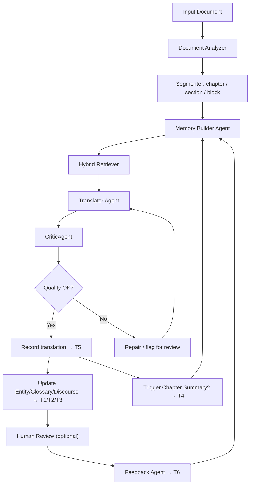

# KẾ HOẠCH NGHIÊN CỨU VÀ TRIỂN KHAI V2
## Đề tài: Tiếp cận hệ tác tử trong bài toán dịch máy Anh-Việt cho văn bản dài

> **Câu chốt / Phát biểu cốt lõi:**
> Đề tài thiết kế và đánh giá một hệ thống dịch máy Anh-Việt cho văn bản dài dựa trên kiến trúc tác tử, trong đó LLM được điều phối bởi bộ nhớ ngoài gồm terminology memory, entity memory, discourse memory, summary memory, translation memory, feedback memory và QA memory; hệ thống sử dụng retrieval lai giữa exact lookup và FTS/BM25, kết hợp CriticAgent để kiểm tra chất lượng và feedback loop để cập nhật tri thức dịch cho các đoạn tiếp theo.

---

## Nguyên tắc giữ đúng hướng

> **Điều quan trọng nhất — ĐỌC TRƯỚC KHI LÀM:**
>
> 1. **Đây KHÔNG phải đề tài "sửa app PDF"** — PDF chỉ là adapter đầu vào/đầu ra. Không viết khóa luận thành "ứng dụng dịch PDF".
> 2. **Codebase hiện tại là prototype, không phải kiến trúc chuẩn** — Mỗi module được đánh giá độc lập. Reuse nếu tiện, không bị ràng buộc.
> 3. **Không bắt buộc embedding/vector DB** — Chỉ là hướng mở rộng tùy chọn.
> 4. **Không train LLM từ đầu** — Dùng LLM làm thành phần sinh ngôn ngữ, không thay đổi model.
> 5. **Không over-engineer** — Không biến thành production system.
> 6. **Luôn gắn mỗi tính năng với câu hỏi nghiên cứu và metric đánh giá.**

---

## 1. Định vị đề tài

### 1.1. Bối cảnh

Đề tài không tập trung vào việc "gọi một LLM để dịch" và cũng không tập trung vào xử lý PDF/layout. Trong phạm vi khóa luận, PDF chỉ được xem là một định dạng đầu vào/đầ ra hoặc một adapter minh họa.

Trọng tâm của đề tài là:

- Thiết kế một kiến trúc dịch máy cho văn bản dài có trạng thái.
- Sử dụng LLM như thành phần sinh ngôn ngữ, không xem LLM là toàn bộ hệ thống.
- Điều phối quá trình dịch bằng tác tử, memory, glossary, truy xuất ngữ cảnh và kiểm tra chất lượng.
- Đánh giá bằng dataset, baseline, metric và thí nghiệm so sánh.

### 1.2. Vấn đề nghiên cứu

Khi dịch sách giáo khoa, tiểu thuyết hoặc tài liệu nhiều chương, các lỗi quan trọng thường xuất hiện ở mức document:

- Thuật ngữ được dịch không nhất quán.
- Tên riêng, nhân vật, địa danh, alias bị thay đổi qua các chương.
- Đại từ và xưng hô không phù hợp với quan hệ nhân vật.
- Phong văn thay đổi giữa các phần.
- Đoạn sau không nhớ quyết định dịch của đoạn trước.
- LLM có thể bỏ sót ý, thêm ý hoặc dịch lệch nghĩa mà không có cơ chế tự kiểm tra.
- Feedback của người dùng không được dùng để cải thiện các đoạn sau.

**Câu hỏi nghiên cứu:**

> Kiến trúc tác tử có memory và quality checking có cải thiện tính nhất quán và chất lượng dịch Anh-Việt cho văn bản dài so với cách dịch từng chunk độc lập bằng LLM hay không?

---

## 2. Cơ sở lý thuyết

### 2.1. Giới hạn của single-LLM translation

Mô hình "input -> LLM -> output" có thể hoạt động tốt với đoạn ngắn, nhưng gặp 4 hạn chế cốt lõi với văn bản dài:

| # | Giới hạn | Mô tả | Ảnh hưởng |
|---|----------|-------|-----------|
| 1 | Context window không phải bộ nhớ bền vững | Context window lớn không đảm bảo thông tin ở giữa được truy xuất tốt | Không cập nhật được quyết định dịch sau feedback |
| 2 | Lost in the middle | LLM thường sử dụng thông tin ở đầu và cuối context tốt hơn phần giữa (Liu et al., 2024) | Chapters giữa document dịch kém nhất |
| 3 | Không có external state | Nếu block 20 đã quyết định "machine learning" = "học máy", block 80 có thể dịch thành "máy học" | Nhất quán thuật ngữ = 0 |
| 4 | Không có vòng lặp kiểm tra | LLM đơn lẻ thường sinh output một lần | Lỗi thuật ngữ, thiếu ý, sai xưng hô không được phát hiện |
| 5 | Feedback không được ghi nhớ | Mỗi request là blank slate | Không học được từ feedback người dùng |

### 2.2. Agent-based translation

Agent = hệ thống có khả năng **Perceive → Reason → Act → Learn/Remember**. LLM đơn lẻ chỉ có 2/4.

```
Observe -> Reason -> Retrieve memory/tools -> Act -> Review -> Update memory -> Repeat
```

Một agent dịch có thể:
- Đọc block hiện tại và thông tin vị trí trong tài liệu.
- Truy xuất glossary, entity, summary, translation memory.
- Tạo prompt có kiểm soát cho LLM.
- Gọi CriticAgent để kiểm tra.
- Ghi lại kết quả, issue và feedback vào memory.

### 2.3. Document-level MT

Document-level MT nghiên cứu dịch máy ở mức văn bản hoàn chỉnh thay vì từng câu độc lập. Các vấn đề chính:

- **Coherence**: tính mạch lạc giữa các câu/đoạn.
- **Consistency**: nhất quán thuật ngữ, tên riêng, style.
- **Discourse**: đại từ, tham chiếu, quan hệ ngữ cảnh.
- **Context modeling**: sử dụng ngữ cảnh trước/sau để dịch đúng hơn.

### 2.4. External Memory và Hybrid Retrieval

RAG không nên hiểu đơn giản là "vector database". Nên dùng **hybrid memory retrieval**:

- Exact/structured lookup cho glossary và entity.
- FTS/BM25 cho block, memory item, translation memory và summary liên quan.
- Embedding/vector search là hướng mở rộng tùy chọn.

---

## 3. Kiến trúc 3 lớp

Kiến trúc tách thành 3 lớp rõ ràng:

```
╔══════════════════════════════════════════════════════════════════╗
║  LỚP 1: MÔ HÌNH NGHIÊN CỨU LÝ TƯỞNG                          ║
║  (Thiết kế từ cơ sở lý thuyết — ĐÂY LÀ PHẦN LUẬN VĂN)       ║
╠══════════════════════════════════════════════════════════════════╣
║  ├── Core Translation Agent                                      ║
║  ├── Memory Manager (7 layers)                                   ║
║  ├── Hybrid Retriever                                            ║
║  ├── Translator Agent                                             ║
║  ├── CriticAgent (2-tier)                                        ║
║  ├── Summary Agent                                               ║
║  ├── Feedback Agent                                              ║
║  └── Evaluation Harness                                          ║
╚════════════════════════════════╤═════════════════════════════════╝
                                 │ "Có thể reuse nếu tiện"
                                 ▼
╔══════════════════════════════════════════════════════════════════╗
║  LỚP 2: PROTOTYPE TRIỂN KHAI                                  ║
║  (Refactor hoặc viết mới — không bị ràng buộc bởi code cũ)    ║
╠══════════════════════════════════════════════════════════════════╣
║  REUSE: store.py, schema, context_pack, translator, retriever     ║
║  REFACTOR: find_glossary, find_entities, active_scene.summary    ║
║  VIẾT MỚI: CriticAgent, Summary pipeline, FTS layer, harness   ║
╚════════════════════════════════╤═════════════════════════════════╝
                                 │ "Adapter"
                                 ▼
╔══════════════════════════════════════════════════════════════════╗
║  LỚP 3: PDF/UI ADAPTER                                         ║
║  (Chỉ là input/output — KHÔNG PHẢI PHẦN NGHIÊN CỨU)           ║
╚══════════════════════════════════════════════════════════════════╝
```

---

## 4. Phạm vi đề tài

### 4.1. Trong phạm vi

- Dịch Anh-Việt cho văn bản dài theo chapter/block.
- Thiết kế agent pipeline với 8 modules.
- Thiết kế memory 7 lớp.
- Hybrid retrieval: exact + FTS/BM25.
- CriticAgent hai tầng (rule-based + LLM).
- Human feedback loop để cập nhật memory.
- Thí nghiệm so sánh: S0/S1/S2/S3 + ablation + human evaluation.

### 4.2. Ngoài phạm vi

- Không train LLM từ đầu.
- Không tập trung vào OCR, PDF layout, render PDF.
- Không xây hệ production multi-user.
- Không bắt buộc vector database nâng cao.
- Không cần benchmark khổng lồ.

---

## 5. Hệ thống bộ nhớ 7 lớp

### 5.1. T1: Terminology Memory

**Mục đích:** Đảm bảo thuật ngữ được dịch nhất quán.

| Trường | Mô tả |
|--------|-------|
| `source_term` | Thuật ngữ tiếng Anh |
| `target_term` | Bản dịch tiếng Việt |
| `status` | candidate \| verified \| locked \| human_verified |
| `confidence` | 0.0-1.0 |
| `allowed_variants` | Các dịch được chấp nhận |
| `forbidden_variants` | Các dịch không được dùng |
| `domain` | general \| math \| CS \| literature |
| `chapter_scope` | global \| chapter_N |
| `evidence_blocks` | Blocks nơi thuật ngữ xuất hiện |

**Retrieval:** Exact match là ưu tiên cao nhất. FTS/BM25 chỉ dùng để gợi ý hoặc fallback.

### 5.2. T2: Entity Memory

**Mục đích:** Quản lý tên riêng, nhân vật, địa danh, tổ chức, concept.

| Trường | Mô tả |
|--------|-------|
| `canonical_source` | Tên gốc tiếng Anh |
| `canonical_target` | Tên tiếng Việt đã chốt |
| `entity_type` | person \| place \| org \| concept |
| `gender` | male \| female \| neutral |
| `role` | Vai trò trong văn bản |
| `aliases_source` | Các alias tiếng Anh |
| `aliases_target` | Các alias tiếng Việt |
| `preferred_vietnamese_forms` | Ánh xạ context → form ưu tiên |
| `valid_from_block` / `valid_to_block` | Phạm vi block có hiệu lực |
| `status` | candidate \| verified \| locked |

**Retrieval:** Exact surface match → entity ID. FTS fallback cho tên gần đúng.

### 5.3. T3: Discourse Memory

**Mục đích:** Giữ ngữ cảnh hội thoại, đại từ, xưng hô và quan hệ nhân vật.

| Trường | Mô tả |
|--------|-------|
| `speaker_turns` | Block, speaker_entity, addressee |
| `pronoun_resolution` | Surface → entity_id |
| `form_of_address` | "Alice" → "Alice" \| "cô ấy" (thay đổi theo context) |
| `character_relations` | (entity_A, relation, entity_B) |
| `emotional_state` | {entity: state} |
| `current_location` | Bối cảnh không gian |
| `timeline_position` | Vị trí thời gian |

**MVP:** Chỉ cần speaker/addressee tracking cơ bản + quan hệ/xưng hô structured.

### 5.4. T4: Summary Memory

**Mục đích:** Lưu tóm tắt cấp chapter/event để cung cấp ngữ cảnh dài hạn.

| Trường | Mô tả |
|--------|-------|
| `chapter_id` | ID của chapter |
| `type` | chapter \| section \| event |
| `summary_source` | Tóm tắt nội dung gốc |
| `summary_target` | Tóm tắt bản dịch |
| `key_events` | Các sự kiện chính |
| `characters_present` | Nhân vật xuất hiện |
| `new_terms_added` | Thuật ngữ mới trong chapter |
| `emotional_tone` | Giọng điệu |
| `setting` | Bối cảnh |
| `translation_notes` | Ghi chú dịch thuật |

**Trigger:** Sau mỗi chapter, hoặc mỗi N blocks, hoặc khi user yêu cầu.
**Retrieval:** Đẩy vào context pack khi bắt đầu chapter mới.

### 5.5. T5: Translation Memory

**Mục đích:** Lưu các cặp source-target đã dịch, đặc biệt các đoạn đã được human review.

| Trường | Mô tả |
|--------|-------|
| `block_id` | ID block |
| `source_text` | Văn bản nguồn |
| `target_text` | Bản dịch |
| `verified` | Đã được human review? |
| `similarity_hash` | Hash cho deduplication |
| `chapter_id` | Chapter của block |
| `retrieval_count` | Số lần được truy xuất |

**Retrieval:** BM25/FTS cho đoạn có từ khóa giống. Embedding là hướng mở rộng.

### 5.6. T6: Feedback Memory

**Mục đích:** Biến sửa đổi của người dùng thành tri thức cho các đoạn sau.

| Trường | Mô tả |
|--------|-------|
| `block_id` | Block được sửa |
| `before_translation` | Bản dịch trước sửa |
| `after_translation` | Bản dịch sau sửa |
| `feedback_type` | manual_edit \| bulk_review \| ... |
| `derived_memory_ids` | Glossary/entity/translation được tạo từ feedback |
| `status` | active \| superseded \| ignored |

**Feedback tự động sinh:** Glossary entry, entity alias, discourse note, verified translation, QA issue resolved.

### 5.7. T7: QA Memory (Issue Log)

**Mục đích:** Lưu issue để review, sửa lỗi và đánh giá CriticAgent.

| Trường | Mô tả |
|--------|-------|
| `issue_id` | ID issue |
| `block_id` | Block chứa lỗi |
| `issue_type` | Loại lỗi (xem taxonomy) |
| `severity` | critical \| major \| minor \| suggestion |
| `detected_by` | rule \| llm_reviewer \| human |
| `description` | Mô tả lỗi |
| `evidence` | Bằng chứng |
| `fixed` | Đã được sửa? |
| `fix_detail` | Chi tiết cách sửa |

---

## 6. Agent Modules

### 6.1. Coordinator Agent

- Quản lý pipeline, quyết định thứ tự xử lý.
- Phân công Analyzer, Retriever, Translator, Critic, Summary, Feedback Agent.
- Đảm bảo memory được cập nhật sau mỗi bước.

### 6.2. Document Analyzer

- Đọc input, tách chapter/section/block.
- Gán metadata: chapter_id, order, type.
- Phát hiện dialogue, heading, list, table, formula.

### 6.3. Memory Manager

- Ghi/đọc memory T1-T7.
- Cập nhật glossary/entity/translation/feedback/QA.
- Tránh ghi đè các entry đã human_verified.
- Quản lý version/supersede/conflict.

### 6.4. Hybrid Retriever

- Lấy memory liên quan cho block hiện tại.
- Ưu tiên exact lookup cho glossary/entity (T1, T2).
- Dùng FTS/BM25 cho block, summary, translation memory (T3-T5).
- Structured query cho discourse, QA issue (T3, T7).

### 6.5. Translator Agent

- Tạo prompt dịch có kiểm soát với memory pack.
- Yêu cầu LLM trả về bản dịch sạch, không thêm giải thích.
- Ghi lại memory refs đã dùng.

### 6.6. CriticAgent (2-tier)

**Tier 1 — Rule-based (fast, deterministic):**

| Check | Mô tả |
|-------|-------|
| Glossary adherence | Term → expected translation có trong target? |
| Entity consistency | Entity name/alias có nhất quán? |
| Length ratio | target/source length ratio có trong ngưỡng? |
| Leftover English | Có từ tiếng Anh thừa? |
| Foreign script | Có ký tự lạ trong output? |
| Formula preservation | Công thức toán có bị dịch sai? |
| Missing required term | Thuật ngữ đã biết có bị bỏ? |
| Forbidden variant | Có dịch sai thuật ngữ? |

**Tier 2 — LLM-based (slower, semantic):**

| Check | Mô tả |
|-------|-------|
| Omission | Có ý nào bị bỏ sót? |
| Addition | Có ý nào được thêm không có trong source? |
| Mistranslation | Có câu nào sai nghĩa? |
| Style mismatch | Giọng văn có phù hợp? |
| Fluency issue | Có lỗi ngữ pháp/tone Tiếng Việt? |
| Discourse/xưng hô | Đại từ và xưng hô có phù hợp? |

**Output format:**

```json
{
  "block_id": "b001",
  "quality_score": 0.82,
  "tier1_passed": true,
  "tier2_issues": [...],
  "issues": [
    {
      "type": "terminology",
      "subtype": "inconsistent_term",
      "severity": "major",
      "description": "machine learning was translated inconsistently",
      "detected_by": "rule",
      "evidence": "block 20 uses 'học máy', block 25 uses 'máy học'"
    }
  ],
  "suggested_action": "repair_or_human_review"
}
```

### 6.7. Summary Agent

- Sinh summary sau chapter/N blocks.
- Trích xuất nhân vật, sự kiện, setting, tone, thuật ngữ mới.
- Ghi vào T4 Summary Memory.
- Cung cấp context cho các chapter sau.

### 6.8. Feedback Agent

- Phân tích manual edit.
- Phát hiện cặp term mới.
- Cập nhật glossary/entity/translation memory.
- Đóng issue QA nếu đã sửa.

---

## 7. Kiến trúc tổng thể (Pipeline)



---

## 8. So sánh với codebase hiện tại

### 8.1. Thực trạng codebase tại `C:\work\odl-pdf-demo`

```
FTS STORAGE: ĐÃ CÓ ✓
├── blocks_fts     → populated trong _replace_block_index()
├── entities_fts   → populated trong upsert_entity()
└── glossary_fts   → populated trong upsert_glossary_entry()

FTS RETRIEVAL: CHƯA DÙNG ✗
├── find_glossary_entries() → duyệt list + substring "in"
├── find_entities()         → duyệt list + set intersection + substring "in"
└── retriever.py           → gọi 2 hàm trên, không query FTS

→ GAP: FTS được ghi nhưng không được đọc trong retrieval.
```

### 8.2. Bảng đánh giá từng module

| Module | Codebase hiện tại | Cần làm | Priority |
|--------|-------------------|---------|----------|
| SQLite storage (store.py) | Tốt, 17 tables chuẩn hóa | Giữ nguyên | Không |
| Glossary/Entity storage | Tốt | Giữ nguyên | Không |
| FTS indexes (storage) | Đã populate khi ghi | Giữ nguyên | Không |
| FTS indexes (retrieval) | Chưa dùng, dùng linear scan | Refactor find_* | Cao |
| Chapter/Event summary | Schema có, `summary = ""` | Viết pipeline mới | Cao |
| CriticAgent | Chỉ có risk labels | Viết 2-tier mới | Cao |
| Context pack builder | Cơ bản, cần thêm T4 | Mở rộng | Trung bình |
| Feedback consolidator | Cơ bản | Mở rộng T1-T7 | Trung bình |
| PDF/UI | Chỉ là adapter | Giữ nguyên | Không |
| Translation agent | LLM call đã có | Giữ nguyên | Không |

### 8.3. Phân loại work items

```
REUSE (đủ tốt, không cần thay):
├── memory/store.py           — SQLite wrapper, transaction, CRUD
├── schemas/memory_store_schema.sql — data model
├── memory/context_pack.py    — memory pack building
├── memory/translator.py      — LLM API call
└── PDF parsing / page extraction

REFACTOR (cần cải thiện đáng kể):
├── find_glossary_entries()  — dùng FTS5 query thay linear scan
├── find_entities()          — giữ exact match, thêm FTS fallback
└── active_scene.summary     — populate từ summary pipeline

VIẾT MỚI HOÀN TOÀN:
├── chapter_summary_pipeline  — LLM summarization + T4 storage
├── critic_agent/            — Tier 1 (rules) + Tier 2 (LLM reviewer)
├── translation_agent/       — core orchestration
├── retrieval/ft5.py         — FTS5 query layer với BM25 ranking
└── evaluation/harness.py    — experiment runner + metrics
```

---

## 9. Research Questions và Giả thuyết

### RQ1
Liệu kiến trúc agent-based với memory system có cải thiện đáng kể tính nhất quán thuật ngữ và entity so với dịch chunk độc lập?

| # | Giả thuyết | Metric | Baseline kỳ vọng |
|---|-----------|--------|-----------------|
| H1 | Glossary/terminology memory giảm lỗi sai thuật ngữ | Term Accuracy Rate (TAR) | S0: ~65% → S3: >85% |
| H2 | Entity/discourse memory cải thiện nhất quán nhân vật | Entity Consistency Score (ECS) | S0: ~70% → S3: >90% |

### RQ2
Chapter/event summary memory có giúp cải thiện chất lượng dịch và coherence ở các đoạn sau không?

| # | Giả thuyết | Metric | Baseline kỳ vọng |
|---|-----------|--------|-----------------|
| H3 | Chapter summary cải thiện context understanding | chrF / COMET trên boundary blocks | Cải thiện 5-10 điểm |

### RQ3
CriticAgent hai tầng có phát hiện được các lỗi dịch quan trọng không?

| # | Giả thuyết | Metric | Baseline kỳ vọng |
|---|-----------|--------|-----------------|
| H4 | CriticAgent phát hiện >60% lỗi | Precision/Recall trên injected errors | Recall: ~65%, Precision: ~70% |

### RQ4
Feedback của người dùng có cải thiện các đoạn dịch sau không?

| # | Giả thuyết | Metric | Baseline kỳ vọng |
|---|-----------|--------|-----------------|
| H5 | Feedback loop cải thiện downstream blocks | Quality score trong vòng 3 blocks sau feedback | Cải thiện đáng kể |

---

## 10. Hệ thống so sánh

| Hệ | Mô tả | Mục đích |
|----|-------|----------|
| **S0: Baseline** | LLM dịch từng chunk độc lập, không memory, không context | Baseline thấp nhất |
| **S1: Sequential** | LLM + previous chunk context trong prompt | Đo lợi ích của local context |
| **S2: Memory-enabled** | LLM + memory pack (glossary, entity, previous blocks) | Đo tác động của memory có cấu trúc |
| **S3: Full Agent** | S2 + FTS/BM25 + Chapter summary + CriticAgent | Hệ đề xuất đầy đủ |

### Ablation

| Ablation | Mô tả |
|----------|-------|
| **S3a** | S3 không Chapter/Event Summary |
| **S3b** | S3 không CriticAgent |

---

## 11. Datasets

```
Layer 1: Sentence-level (đo BLEU, chrF, COMET)
├── IWSLT'15 EN-VI (ted_test2012) — 1,553 sentences
├── PhoMT dev/test — ~2K sentence pairs
└── FLORES-200 EN-VI — 1,012 sentences
→ Mục đích: đo fluency, accuracy ở mức câu

Layer 2: Document-level (đo consistency)
├── Alice in Wonderland — ~20K words, 12 chapters, dialogue-heavy
├── MCS Mathematics excerpt — ~200K words, technical terms, formulas
└── 1-2 chapters tài liệu kỹ thuật (CS/ML)
→ Mục đích: đo TCS, ECS, context preservation

Layer 3: Term/Entity list (đo glossary adherence)
├── 50-100 pre-defined EN-VI term pairs (expert-curated)
├── 20-30 named entities (characters, places, organizations)
└── Đánh dấu occurrences trong test documents
→ Mục đích: đo Term Accuracy Rate, Entity Consistency Score

Layer 4: Injected-error dataset (đo CriticAgent)
├── Lấy các bản dịch đúng
├── Cố tình chèn lỗi: terminology/entity/omission/addition/style
├── Ghi ground truth issue
└── Đo precision/recall của CriticAgent
```

---

## 12. Metrics

```
NHÓM 1: Automatic MT Metrics
├── BLEU: n-gram overlap với reference
├── chrF: character-level F-score (tốt cho Vietnamese)
└── COMET / BERTScore: semantic similarity

NHÓM 2: Consistency Metrics (tự định nghĩa)
├── Term Accuracy Rate (TAR):
│   = (số thuật ngữ dịch đúng theo glossary) / (tổng occurrences) × 100%
├── Entity Consistency Score (ECS):
│   = (references nhất quán) / (tổng references) × 100%
└── Content Preservation Rate:
    = (sentences không thiếu/thừa ý) / (tổng sentences) × 100%

NHÓM 3: CriticAgent Metrics
├── Detection Precision = flagged_correct / total_flagged
├── Detection Recall = flagged_correct / total_real_issues
└── F1 = 2 × Precision × Recall / (Precision + Recall)

NHÓM 4: Human Evaluation
├── MQM (Multidimensional Quality Metrics):
│   ├── Accuracy: mistranslation, omission, addition
│   ├── Fluency: grammar, punctuation, naturalness
│   ├── Terminology: wrong term, inconsistent term
│   ├── Style: register, tone, phrasing
│   └── Consistency: named entity, formatting
├── Preference test: System A vs System B
└── Likert scale: fluency (1-5), accuracy (1-5)

NHÓM 5: Process Metrics
├── Memory Hit Rate (MHR): blocks có non-empty memory pack / total
├── Retrieval Time: ms per query
├── Token Usage: avg tokens per block translation
└── Cost: $ per 1000 tokens
```

---

## 13. Thí nghiệm chi tiết

### E1: Tác động của Memory (RQ1, H1, H2)

```
Design:
  • Datasets: Layer 2 (Alice + MCS)
  • Systems: S0, S1, S2, S3
  • Metrics: TAR, ECS, chrF, COMET
  • Analysis: paired t-test, p < 0.05

Expected:
  • TAR: S0 ~65% → S3 >85%
  • ECS: S0 ~70% → S3 >90%
  • chrF/COMET: S3 tốt hơn S0 5-10 điểm
```

### E2: Hiệu quả của CriticAgent (RQ3, H4)

```
Design:
  • Inject 50 known errors vào 50 blocks (10 per type)
  • Error types: omission, mistranslation, term_error, entity_error, style
  • Run CriticAgent (Tier 1 + Tier 2) trên các blocks
  • Measure: Precision, Recall, F1 per error type
  • Ablation: Tier 1 only vs Tier 2 only vs Full

Expected:
  • Overall Recall: ~65%
  • Overall Precision: ~70%
  • Tier 2 (LLM) tốt hơn Tier 1 cho omission/mistranslation
  • Tier 1 (rule) tốt hơn Tier 2 cho term/entity consistency
```

### E3: Tác động của Summary và Feedback (RQ2, RQ4, H3, H5)

```
Design:
  • Compare S3 vs S3a (S3 không summary)
  • Focus: blocks at chapter boundaries và chapters giữa document
  • Metrics: chrF, COMET, human evaluation

Design (Feedback):
  • S3 translate 50% document
  • User corrects 20 blocks (chunk thứ 2)
  • S3 continue translate 50% còn lại
  • Compare: blocks within 3 blocks of corrections vs far blocks

Expected:
  • Boundary blocks: cải thiện đáng kể
  • Near corrections: quality cải thiện
  • Far blocks: baseline quality
```

---

## 14. Error Taxonomy cho CriticAgent

```
T1: TERMINOLOGY ERRORS
├── T1.1: Wrong term — dịch sai, không theo glossary
├── T1.2: Inconsistent term — cùng từ dịch khác nhau
├── T1.3: Missing term — thuật ngữ đã biết bị bỏ
└── T1.4: Over-translation — dịch thuật ngữ không nên dịch

T2: ENTITY ERRORS
├── T2.1: Inconsistent name — tên riêng dịch khác nhau
├── T2.2: Wrong pronoun — đại từ không refer đúng entity
└── T2.3: Wrong title/role — xưng hô không phù hợp

T3: CONTENT ERRORS
├── T3.1: Omission — thiếu ý từ source
├── T3.2: Addition — thêm ý không có trong source
├── T3.3: Mistranslation — sai nghĩa cơ bản
└── T3.4: Over-translation — dịch quá/ sai biên độ

T4: STYLE/FORMALITY ERRORS
├── T4.1: Register shift — formal ↔ informal sai
├── T4.2: Inconsistent tone — giọng văn thay đổi bất thường
└── T4.3: Unnatural phrasing — câu Tiếng Việt không tự nhiên

T5: SPECIAL CONTENT
├── T5.1: Formula corrupted — công thức toán bị hỏng
├── T5.2: OCR error leaked — lỗi OCR từ input vào output
└── T5.3: Notation changed — ký hiệu bị thay đổi
```

---

## 15. Lộ trình thực hiện

```
┌──────────────────────────────────────────────────────────────────┐
│ GIAI ĐOẠN 1: THIẾT KẾ VÀ CƠ SỞ LÝ THUYẾT         (Tuần 1-4) │
├──────────────────────────────────────────────────────────────────┤
│ T1: Đọc tài liệu, tổng hợp lý thuyết                           │
│   • ReAct, RAG, Document-level MT, MQM, COMET                   │
│   • Viết Chương 2: Theoretical Framework (30-40 trang)           │
│   • Vẽ: system architecture diagram, agent workflow diagram        │
│   Output: Chương 2 draft, architecture diagrams                  │
├──────────────────────────────────────────────────────────────────┤
│ T2: Thiết kế chi tiết                                           │
│   • Thiết kế: CriticAgent output format, issue taxonomy           │
│   • Thiết kế: Chapter summary prompt và schema                    │
│   • Thiết kế: Experiment harness (input/output format)           │
│   • Chuẩn bị: Dataset Layer 2 + Layer 3 (Alice, MCS, term list)  │
│   • Chuẩn bị: Injected-error dataset cho E2                     │
│   Output: Design docs, prepared datasets                          │
├──────────────────────────────────────────────────────────────────┤
│ T3: Chốt research questions, baselines, experiment protocol       │
│   • Viết Chương 1: Introduction (draft đầu)                      │
│   • Chốt cấu trúc luận văn                                      │
│   Output: Chương 1 draft, experiment protocol                    │
└──────────────────────────────────────────────────────────────────┘

┌──────────────────────────────────────────────────────────────────┐
│ GIAI ĐOẠN 2: TRIỂN KHAI CỐT LÕI                    (Tuần 5-12) │
├──────────────────────────────────────────────────────────────────┤
│ T4-T5: CriticAgent (Priority cao nhất)                            │
│   • Tier 1: rule-based checks (glossary, entity, length,          │
│   │   foreign script, formula, forbidden variant)                  │
│   • Tier 2: LLM reviewer prompt (omission, addition, style)     │
│   • Output: quality_json + T7 QA Memory                          │
│   • Integration: gọi sau translation, retry nếu critical         │
│   Output: critic_agent/ module hoạt động                         │
├──────────────────────────────────────────────────────────────────┤
│ T6-T7: Chapter/Event Summary Pipeline                            │
│   • Summary trigger (per chapter, per N blocks)                   │
│   • LLM summarizer với structured output                         │
│   • Storage → T4 Summary Memory                                  │
│   • Retrieval → đẩy vào context_pack                             │
│   • Update: active_scene.summary populated thay vì ""             │
│   Output: chapter_summary_pipeline/ module                        │
├──────────────────────────────────────────────────────────────────┤
│ T8-T9: FTS Retrieval Layer                                       │
│   • Refactor find_glossary_entries() → FTS5 query               │
│   • Refactor find_entities() → giữ exact + FTS fallback          │
│   • Thêm: BM25 ranking cho blocks_fts retrieval                  │
│   • Thêm: similarity retrieval cho T5 Translation Memory         │
│   Output: retrieval/ft5.py, refactored find_*                    │
├──────────────────────────────────────────────────────────────────┤
│ T10-T12: Integration và Testing                                  │
│   • Kết nối: all modules → full pipeline S3                     │
│   • Test: trên sample documents                                  │
│   • Debug: memory flow, retrieval quality, critic output         │
│   • Chạy: S0/S1/S2/S3 trên Layer 2 datasets (pilot run)        │
│   Output: Working S3 prototype, pilot results                     │
└──────────────────────────────────────────────────────────────────┘

┌──────────────────────────────────────────────────────────────────┐
│ GIAI ĐOẠN 3: EXPERIMENTS VÀ ĐÁNH GIÁ            (Tuần 13-17)  │
├──────────────────────────────────────────────────────────────────┤
│ T13: Full Benchmark                                               │
│   • Chạy: S0, S1, S2, S3 trên Layer 2 datasets                 │
│   • Thu thập: TAR, ECS, chrF, COMET, processing time            │
│   Output: Raw experiment results (all systems)                   │
├──────────────────────────────────────────────────────────────────┤
│ T14: CriticAgent Evaluation (E2)                                  │
│   • Inject 50 errors                                             │
│   • Run CriticAgent → measure precision/recall                   │
│   • Ablation: Tier 1 only vs Tier 2 only vs Full                │
│   Output: Precision/Recall/F1 scores per type                    │
├──────────────────────────────────────────────────────────────────┤
│ T15: Ablation Experiments (E1, E3)                              │
│   • S3a (không summary) vs S3                                   │
│   • S3b (không CriticAgent) vs S3                               │
│   • Feedback experiment (E3b)                                    │
│   Output: Ablation results                                       │
├──────────────────────────────────────────────────────────────────┤
│ T16: Human Evaluation                                           │
│   • Tuyển 5-10 reviewers                                        │
│   • Mỗi reviewer đánh giá ~50 sentence pairs (S0 vs S3)        │
│   • MQM scoring: accuracy, fluency, terminology, style           │
│   Output: Human evaluation results                               │
├──────────────────────────────────────────────────────────────────┤
│ T17: Statistical Analysis                                       │
│   • Paired t-test cho S0 vs S3 (TAR, ECS, chrF)               │
│   • Significance testing: p-value, effect size                  │
│   • Error analysis: breakdown lỗi theo type                    │
│   Output: Statistical significance results                        │
└──────────────────────────────────────────────────────────────────┘

┌──────────────────────────────────────────────────────────────────┐
│ GIAI ĐOẠN 4: VIẾT LUẬN VĂN                       (Tuần 18-24) │
├──────────────────────────────────────────────────────────────────┤
│ T18-T19: Chương 3 (System Design)                              │
│   • 3.1: System Architecture                                    │
│   • 3.2: Memory System Design (7 layers)                       │
│   • 3.3: Hybrid Retrieval Design                                │
│   • 3.4: CriticAgent Design                                    │
│   • 3.5: Chapter Summary Pipeline                              │
│   • 3.6: Implementation Details                                │
├──────────────────────────────────────────────────────────────────┤
│ T20-T21: Chương 4 (Experiments)                               │
│   • 4.1: Experimental Setup                                    │
│   • 4.2: Experiment 1: Memory Impact Results                   │
│   • 4.3: Experiment 2: CriticAgent Effectiveness               │
│   • 4.4: Experiment 3: Chapter Summary Impact                  │
│   • 4.5: Ablation Results                                      │
│   • 4.6: Human Evaluation Results                              │
│   • 4.7: Statistical Analysis                                  │
├──────────────────────────────────────────────────────────────────┤
│ T22-T23: Chương 1 + Chương 5 + Hoàn thiện                     │
│   • Chương 1: Viết lại sau khi biết kết quả                    │
│   • Chương 5: Kết luận và hướng phát triển                    │
│   • Tóm tắt / Abstract                                         │
│   • References                                                  │
│   • Appendix (prompts, sample outputs)                          │
├──────────────────────────────────────────────────────────────────┤
│ T24: Rà soát cuối cùng                                         │
│   • Đọc toàn văn lần cuối                                      │
│   • Chỉnh sửa cuối                                             │
│   • Kiểm tra references                                        │
│   Output: Luận văn hoàn chỉnh                                  │
└──────────────────────────────────────────────────────────────────┘
```

---

## 16. MVP Priority

Nếu thời gian hạn chế, thứ tự ưu tiên:

```
BẮT BUỘC (không có = không nộp được):
1. S0/S1/S2/S3 runner (evaluation harness)
2. Terminology Memory (T1) + Retrieval
3. Entity Memory (T2) + Retrieval
4. Translation Memory (T5) cơ bản
5. CriticAgent Tier 1 (rule-based)
6. LLM reviewer tối thiểu (Tier 2: omission/mistranslation/style)
7. QA issue log (T7)
8. Evaluation với TAR, ECS, chrF + 1 human review round

NÊN CÓ (tăng điểm thesis):
9. Chapter Summary Memory (T4) + pipeline
10. Feedback update glossary/entity (T6)
11. Discourse Memory (T3) cơ bản
12. FTS/BM25 retrieval thay linear scan

CÓ THỂ BỎ (hướng phát triển tương lai):
13. Vector/embedding search
14. Event graph phức tạp
15. Full coreference resolver
16. Multi-agent parallel execution
17. Multi-user collaboration
```

---

## 17. Checkpoint để review định kỳ

```
Checkpoint 1 (Tuần 4): Cơ sở lý thuyết
  □ Chương 2 draft xong
  □ Architecture diagram hoàn chỉnh
  □ Dataset Layer 2 + Layer 3 đã chuẩn bị
  □ Experiment protocol đã chốt

Checkpoint 2 (Tuần 8): CriticAgent xong
  □ Tier 1 + Tier 2 hoạt động
  □ Test trên sample documents
  □ Issue log ghi được vào T7
  □ Chapter summary pipeline draft

Checkpoint 3 (Tuần 12): Toàn bộ pipeline S3
  □ Tất cả modules kết nối
  □ Chapter summary pipeline hoạt động
  □ FTS retrieval thay thế linear scan
  □ Test E2E trên 1 document
  □ Pilot run: S0/S1/S2/S3 benchmarked

Checkpoint 4 (Tuần 16): Experiments xong
  □ S0/S1/S2/S3 fully benchmarked
  □ Ablation S3a/S3b done
  □ Human evaluation done
  □ Statistical analysis done

Checkpoint 5 (Tuần 20): Luận văn draft
  □ Chương 3 + 4 draft xong
  □ Results có số cụ thể
  □ Chương 1 viết lại sau khi biết KQ

Final (Tuần 24): Nộp
  □ Toàn văn hoàn chỉnh
  □ Rà soát lỗi lần cuối
  □ References đầy đủ
```

---

## 18. Cấu trúc luận văn dự kiến

```
TRANG BÌA
TRANG PHỤ BÌA
LỜI CẢM ƠN
MỤC LỤC
DANH MỤC HÌNH
DANH MỤC BẢNG
TÓM TẮT / ABSTRACT

CHƯƠNG 1: GIỚI THIỆU
  1.1. Bối cảnh dịch máy với LLM
  1.2. Vấn đề dịch văn bản dài
  1.3. Mục tiêu nghiên cứu
  1.4. Câu hỏi nghiên cứu và giả thuyết
  1.5. Phạm vi và giới hạn
  1.6. Đóng góp của luận văn
  1.7. Cấu trúc luận văn

CHƯƠNG 2: CƠ SỞ LÝ THUYẾT
  2.1. Machine translation và hạn chế của LLM đơn lẻ
  2.2. Document-level machine translation
  2.3. LLM agent và kiến trúc ReAct
  2.4. External memory và hybrid retrieval
  2.5. Đánh giá chất lượng dịch máy (BLEU, chrF, COMET, MQM)
  2.6. Tổng kết chương

CHƯƠNG 3: KIẾN TRÚC HỆ THỐNG ĐỀ XUẤT
  3.1. Tổng quan kiến trúc ba lớp
  3.2. Hệ thống bộ nhớ bảy lớp (T1-T7)
  3.3. Agent modules (Coordinator, Analyzer, Retriever, Translator,
       CriticAgent, Summary, Feedback)
  3.4. Hybrid retrieval: exact + FTS/BM25
  3.5. CriticAgent hai tầng
  3.6. Feedback loop và cập nhật memory
  3.7. Triển khai chi tiết
  3.8. So sánh với codebase hiện tại

CHƯƠNG 4: THỰC NGHIỆM VÀ ĐÁNH GIÁ
  4.1. Thiết lập thực nghiệm
      4.1.1. Datasets
      4.1.2. Baseline systems (S0-S3)
      4.1.3. Metrics
  4.2. Thực nghiệm 1: Tác động của memory (RQ1)
  4.3. Thực nghiệm 2: Hiệu quả CriticAgent (RQ3)
  4.4. Thực nghiệm 3: Tác động summary và feedback (RQ2, RQ4)
  4.5. Kết quả Ablation
  4.6. Đánh giá con người (MQM)
  4.7. Phân tích thống kê
  4.8. Phân tích lỗi

CHƯƠNG 5: KẾT LUẬN VÀ HƯỚNG PHÁT TRIỂN
  5.1. Tóm tắt kết quả
  5.2. Đóng góp của luận văn
  5.3. Hạn chế
  5.4. Hướng nghiên cứu tương lai

TÀI LIỆU THAM KHẢO

PHỤ LỤC
  A. Prompt templates cho Translator Agent và CriticAgent
  B. Sample outputs: S0 vs S3 trên Alice in Wonderland
  C. Term/entity lists cho Layer 3
  D. User evaluation form (MQM)
```

---

## 19. Nguồn tham khảo chính

```
AGENT THEORY
├── ReAct: Synergizing Reasoning and Acting in Language Models
│   (Yao et al., 2023) — arXiv:2210.03629
├── Tool-Augmented Language Models
│   (Schick et al., 2024) — arXiv:2305.11548
└── A Survey of Large Language Model Agents
    (Xi et al., 2023) — arXiv:2308.03688

MEMORY & RAG
├── Retrieval-Augmented Generation for Knowledge-Intensive NLP
│   (Lewis et al., 2020) — arXiv:2005.11401
├── Hybrid RAG strategies (various, 2024)
└── Memory in Language Models: surveys (various, 2023-2024)

DOCUMENT-LEVEL MT
├── Document-level Neural Machine Translation: A Survey
│   (Maruf et al., 2019) — arXiv:1912.08494
├── A Survey of Context in Neural MT
│   (Bawden & Søgaard, Cambridge, 2020)
└── Lost in the Middle: How Language Models Use Long Contexts
    (Liu et al., 2024) — arXiv:2307.03172

MT EVALUATION
├── BLEU: A Method for Automatic Evaluation of MT
│   (Papineni et al., 2002) — ACL P02-1040
├── chrF: Character n-gram F-score
│   (Popović, 2015) — ACL W15-3049
├── COMET: Neural MT Evaluation
│   (Rei et al., 2020) — EMNLP 2020
└── MQM: Multidimensional Quality Metrics
    (Lommel et al., 2014) — TC 1.6

EN-VI DATASETS
├── IWSLT'15 English-Vietnamese (Stanford NLP Group)
├── PhoMT: Vietnamese-English MT Dataset
│   (Nvidia et al., 2021) — EMNLP 2021
└── FLORES-200 / NLLB
    (NLLB Team, 2022) — arXiv:2207.04672
```

---

## 20. Tài liệu tham khảo

Kế hoạch này được xây dựng dựa trên:

- Phân tích cơ sở lý thuyết (Agent, RAG, Document-level MT, MT Evaluation).
- Đánh giá codebase hiện tại tại `C:\work\odl-pdf-demo`.
- Thảo luận giữa Claude và Code X.
- Bản kết hợp lấy xương sống từ **Plan Code X** (đúng hướng thesis, nguyên tắc giữ hướng, MVP priority) và bổ sung chi tiết từ **Plan Claude** (experiment plan, checkpoint, baseline kỳ vọng, codebase analysis).
