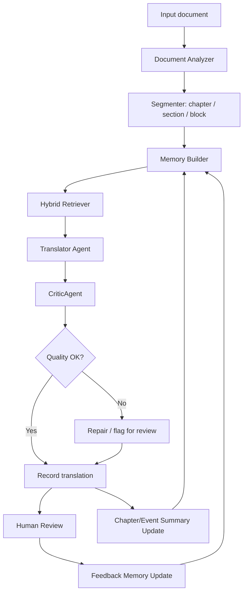

# Kế hoạch nghiên cứu và triển khai

## Đề tài

**Tiếng Việt:** Tiếp cận hệ tác tử trong bài toán dịch máy Anh-Việt cho văn bản dài.

**Tiếng Anh:** Agent-based approach for long-document English-Vietnamese machine translation.

## 1. Định vị đề tài

Đề tài không tập trung vào việc "gọi một LLM để dịch" và cũng không tập trung vào xử lý PDF/layout. Trong phạm vi khóa luận, PDF chỉ nên được xem là một định dạng đầu vào/đầu ra hoặc một adapter minh họa.

Trọng tâm của đề tài là:

- Thiết kế một kiến trúc dịch máy cho văn bản dài có trạng thái.
- Sử dụng LLM như thành phần sinh ngôn ngữ, không xem LLM là toàn bộ hệ thống.
- Điều phối quá trình dịch bằng tác tử, memory, glossary, truy xuất ngữ cảnh và kiểm tra chất lượng.
- Đánh giá bằng dataset, baseline, metric và thí nghiệm so sánh.

Phát biểu cốt lõi:

> Đề tài thiết kế và đánh giá một hệ thống dịch máy Anh-Việt cho văn bản dài dựa trên kiến trúc tác tử, trong đó LLM được điều phối bởi bộ nhớ ngoài gồm terminology memory, entity memory, discourse memory, summary memory, translation memory, feedback memory và QA memory; hệ thống sử dụng retrieval lai giữa exact lookup và FTS/BM25, kết hợp CriticAgent để kiểm tra chất lượng và feedback loop để cập nhật tri thức dịch cho các đoạn tiếp theo.

## 2. Vấn đề nghiên cứu

Khi dịch sách giáo khoa, tiểu thuyết hoặc tài liệu nhiều chương, vấn đề không chỉ là dịch đúng từng câu. Các lỗi quan trọng thường xuất hiện ở mức document:

- Thuật ngữ được dịch không nhất quán.
- Tên riêng, nhân vật, địa danh, alias bị thay đổi qua các chương.
- Đại từ và xưng hô không phù hợp với quan hệ nhân vật.
- Phong văn thay đổi giữa các phần.
- Đoạn sau không nhớ quyết định dịch của đoạn trước.
- LLM có thể bỏ sót ý, thêm ý hoặc dịch lệch nghĩa mà không có cơ chế tự kiểm tra.
- Feedback của người dùng không được dùng để cải thiện các đoạn sau.

Vì vậy, bài toán nghiên cứu nên được đặt là:

> Kiến trúc tác tử có memory và quality checking có cải thiện tính nhất quán và chất lượng dịch Anh-Việt cho văn bản dài so với cách dịch từng chunk độc lập bằng LLM hay không?

## 3. Vì sao không chỉ dùng một LLM đơn lẻ?

### 3.1 Giới hạn của single-LLM translation

Mô hình "input -> LLM -> output" có thể hoạt động tốt với đoạn ngắn, nhưng gặp hạn chế với văn bản dài:

1. **Context window không phải bộ nhớ bền vững**  
   Context window lớn giúp đưa nhiều nội dung vào prompt, nhưng không đảm bảo thông tin ở giữa được truy xuất tốt và không giải quyết việc cập nhật quyết định dịch sau feedback.

2. **Lost in the middle**  
   Các nghiên cứu về long-context LLM cho thấy model thường sử dụng thông tin ở đầu và cuối context tốt hơn phần giữa. Với tài liệu dài, chỉ đưa nhiều nội dung vào prompt không đủ để đảm bảo nhất quán.

3. **Không có external state**  
   Nếu block 20 đã quyết định "machine learning" = "học máy", block 80 có thể dịch thành "máy học" nếu không có glossary/memory ràng buộc.

4. **Không có vòng lặp kiểm tra**  
   LLM đơn lẻ thường sinh output một lần. Nếu có lỗi thuật ngữ, thiếu ý hoặc sai xưng hô, cần một cơ chế reviewer/critic để phát hiện.

5. **Feedback không được ghi nhớ**  
   Nếu người dùng sửa một tên nhân vật hoặc thuật ngữ, hệ thống cần biến sửa đổi đó thành memory cho các đoạn sau.

### 3.2 Vì sao cần agent?

Trong đề tài này, agent không có nghĩa là "một model mới". Agent là một cơ chế điều phối:

```text
Observe -> Reason -> Retrieve memory/tools -> Act -> Review -> Update memory -> Repeat
```

Một agent dịch có thể:

- Đọc block hiện tại và thông tin vị trí trong tài liệu.
- Truy xuất glossary, entity, summary, translation memory.
- Tạo prompt có kiểm soát cho LLM.
- Gọi LLM để dịch.
- Gọi CriticAgent để kiểm tra.
- Ghi lại kết quả, issue và feedback vào memory.

## 4. Cơ sở lý thuyết

### 4.1 Document-level machine translation

Document-level MT nghiên cứu dịch máy ở mức văn bản hoàn chỉnh thay vì từng câu độc lập. Các vấn đề chính gồm:

- coherence: tính mạch lạc giữa các câu/đoạn;
- consistency: nhất quán thuật ngữ, tên riêng, style;
- discourse: đại từ, tham chiếu, quan hệ ngữ cảnh;
- context modeling: sử dụng ngữ cảnh trước/sau để dịch đúng hơn.

Đây là nền tảng để lý giải vì sao dịch tài liệu dài cần memory và context retrieval.

### 4.2 LLM agent và ReAct

Kiến trúc ReAct đề xuất việc kết hợp reasoning và acting: model không chỉ trả lời, mà còn suy luận để chọn hành động, gọi tool, nhận observation, rồi tiếp tục. Trong bài toán dịch:

```text
Thought: Đoạn này có "White Rabbit", cần tra glossary.
Action: search_glossary("White Rabbit")
Observation: White Rabbit -> Thỏ Trắng
Thought: Dùng glossary khi dịch.
Action: translate_with_memory(...)
Observation: Bản dịch hoàn tất.
Action: record_translation(...)
```

### 4.3 External memory và RAG

RAG cho phép mô hình truy xuất tri thức bên ngoài trước khi sinh output. Trong đề tài này, RAG không nên hiểu đơn giản là "vector database". Nên dùng **hybrid memory retrieval**:

- Exact/structured lookup cho glossary và entity.
- FTS/BM25 cho block, memory item, translation memory và summary liên quan.
- Embedding/vector search là hướng mở rộng tùy chọn cho semantic retrieval.

### 4.4 Quality checking trong MT

Đánh giá dịch máy cần kết hợp:

- automatic metrics: BLEU, chrF, COMET, BERTScore;
- task-specific metrics: terminology accuracy, entity consistency;
- human/MQM evaluation: accuracy, fluency, terminology, style, consistency;
- critic precision/recall: đo khả năng phát hiện lỗi của CriticAgent.

## 5. Phạm vi đề tài

### 5.1 Trong phạm vi

- Dịch Anh-Việt cho văn bản dài theo chapter/block.
- Thiết kế agent pipeline.
- Thiết kế memory 7 lớp.
- Truy xuất memory trước khi dịch.
- Kiểm tra chất lượng bằng rule và LLM reviewer.
- Human feedback loop để cập nhật memory.
- Thí nghiệm so sánh với baseline.

### 5.2 Ngoài phạm vi

- Không train LLM từ đầu.
- Không tập trung vào OCR, PDF layout, render PDF.
- Không xây hệ production multi-user.
- Không bắt buộc vector database nâng cao.
- Không cần benchmark khổng lồ.

## 6. Kiến trúc tổng thể

Kiến trúc nên tách thành 3 lớp:

### 6.1 Lớp 1: Mô hình nghiên cứu lý tưởng

Đây là kiến trúc được trình bày trong khóa luận, xây từ cơ sở lý thuyết:

- Core Translation Agent
- Memory Manager
- Hybrid Retriever
- Translator Agent
- CriticAgent
- Summary Agent
- Feedback Agent
- Evaluation Harness

### 6.2 Lớp 2: Prototype triển khai

Prototype có thể reuse code hiện tại nếu phù hợp, nhưng không bị ràng buộc bởi code cũ. Có thể refactor hoặc viết module mới sạch hơn.

Có thể reuse:

- SQLite store và data model có sẵn.
- Memory pack interface.
- Glossary/entity logic hiện có nếu phù hợp.
- UI review/human feedback nếu cần demo.

Cần viết mới hoặc refactor:

- Core translation agent orchestration.
- CriticAgent.
- Chapter/event summary pipeline.
- FTS/BM25 retrieval layer.
- Evaluation harness.

### 6.3 Lớp 3: PDF/UI adapter

PDF parser, preview, render, UI hiện tại chỉ đóng vai trò adapter. Đây không phải phần nghiên cứu chính.



## 7. Thiết kế memory 7 lớp

### 7.1 Terminology Memory

Mục đích: đảm bảo thuật ngữ được dịch nhất quán.

Trường dữ liệu đề xuất:

- source_term
- target_term
- normalized_source
- status: candidate, verified, locked, human_verified
- confidence
- allowed_variants
- forbidden_variants
- domain
- chapter_scope
- evidence_blocks

Retrieval:

- exact match là ưu tiên cao nhất;
- FTS/BM25 chỉ dùng để gợi ý hoặc fallback;
- không phụ thuộc hoàn toàn vào embedding.

### 7.2 Entity Memory

Mục đích: quản lý tên riêng, nhân vật, địa danh, tổ chức, concept.

Trường dữ liệu đề xuất:

- entity_id
- canonical_source
- canonical_target
- entity_type
- gender
- role
- aliases_source
- aliases_target
- preferred_vietnamese_forms
- first_seen_block
- latest_seen_block
- status
- evidence_spans

Retrieval:

- exact surface match;
- alias lookup;
- FTS fallback cho tên gần đúng.

### 7.3 Discourse Memory

Mục đích: giữ ngữ cảnh hội thoại, đại từ, xưng hô và quan hệ nhân vật.

Trường dữ liệu đề xuất:

- speaker_turns
- speaker_entity
- addressee_entity
- pronoun_resolution
- character_relations
- form_of_address
- emotional_state
- current_location
- timeline_position

MVP có thể chỉ cần:

- speaker/addressee tracking cơ bản;
- quan hệ và xưng hô ở dạng structured note;
- coreference hints cho Translator Agent.

### 7.4 Summary Memory

Mục đích: lưu tóm tắt cấp chapter/event để cung cấp ngữ cảnh dài hạn.

Trường dữ liệu đề xuất:

- summary_id
- type: chapter, section, event
- chapter_id
- block_start
- block_end
- summary_source
- summary_target
- key_events
- characters_present
- new_terms_added
- emotional_tone
- setting
- translation_notes

Trigger:

- sau mỗi chapter;
- hoặc sau mỗi N blocks;
- hoặc khi người dùng yêu cầu cập nhật memory.

Retrieval:

- đưa summary của chapter trước và summary liên quan vào context pack;
- dùng FTS/BM25 để tìm summary liên quan;
- embedding là hướng mở rộng nếu cần semantic retrieval.

### 7.5 Translation Memory

Mục đích: lưu các cặp source-target đã dịch, đặc biệt các đoạn đã được human review.

Trường dữ liệu đề xuất:

- block_id
- source_text
- target_text
- verified
- model/provider
- memory_pack_id
- chapter_id
- similarity_hash
- retrieval_count

Retrieval:

- BM25/FTS cho đoạn có từ khóa giống;
- embedding cho đoạn tương tự về nghĩa;
- chỉ đưa vào prompt các bản dịch có liên quan và không gây future leakage.

### 7.6 Feedback Memory

Mục đích: biến sửa đổi của người dùng thành tri thức cho các đoạn sau.

Trường dữ liệu đề xuất:

- feedback_id
- block_id
- before_translation
- after_translation
- feedback_type
- derived_memory_ids
- status

Feedback có thể tạo/cập nhật:

- glossary entry;
- entity alias;
- discourse note;
- verified translation memory;
- QA issue resolved.

### 7.7 QA Memory

Mục đích: lưu issue để review, sửa lỗi và đánh giá CriticAgent.

Trường dữ liệu đề xuất:

- issue_id
- block_id
- issue_type
- severity
- detected_by: rule, llm_reviewer, human
- description
- evidence
- fixed
- fix_detail
- related_feedback_id

Issue taxonomy:

- terminology: wrong term, inconsistent term, missing term;
- entity: inconsistent name, wrong alias, wrong pronoun;
- content: omission, addition, mistranslation;
- style: register shift, tone inconsistency;
- fluency: unnatural Vietnamese, grammar issue;
- special content: formula, notation, table, code.

## 8. Agent modules

### 8.1 Coordinator Agent

Vai trò:

- quản lý pipeline;
- quyết định thứ tự xử lý;
- phân công Analyzer, Retriever, Translator, Critic, Summary Agent;
- đảm bảo memory được cập nhật sau mỗi bước.

### 8.2 Document Analyzer

Vai trò:

- đọc input;
- tách chapter/section/block;
- gán metadata: chapter_id, order, type;
- phát hiện dialogue, heading, list, table nếu cần.

### 8.3 Memory Manager

Vai trò:

- ghi/đọc memory;
- cập nhật glossary/entity/translation/feedback/QA;
- tránh ghi đè các entry đã human_verified;
- quản lý version/supersede/conflict.

### 8.4 Hybrid Retriever

Vai trò:

- lấy memory liên quan cho block hiện tại;
- ưu tiên exact lookup cho glossary/entity;
- dùng FTS/BM25 cho block, summary, translation memory;
- có thể mở rộng embedding/vector search.

### 8.5 Translator Agent

Vai trò:

- tạo prompt dịch có kiểm soát;
- đưa memory pack vào prompt;
- yêu cầu LLM trả về bản dịch sạch, không thêm giải thích;
- ghi lại memory refs đã dùng.

### 8.6 CriticAgent

CriticAgent gồm 2 tầng.

Tier 1: rule-based:

- glossary adherence;
- entity consistency;
- length ratio;
- leftover English;
- foreign script/mojibake;
- formula/math/code preservation;
- missing required term;
- forbidden variant.

Tier 2: LLM-based reviewer:

- omission;
- addition;
- mistranslation;
- style mismatch;
- fluency issue;
- discourse/xưng hô issue.

Output:

```json
{
  "block_id": "b001",
  "quality_score": 0.82,
  "issues": [
    {
      "type": "terminology",
      "severity": "major",
      "description": "machine learning was translated inconsistently",
      "detected_by": "rule"
    }
  ],
  "suggested_action": "repair_or_human_review"
}
```

### 8.7 Summary Agent

Vai trò:

- sinh summary sau chapter/N blocks;
- trích xuất nhân vật, sự kiện, setting, tone, thuật ngữ mới;
- ghi vào Summary Memory;
- cung cấp context cho các chapter sau.

### 8.8 Feedback Agent

Vai trò:

- phân tích manual edit;
- phát hiện cặp term mới;
- cập nhật glossary/entity/translation memory;
- đóng issue QA nếu đã sửa.

## 9. Retrieval strategy

### 9.1 Nguyên tắc

Không dùng một kiểu retrieval cho mọi thứ. Retrieval phải phù hợp với loại memory.

| Loại memory | Retrieval chính | Retrieval phụ |
|---|---|---|
| Terminology | exact/structured | FTS fallback |
| Entity | exact alias/surface | FTS fallback |
| Discourse | structured by block/chapter | none/FTS |
| Summary | FTS/BM25 | embedding optional |
| Translation memory | BM25/FTS | embedding optional |
| Feedback | structured by block/entity/term | FTS |
| QA issue | structured by issue type/block | FTS |

### 9.2 Vai trò của embedding/vector search

Embedding không bắt buộc trong MVP. Nên để như một hướng mở rộng hoặc optional experiment.

Cần embedding khi:

- muốn tìm đoạn tương tự về nghĩa nhưng khác từ khóa;
- muốn semantic retrieval cho summary;
- muốn tìm translation memory gần nghĩa.

Không cần embedding cho:

- glossary exact match;
- entity canonical name;
- forbidden/allowed variants;
- issue log theo block.

## 10. Research questions và giả thuyết

### RQ1

Kiến trúc agent-based có memory có cải thiện tính nhất quán thuật ngữ và entity so với dịch chunk độc lập không?

Giả thuyết:

- S2/S3 có Terminology Accuracy cao hơn S0/S1.
- S2/S3 có Entity Consistency cao hơn S0/S1.

### RQ2

Chapter/event summary memory có giúp cải thiện chất lượng dịch và coherence ở các đoạn sau không?

Giả thuyết:

- S3 cao hơn S3 không summary ở context preservation và human preference.

### RQ3

CriticAgent có phát hiện được các lỗi dịch quan trọng không?

Giả thuyết:

- CriticAgent đạt recall khá chấp nhận với lỗi terminology/entity/content được inject.
- Rule-based tốt với lỗi có cấu trúc, LLM reviewer tốt với omission/mistranslation/style.

### RQ4

Feedback của người dùng có cải thiện các đoạn dịch sau không?

Giả thuyết:

- Sau khi người dùng sửa glossary/entity, các đoạn sau có tỷ lệ tuân thủ glossary cao hơn.

## 11. Hệ thống so sánh

### S0: Chunk-independent LLM

- Chia tài liệu thành chunk.
- Mỗi chunk được dịch độc lập.
- Không memory, không glossary, không previous context.

Mục đích: baseline thấp nhất.

### S1: Sequential LLM with previous context

- Dịch tuần tự.
- Mỗi chunk nhận previous chunk/source-target gần nhất.
- Không có memory có cấu trúc.

Mục đích: đo lợi ích của local context.

### S2: Memory-aware LLM

- Sử dụng glossary/entity/translation record.
- Build memory pack cho mỗi block.
- Chưa có full CriticAgent và summary pipeline.

Mục đích: đo tác động của memory có cấu trúc.

### S3: Full Agent Pipeline

- S2 + Hybrid Retrieval.
- S2 + Chapter/Event Summary Memory.
- S2 + CriticAgent.
- S2 + Feedback/QA memory.

Mục đích: hệ đề xuất đầy đủ.

### Ablation

- S3-no-summary: bỏ Summary Memory.
- S3-no-critic: bỏ CriticAgent.
- Tùy thời gian có thể thêm S3-no-feedback.

## 12. Dataset

### 12.1 Sentence-level dataset

Dùng để đo automatic MT metrics:

- IWSLT'15 English-Vietnamese.
- PhoMT.
- FLORES-200 English-Vietnamese.

Metric:

- BLEU;
- chrF;
- COMET/BERTScore nếu thiết lập được.

Lưu ý: các dataset này chủ yếu ở mức sentence/paragraph, không đủ để đo document-level consistency một cách đầy đủ.

### 12.2 Document-level dataset

Dùng để đo memory và consistency:

- Alice in Wonderland hoặc tác phẩm public domain.
- Tài liệu kỹ thuật/giao trình ngắn về CS/AI/Math.
- Một tập tài liệu dài từ project hiện có nếu có quyền sử dụng.

Cần chuẩn bị:

- source text chia chapter/block;
- danh sách 50-100 term/entity;
- một phần reference translation hoặc human review;
- annotation lỗi cho một tập test nhỏ.

### 12.3 Injected-error dataset

Dùng để đánh giá CriticAgent:

- lấy các bản dịch đúng;
- cố tình chèn lỗi terminology/entity/omission/addition/style;
- ghi ground truth issue;
- đo precision/recall của CriticAgent.

## 13. Metrics

### 13.1 Automatic MT metrics

- BLEU: đo n-gram overlap.
- chrF: phù hợp hơn với ngôn ngữ có biến thể ký tự/từ.
- COMET/BERTScore: đo gần nghĩa nếu có reference.

### 13.2 Terminology Accuracy

Công thức:

```text
Terminology Accuracy = correct_term_translations / total_term_occurrences
```

Ví dụ:

- "machine learning" xuất hiện 20 lần;
- 18 lần dịch đúng theo glossary;
- score = 18/20 = 90%.

### 13.3 Entity Consistency

Công thức:

```text
Entity Consistency = consistent_entity_mentions / total_entity_mentions
```

Cần tính cả alias chấp nhận được. Ví dụ "Alice", "cô bé Alice", "cô ấy" có thể chấp nhận tùy context; "Alicia" thì không.

### 13.4 QA Precision/Recall

Dùng cho CriticAgent:

```text
Precision = correct_flagged_issues / total_flagged_issues
Recall = correct_flagged_issues / total_real_issues
F1 = 2 * precision * recall / (precision + recall)
```

### 13.5 Human/MQM evaluation

Human reviewer chấm theo nhóm:

- accuracy;
- fluency;
- terminology;
- entity/name consistency;
- style;
- omission/addition;
- overall preference.

Có thể dùng scale 1-5 hoặc pairwise preference giữa S0/S1/S2/S3.

## 14. Thí nghiệm đề xuất

### E1: Tác động của memory

Mục tiêu:

- So sánh S0, S1, S2, S3.

Metric:

- Terminology Accuracy;
- Entity Consistency;
- chrF/COMET nếu có reference;
- human preference.

Kết quả kỳ vọng:

- S2/S3 tốt hơn S0/S1 ở consistency.

### E2: Hiệu quả của CriticAgent

Mục tiêu:

- Đo khả năng phát hiện lỗi.

Phương pháp:

- tạo injected-error dataset;
- chạy CriticAgent;
- so với ground truth.

Metric:

- precision;
- recall;
- F1;
- breakdown theo issue type.

Kết quả kỳ vọng:

- rule-based mạnh với terminology/entity/formula;
- LLM reviewer mạnh với omission/addition/mistranslation/style.

### E3: Tác động của summary và feedback

Mục tiêu:

- Đo summary memory và feedback loop có giúp đoạn sau nhất quán hơn không.

Phương pháp:

- dịch một phần tài liệu;
- tạo chapter summary;
- hoặc sửa một số glossary/entity qua feedback;
- dịch các đoạn tiếp theo;
- so sánh với bản không có summary/feedback.

Metric:

- Terminology Accuracy sau feedback;
- Entity Consistency;
- human preference;
- context preservation.

## 15. Lộ trình triển khai

### Giai đoạn 1: Thiết kế và tái cấu trúc đề tài

Thời gian: 1-2 tuần.

Công việc:

- Viết cơ sở lý thuyết.
- Chốt research questions.
- Vẽ architecture diagram.
- Thiết kế memory 7 lớp.
- Chốt dataset và metrics.

Output:

- Chapter 1/2 draft.
- File architecture design.
- Experiment protocol.

### Giai đoạn 2: Core agent prototype

Thời gian: 2-3 tuần.

Công việc:

- Tách core translation pipeline khỏi PDF/UI nếu cần.
- Xây interface cho:
  - Document Analyzer;
  - Memory Manager;
  - Retriever;
  - Translator Agent;
  - CriticAgent;
  - Feedback update.

Output:

- Chạy được S0/S1/S2.
- Có script/evaluation runner cơ bản.

### Giai đoạn 3: CriticAgent

Thời gian: 2 tuần.

Công việc:

- Implement Tier 1 rules.
- Implement Tier 2 LLM reviewer.
- Lưu issue vào QA memory.
- Tạo injected-error dataset.

Output:

- Chạy E2 được.
- Có precision/recall ban đầu.

### Giai đoạn 4: Summary Memory

Thời gian: 2 tuần.

Công việc:

- Implement chapter/N-block summary generation.
- Lưu structured summary.
- Đưa summary vào context pack.
- Chạy ablation có/không summary.

Output:

- Chạy E3 được.
- Có ví dụ summary và tác động lên dịch.

### Giai đoạn 5: Hybrid Retrieval

Thời gian: 1-2 tuần.

Công việc:

- Thêm FTS/BM25 retrieval cho block, memory item, summary.
- Giữ exact lookup cho glossary/entity.
- Đo retrieval hit rate và relevance.

Output:

- Retrieval layer rõ ràng hơn.
- Có so sánh với linear scan nếu cần.

### Giai đoạn 6: Full evaluation

Thời gian: 2-3 tuần.

Công việc:

- Chạy S0/S1/S2/S3.
- Chạy ablation.
- Tính metrics.
- Làm bảng biểu và phân tích lỗi.
- Human evaluation nếu có người chấm.

Output:

- Kết quả thực nghiệm.
- Bảng số liệu.
- Error analysis.

### Giai đoạn 7: Viết khóa luận

Thời gian: 3-4 tuần.

Công việc:

- Chương 1: Giới thiệu.
- Chương 2: Cơ sở lý thuyết.
- Chương 3: Kiến trúc đề xuất.
- Chương 4: Cài đặt hệ thống.
- Chương 5: Thực nghiệm và đánh giá.
- Chương 6: Kết luận và hướng phát triển.

## 16. Cấu trúc khóa luận đề xuất

### Chương 1: Giới thiệu

- Bối cảnh dịch máy với LLM.
- Vấn đề dịch văn bản dài.
- Mục tiêu đề tài.
- Phạm vi và đóng góp.

### Chương 2: Cơ sở lý thuyết

- Machine translation.
- Document-level MT.
- LLM và prompt-based translation.
- LLM agent, ReAct, tool-augmented agent.
- External memory và RAG.
- MT evaluation.

### Chương 3: Kiến trúc hệ thống đề xuất

- Tổng quan pipeline.
- Agent modules.
- Memory 7 lớp.
- Hybrid retrieval.
- CriticAgent.
- Feedback loop.

### Chương 4: Cài đặt prototype

- Công nghệ sử dụng.
- Data model.
- Agent orchestration.
- Prompt design.
- Storage/retrieval.
- UI/demo nếu có.

### Chương 5: Thực nghiệm và đánh giá

- Dataset.
- Baseline systems.
- Metrics.
- Kết quả E1/E2/E3.
- Error analysis.
- Discussion.

### Chương 6: Kết luận

- Tổng kết đóng góp.
- Hạn chế.
- Hướng phát triển.

## 17. Nguyên tắc giữ đúng hướng

- Không viết khóa luận thành "ứng dụng dịch PDF".
- Không coi memory hiện tại là kiến trúc bắt buộc.
- Không bắt buộc embedding/vector DB nếu chưa cần.
- Không train model từ đầu.
- Không over-engineer thành production system.
- Luôn gắn mỗi tính năng với câu hỏi nghiên cứu và metric đánh giá.

## 18. Ưu tiên MVP

Nếu thời gian hạn chế, MVP nên gồm:

1. S0/S1/S2/S3 runner.
2. Terminology Memory.
3. Entity Memory.
4. Translation Memory.
5. Summary Memory mức chapter.
6. CriticAgent Tier 1.
7. LLM reviewer tối thiểu cho omission/mistranslation/style.
8. QA issue log.
9. Feedback update glossary/entity.
10. Evaluation với Terminology Accuracy, Entity Consistency, chrF/COMET và một phần human review.

Phần có thể để hướng phát triển:

- vector database;
- event graph phức tạp;
- full coreference resolver;
- multi-agent parallel execution;
- multi-user collaboration;
- production database.

## 19. Tài liệu tham khảo nên cite

- ReAct: Synergizing Reasoning and Acting in Language Models.
- Retrieval-Augmented Generation for Knowledge-Intensive NLP Tasks.
- Lost in the Middle: How Language Models Use Long Contexts.
- A Survey on Document-level Neural Machine Translation.
- BLEU: a Method for Automatic Evaluation of Machine Translation.
- chrF: character n-gram F-score for automatic MT evaluation.
- COMET: A Neural Framework for MT Evaluation.
- MQM: Multidimensional Quality Metrics.
- PhoMT: A High-Quality and Large-Scale Benchmark Dataset for Vietnamese-English Machine Translation.
- FLORES-200 / NLLB benchmark.

## 20. Kết luận định hướng

Hướng nghiên cứu hợp lý nhất là không bó buộc vào codebase hiện tại, mà xem codebase hiện tại như prototype có thể tận dụng. Khóa luận nên trình bày một kiến trúc agent-based rõ ràng, trong đó memory và quality checking là đóng góp chính.

Nếu làm đúng phạm vi, đề tài sẽ có đầy đủ:

- cơ sở lý thuyết;
- kiến trúc module rõ ràng;
- dataset;
- baseline;
- ablation;
- metrics;
- phân tích lỗi;
- prototype minh họa.

Do đó, đề tài có thể tránh lệch hướng khỏi PDF/layout và tập trung vào bài toán cốt lõi: **dịch văn bản dài Anh-Việt có ngữ cảnh, có memory và có kiểm soát chất lượng**.
