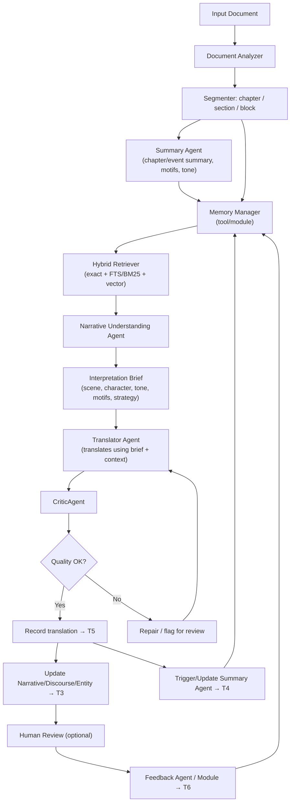

# KẾ HOẠCH NGHIÊN CỨU VÀ TRIỂN KHAI V3

## Đề tài: Tiếp cận hệ tác tử trong bài toán dịch máy Anh-Việt cho văn bản dài

> **Câu chốt / Phát biểu cốt lõi:**
> Đề tài thiết kế và đánh giá một hệ thống dịch máy Anh-Việt cho văn bản dài dựa trên kiến trúc tác tử, trong đó LLM được điều phối bởi bộ nhớ ngoài gồm terminology, entity, discourse/narrative, summary/motifs và QA memory (tất cả **agent tự sinh từ 0** — xem §0 Directional Lock); hệ thống sử dụng hybrid retrieval (exact lookup + FTS/BM25 + vector retrieval cho ngữ cảnh văn chương), kết hợp 4 LLM agents chính (Summary, Narrative Understanding, Translator, Critic) để tạo Interpretation Brief, dịch và kiểm tra chất lượng. **Critic/revision là core; vòng feedback/human loop là future work, không thuộc đóng góp chính.** Translation memory nếu dùng ở runtime chỉ là output trước đó của chính agent, không phải bản dịch người.
>
> **Mục tiêu cốt lõi:** Không chỉ dịch đúng nghĩa bề mặt, mà model "hiểu" câu chuyện để kể lại bằng giọng văn tự nhiên, giữ được ẩn ý tác giả, motif và văn phong nhất quán.

---

## Nguyên tắc giữ đúng hướng

> **Điều quan trọng nhất — ĐỌC TRƯỚC KHI LÀM:**
>
> 1. **Đây KHÔNG phải đề tài "sửa app PDF"** — PDF chỉ là adapter đầu vào/đầu ra. Không viết khóa luận thành "ứng dụng dịch PDF".
> 2. **Codebase hiện tại là prototype, không phải kiến trúc chuẩn** — Mỗi module được đánh giá độc lập. Reuse nếu tiện, không bị ràng buộc.
> 3. **Vector retrieval là thành phần cốt lõi cho S3** — phục vụ mục tiêu narrative-aware translation. Không phải hướng mở rộng tùy chọn.
> 4. **Không train LLM từ đầu** — Dùng LLM làm thành phần sinh ngôn ngữ, không thay đổi model.
> 5. **Không over-engineer** — Không biến thành production system.
> 6. **Luôn gắn mỗi tính năng với câu hỏi nghiên cứu và metric đánh giá.**
> 7. **Infrastructure không phải agent** — Document Analyzer, Memory Manager, Hybrid Retriever, Coordinator và Evaluation Harness là tool/module hỗ trợ, không phải LLM agent độc lập.

---

## 0. DIRECTIONAL LOCK — Pipeline tự động từ 0 (GVHD chốt 2026-06-04)

> **Đây là ràng buộc override. Khi phần nào bên dưới mâu thuẫn, theo mục này.**
> Lý do: GVHD yêu cầu luận văn phải là **pipeline dịch tự động end-to-end, đo được
> bằng số**, không nói suông/chấm bằng mắt.
>
> 1. **Autonomous từ con số 0:** ném sách thô vào → nhả bản dịch + số liệu. Agent
>    **KHÔNG đọc bất kỳ kết quả người làm cho cuốn input** (không annotation người,
>    không bản dịch người). Phân biệt với AI-LAB: AI-LAB *được* dùng người/AI dựng
>    dataset; thesis runtime thì không.
> 2. **AI-LAB human gold = EVAL-ONLY:** chỉ dùng làm reference để chấm + thước đo
>    chất lượng auto-extraction của agent. Không nạp vào pipeline. (xem
>    `RUN_EVAL_SCHEMA.md` nhóm `reference_eval_only`, cách ly tuyệt đối.)
> 3. **Tự nhiên tiếng Việt = base model + CriticAgent**, KHÔNG dùng exemplar người
>    dịch. Vì vậy mọi chỗ "học lối kể từ đoạn đã dịch tốt" / "similar passages /
>    translation memory style reference" (T5, prompt A.4) chỉ được là **output
>    trước đó của CHÍNH agent**, không phải gold người.
> 4. **Memory dựng bằng whole-book pre-pass rồi FREEZE (V1):** Summary/Analyzer quét
>    cả sách (theo chương rồi merge) → registry; **đóng băng trước khi dịch**. Vì
>    pre-pass đã "biết khúc cuối" nên freeze là hợp lý. Critic/revision chỉ sửa
>    **output**, không sửa memory.
> 5. **Status `human_verified` / `locked` (T1/T2) thuộc AI-LAB eval-gold, KHÔNG dùng
>    ở runtime thesis.** Trong pipeline, mọi entry là auto-sinh + `confidence` +
>    provenance.
> 6. **Vòng feedback người → bỏ khỏi core, thành future work:** T6 Feedback Memory,
>    C5, RQ4/H5, thí nghiệm E4, ablation S3c, node "Human Review" trong pipeline §6
>    — tất cả **không còn là đóng góp chính**. Lý do: human-in-loop mâu thuẫn
>    autonomous, và iterative-memory mâu thuẫn freeze-V1. Giữ lại như hướng phát
>    triển (agent-self memory-repair = V2). Ablation core còn S3a/S3b/S3d.
> 7. **Chứng minh "hơn dịch thường" = ablation ladder** S0→S1→S2→S3 cùng base model
>    (chỉ kiến trúc đổi), + **consistency metric `*_internal` toàn sách** (BLEU gần
>    như không nhúc nhích theo nhất quán — lực chính của hệ). Thêm **backtranslation**
>    (GVHD đề xuất) làm metric phụ/diagnostic. Lớp lưu run/eval ở `RUN_EVAL_SCHEMA.md`.
> 8. **Memory quality ≠ translation quality:** đo riêng (auto-extract đúng tới đâu vs
>    bản dịch hay tới đâu), không trộn.

---

## 1. Định vị đề tài

### 1.1. Bối cảnh

Đề tài không tập trung vào việc "gọi một LLM để dịch" và cũng không tập trung vào xử lý PDF/layout. Trong phạm vi khóa luận, PDF chỉ được xem là một định dạng đầu vào/đầu ra hoặc một adapter minh họa.

Trọng tâm của đề tài là:

- Thiết kế một kiến trúc dịch máy cho văn bản dài có trạng thái.
- Sử dụng LLM như thành phần sinh ngôn ngữ, không xem LLM là toàn bộ hệ thống.
- Điều phối quá trình dịch bằng tác tử, memory, glossary, truy xuất ngữ cảnh và kiểm tra chất lượng.
- Đánh giá bằng dataset, baseline, metric và thí nghiệm so sánh.

### 1.2. Vấn đề nghiên cứu

Khi dịch sách giáo khoa, tiểu thuyết hoặc tài liệu nhiều chương, các lỗi quan trọng thường xuất hiện ở mức document:

- Thuật ngữ được dịch không nhất quán.
- Tên riêng, nhân vật, địa danh, alias bị thay đổi qua các chương.
- Đại từ và xưng hô không phù hợp với quan hệ nhân vật.
- Phong văn thay đổi giữa các phần.
- Đoạn sau không nhớ quyết định dịch của đoạn trước.
- LLM có thể bỏ sót ý, thêm ý hoặc dịch lệch nghĩa mà không có cơ chế tự kiểm tra.
- Feedback của người dùng không được dùng để cải thiện các đoạn sau.
- Bản dịch đọc như máy, không có "giọng kể", không giữ được ẩn ý tác giả và motif văn chương.

**Câu hỏi nghiên cứu:**

> Kiến trúc tác tử có memory và quality checking có cải thiện tính nhất quán, chất lượng dịch Anh-Việt cho văn bản dài so với cách dịch từng chunk độc lập bằng LLM hay không? Và việc bổ sung Narrative Understanding Agent với vector retrieval có giúp bản dịch có giọng văn tự nhiên, nhất quán về phong cách hơn không?

**Định vị so với TRANSAGENTS:** TRANSAGENTS (Wu et al., 2025) mô phỏng công ty dịch thuật với 6 vai trò và dùng translation guideline cấp toàn cục. Đề tài này kế thừa ý tưởng multi-agent literary translation nhưng tập trung vào hướng **memory/retrieval-centric**: truy xuất context liên quan cho từng block bằng exact lookup + FTS/BM25 + vector retrieval, sau đó tạo **Interpretation Brief động** trước khi dịch. Khoảng trống chính mà đề tài khai thác là: TRANSAGENTS dùng guideline tĩnh cấp toàn sách, không tập trung vào external memory store nhiều lớp, không có retrieval per-block bằng FTS/vector, và repo công khai chủ yếu cung cấp outputs/case studies chứ không phát hành pipeline code hoàn chỉnh.

### 1.3. Phạm vi đề tài

#### 1.3.1. Trong phạm vi

- Dịch Anh-Việt cho văn bản dài theo chapter/block.
- Thiết kế pipeline với 4 LLM agents chính: Summary, Narrative Understanding, Translator, Critic.
- Thiết kế các tool/infrastructure modules: Document Analyzer, Memory Manager, Hybrid Retriever, Coordinator, Evaluation Harness.
- Feedback Agent là thành phần optional/trigger-based.
- Thiết kế memory 7 lớp (T3 và T4 mở rộng chứa narrative/literary memory).
- Hybrid retrieval: exact + FTS/BM25 + vector (narrative context).
- Narrative Understanding Agent tạo Interpretation Brief.
- CriticAgent hai tầng (rule-based + LLM).
- Human feedback loop để cập nhật memory.
- Thí nghiệm so sánh: S0/S1/S2/S3 + ablation + human evaluation.

#### 1.3.2. Ngoài phạm vi

- Không train LLM từ đầu.
- Không tập trung vào OCR, PDF layout, render PDF.
- Không xây hệ production multi-user.
- Không cần benchmark khổng lồ.

### 1.4. Đóng góp dự kiến

| Mã | Đóng góp | Nội dung chính | Cách đánh giá |
|----|----------|----------------|---------------|
| C1 | Hybrid Memory Retrieval | Kết hợp exact lookup cho glossary/entity, FTS/BM25 cho block/translation memory, vector retrieval cho narrative context | Memory hit rate, retrieval relevance, TAR/ECS, latency |
| C2 | Summary + Narrative Memory | Tóm tắt chapter/event, motif, tone, character state và narrative notes để hỗ trợ dịch đoạn sau | S3 vs S3a, human/MQM, narrative quality Likert |
| C3 | Narrative Understanding Agent | Tạo Interpretation Brief động cho từng block dựa trên memory pack và retrieved evidence | S3 vs S3d, MHP/BLP-like preference, narrative quality |
| C4 | CriticAgent hai tầng | Tier 1 rule-based cho lỗi kiểm soát được; Tier 2 LLM reviewer cho lỗi ngữ nghĩa, văn phong, thiếu/thừa ý | Precision, Recall, F1 trên injected-error dataset |
| C5 | Feedback-to-Memory Update | Biến chỉnh sửa của người dùng thành cập nhật glossary/entity/translation memory/QA memory | S3 vs S3c trên downstream blocks |

Trong đó C1-C4 là đóng góp lõi của prototype. C5 có thể triển khai ở mức MVP nếu thời gian cho phép, nhưng vẫn nên mô tả trong thiết kế vì nó hoàn thiện vòng lặp agent.

---

## 2. Cơ sở lý thuyết

### 2.1. Giới hạn của single-LLM translation

Mô hình "input -> LLM -> output" có thể hoạt động tốt với đoạn ngắn, nhưng gặp 5 hạn chế cốt lõi với văn bản dài:

| # | Giới hạn | Mô tả | Ảnh hưởng |
|---|----------|-------|-----------|
| 1 | Context window không phải bộ nhớ bền vững | Context window lớn không đảm bảo thông tin ở giữa được truy xuất tốt | Không cập nhật được quyết định dịch sau feedback |
| 2 | Lost in the middle | LLM thường sử dụng thông tin ở đầu và cuối context tốt hơn phần giữa (Liu et al., 2024) | Thông tin ở phần giữa document có nguy cơ được sử dụng kém hiệu quả hơn |
| 3 | Không có external state | Nếu block 20 đã quyết định "machine learning" = "học máy", block 80 có thể dịch thành "máy học" | Tính nhất quán thuật ngữ không được đảm bảo |
| 4 | Không có vòng lặp kiểm tra | LLM đơn lẻ thường sinh output một lần | Lỗi thuật ngữ, thiếu ý, sai xưng hô không được phát hiện |
| 5 | Feedback không được ghi nhớ | Mỗi request là blank slate | Không học được từ feedback người dùng |

### 2.2. Agent-based translation

Agent = hệ thống có khả năng **Perceive → Reason → Act → Learn/Remember**. LLM đơn lẻ chỉ có 2/4.

```
Observe -> Reason -> Retrieve memory/tools -> Act -> Review -> Update memory -> Repeat
```

Một agent dịch có thể:
- Đọc block hiện tại và thông tin vị trí trong tài liệu.
- Truy xuất glossary, entity, summary, translation memory.
- Tạo prompt có kiểm soát cho LLM.
- Gọi CriticAgent để kiểm tra.
- Ghi lại kết quả, issue và feedback vào memory.

### 2.3. Document-level MT

Document-level MT nghiên cứu dịch máy ở mức văn bản hoàn chỉnh thay vì từng câu độc lập. Các vấn đề chính:

- **Coherence**: tính mạch lạc giữa các câu/đoạn.
- **Consistency**: nhất quán thuật ngữ, tên riêng, style.
- **Discourse**: đại từ, tham chiếu, quan hệ ngữ cảnh.
- **Context modeling**: sử dụng ngữ cảnh trước/sau để dịch đúng hơn.

### 2.4. External Memory và Hybrid Retrieval

RAG không nên hiểu đơn giản là "vector database". Nên dùng **hybrid memory retrieval**:

- Exact/structured lookup cho glossary và entity.
- FTS/BM25 cho block, memory item, translation memory và summary liên quan.
- **Embedding/vector search cho ngữ cảnh văn chương: motifs, character state, emotional tone, implicit meaning, similar narrative passages.** Đây là thành phần cốt lõi phục vụ mục tiêu narrative-aware translation, không phải hướng mở rộng.

---

## 3. Kiến trúc 3 lớp

Kiến trúc tách thành 3 lớp rõ ràng:

```
╔══════════════════════════════════════════════════════════════════╗
║  LỚP 1: MÔ HÌNH NGHIÊN CỨU LÝ TƯỞNG                          ║
║  (Thiết kế từ cơ sở lý thuyết — ĐÂY LÀ PHẦN LUẬN VĂN)       ║
╠══════════════════════════════════════════════════════════════════╣
║  ├── 4 LLM Agents chính:                                         ║
║  │   ├── Summary Agent                                           ║
║  │   ├── Narrative Understanding Agent                           ║
║  │   ├── Translator Agent                                        ║
║  │   └── CriticAgent (rule + LLM)                                ║
║  ├── Optional: Feedback Agent                                    ║
║  └── Tool/Infrastructure: Analyzer, Memory, Retriever,           ║
║      Coordinator, Evaluation Harness                             ║
╚════════════════════════════════╤════════════════════════════════╝
                                 │ "Có thể reuse nếu tiện"
                                 ▼
╔══════════════════════════════════════════════════════════════════╗
║  LỚP 2: PROTOTYPE TRIỂN KHAI                                   ║
║  (Refactor hoặc viết mới — không bị ràng buộc bởi code cũ)    ║
╠══════════════════════════════════════════════════════════════════╣
║  REUSE: store.py, schema, context_pack, translator, retriever    ║
║  REFACTOR: find_glossary, find_entities, active_scene.summary    ║
║  VIẾT MỚI: CriticAgent, Narrative Agent, Summary Agent,          ║
║             FTS/vector retrieval, Feedback optional, harness      ║
╚════════════════════════════════╤════════════════════════════════╝
                                 │ "Adapter"
                                 ▼
╔══════════════════════════════════════════════════════════════════╗
║  LỚP 3: PDF/UI ADAPTER                                         ║
║  (Chỉ là input/output — KHÔNG PHẢI PHẦN NGHIÊN CỨU)           ║
╚══════════════════════════════════════════════════════════════════╝
```

---

## 4. Hệ thống bộ nhớ 7 lớp

### 4.1. T1: Terminology Memory

**Mục đích:** Đảm bảo thuật ngữ được dịch nhất quán.

| Trường | Mô tả |
|--------|-------|
| `source_term` | Thuật ngữ tiếng Anh |
| `target_term` | Bản dịch tiếng Việt |
| `status` | candidate \| verified \| locked \| human_verified |
| `confidence` | 0.0-1.0 |
| `allowed_variants` | Các dịch được chấp nhận |
| `forbidden_variants` | Các dịch không được dùng |
| `domain` | general \| math \| CS \| literature |
| `chapter_scope` | global \| chapter_N |
| `evidence_blocks` | Blocks nơi thuật ngữ xuất hiện |

**Retrieval:** Exact match là ưu tiên cao nhất. FTS/BM25 chỉ dùng để gợi ý hoặc fallback.

**Construction strategy (optional):** Có thể học từ TRANSAGENTS bằng cách dùng Addition-by-Subtraction cho glossary/summary:

1. Addition step: LLM hoặc rule extractor lấy rộng các term/entity/narrative notes có thể quan trọng.
2. Subtraction step: LLM reviewer hoặc rule filter loại các mục generic, nhiễu hoặc không cần đưa vào memory.
3. Human verification: chỉ các entry quan trọng mới được `verified` hoặc `locked`.

Chiến lược này chỉ là kỹ thuật hỗ trợ xây glossary/summary, không phải đóng góp chính. Đóng góp chính vẫn là memory có cấu trúc, retrieval theo block và Interpretation Brief động.

**Disambiguation rule:** Khi cùng một `source_term` có nhiều `target_term` (ví dụ: "queen" có thể = "nữ hoàng" trong Alice hoặc "quân hậu" trong bài toán N-Queens), áp dụng priority:

1. `status = locked` hoặc `human_verified` → dùng ngay, không flag.
2. `chapter_scope` khớp với chapter hiện tại → dùng, không flag.
3. `domain` khớp với domain của block hiện tại → dùng, không flag.
4. `chapter_scope = global` → dùng như fallback, không flag.
5. Nếu nhiều candidate cùng ưu tiên và nội dung xung đột → **flag cho CriticAgent Tier 2 hoặc human review** để chọn đúng bản dịch cho ngữ cảnh.

### 4.2. T2: Entity Memory

**Mục đích:** Quản lý tên riêng, nhân vật, địa danh, tổ chức, concept.

| Trường | Mô tả |
|--------|-------|
| `canonical_source` | Tên gốc tiếng Anh |
| `canonical_target` | Tên tiếng Việt đã chốt |
| `entity_type` | person \| place \| org \| concept |
| `gender` | male \| female \| neutral |
| `role` | Vai trò trong văn bản |
| `aliases_source` | Các alias tiếng Anh |
| `aliases_target` | Các alias tiếng Việt |
| `preferred_vietnamese_forms` | Ánh xạ context → form ưu tiên |
| `valid_from_block` / `valid_to_block` | Phạm vi block có hiệu lực |
| `status` | candidate \| verified \| locked |

**Retrieval:** Exact surface match → entity ID. FTS fallback cho tên gần đúng.

### 4.3. T3: Discourse + Narrative Memory

**Mục đích:** Giữ ngữ cảnh hội thoại, đại từ, xưng hô, quan hệ nhân vật, **và các yếu tố văn chương: motif, character state, emotional tone, implicit meaning, giọng kể.**

**Tầng nền (layer structured, retrieval nhanh):**

| Trường | MVP | Full | Mô tả |
|---------|-----|------|-------|
| `speaker_turns` | Có | Có | Block, speaker_entity, addressee |
| `pronoun_resolution` | Có | Có | Surface -> entity_id ở mức basic hints |
| `form_of_address` | Có | Có | Ví dụ: Alice -> Alice / cô ấy, tùy ngữ cảnh |
| `character_relations` | Không | Có | (entity_A, relation, entity_B) |
| `emotional_state` | Có | Có | {entity: state} |
| `current_location` | Không | Có | Bối cảnh không gian |
| `timeline_position` | Không | Có | Vị trí thời gian |

**Tầng narrative (phục vụ Interpretation Brief):**

| Trường | MVP | Full | Mô tả |
|---------|-----|------|-------|
| `narrative_notes` | Có | Có | Ghi chú ngắn về ẩn ý, motif, cách hiểu đoạn quan trọng |
| `motifs` | Có | Có | Danh sách motif xuất hiện (ví dụ: "small/large", "falling", "lost") |
| `character_arc` | Có | Có | Trạng thái/tâm lý nhân vật qua các chương |
| `implicit_relations` | Không | Có | Dữ kiện ngầm, foreshadowing |
| `tone_style` | Có | Có | Giọng kể của từng đoạn/chương |

**Retrieval:** Speaker/addressee đẩy vào context pack. Narrative notes và motifs được truy xuất qua **vector retrieval** (tìm motif/scenes liên quan về nghĩa). Tone_style đẩy vào Interpretation Brief. Lưu ý: MVP chỉ ghi nhận narrative context, không tự suy diễn sâu; LLM quyết định dịch dựa trên brief.

### 4.4. T4: Summary + Narrative Memory

**Mục đích:** Lưu tóm tắt cấp chapter/event để cung cấp ngữ cảnh dài hạn, **đồng thời chứa motifs, key events, implicit meaning và narrative notes phục vụ cho Narrative Understanding Agent tạo Interpretation Brief.**

| Trường | Mô tả |
|--------|-------|
| `chapter_id` | ID của chapter |
| `type` | chapter \| section \| event |
| `summary_source` | Tóm tắt nội dung gốc |
| `summary_target` | Tóm tắt bản dịch |
| `key_events` | Các sự kiện chính |
| `characters_present` | Nhân vật xuất hiện |
| `new_terms_added` | Thuật ngữ mới trong chapter |
| `emotional_tone` | Giọng điệu |
| `setting` | Bối cảnh |
| `translation_notes` | Ghi chú dịch thuật |
| `motifs` | Các motif/trend xuất hiện trong chapter |
| `implicit_meaning` | Các ẩn ý, dụng ý tác giả đáng chú ý |
| `narrative_notes` | Ghi chú văn chương bổ sung cho việc dịch |

**Trigger:** Sau mỗi chapter, hoặc mỗi N blocks, hoặc khi user yêu cầu.
**Retrieval:** Đẩy vào context pack khi bắt đầu chapter mới. Motifs và narrative_notes được vector-retrieved để phục vụ Interpretation Brief.

### 4.5. T5: Translation Memory

**Mục đích:** Lưu các cặp source-target đã dịch, đặc biệt các đoạn đã được human review.

| Trường | Mô tả |
|--------|-------|
| `block_id` | ID block |
| `source_text` | Văn bản nguồn |
| `target_text` | Bản dịch |
| `verified` | Đã được human review? |
| `similarity_hash` | Hash cho deduplication |
| `chapter_id` | Chapter của block |
| `retrieval_count` | Số lần được truy xuất |

**Retrieval:** BM25/FTS cho đoạn có từ khóa giống. **Vector retrieval** cho các đoạn có cùng motif, emotional tone hoặc narrative style — phục vụ việc học lối kể từ các đoạn đã dịch tốt.

### 4.6. T6: Feedback Memory

**Mục đích:** Biến sửa đổi của người dùng thành tri thức cho các đoạn sau.

| Trường | Mô tả |
|--------|-------|
| `block_id` | Block được sửa |
| `before_translation` | Bản dịch trước sửa |
| `after_translation` | Bản dịch sau sửa |
| `feedback_type` | manual_edit \| bulk_review \| ... |
| `derived_memory_ids` | Glossary/entity/translation được tạo từ feedback |
| `status` | active \| superseded \| ignored |

**Feedback tự động sinh:** Glossary entry, entity alias, discourse note, verified translation, QA issue resolved.

### 4.7. T7: QA Memory (Issue Log)

**Mục đích:** Lưu issue để review, sửa lỗi và đánh giá CriticAgent.

| Trường | Mô tả |
|--------|-------|
| `issue_id` | ID issue |
| `block_id` | Block chứa lỗi |
| `issue_type` | Loại lỗi (xem taxonomy) |
| `severity` | critical \| major \| minor \| suggestion |
| `detected_by` | rule \| llm_reviewer \| human |
| `description` | Mô tả lỗi |
| `evidence` | Bằng chứng |
| `fixed` | Đã được sửa? |
| `fix_detail` | Chi tiết cách sửa |

---

## 5. LLM Agents và Tool Modules

Không phải mọi module trong pipeline đều là agent. Trong khóa luận này, **agent** được hiểu là thành phần có LLM reasoning, tạo phân tích hoặc quyết định dựa trên ngữ cảnh. Các thành phần parse, storage, retrieval, orchestration và evaluation được xem là tool/infrastructure modules.

### 5.1. Phân loại thành phần

| Loại | Thành phần | Có LLM call? | Vai trò |
|------|------------|--------------|--------|
| **LLM Agent chính** | Summary Agent | Có, theo chapter/N blocks | Tạo summary, motifs, tone, narrative notes |
| **LLM Agent chính** | Narrative Understanding Agent | Có, có điều kiện theo block | Tạo Interpretation Brief |
| **LLM Agent chính** | Translator Agent | Có, theo block | Sinh bản dịch |
| **LLM Agent chính** | CriticAgent | Tier 1 không, Tier 2 có | Kiểm tra chất lượng và đề xuất action |
| **Optional Agent** | Feedback Agent | Có thể rule hoặc LLM | Phân tích sửa đổi user và cập nhật memory |
| **Tool/Infrastructure** | Document Analyzer | Không | Parse/chunk document |
| **Tool/Infrastructure** | Memory Manager | Không | Đọc/ghi T1-T7 |
| **Tool/Infrastructure** | Hybrid Retriever | Không LLM; có embedding model | Exact + FTS/BM25 + vector retrieval |
| **Tool/Infrastructure** | Coordinator | Không | Điều phối pipeline |
| **Tool/Infrastructure** | Evaluation Harness | Không | Chạy benchmark, tính metric |

### 5.2. Summary Agent

- Sinh summary sau chapter/N blocks.
- Trích xuất nhân vật, sự kiện, setting, tone, thuật ngữ mới, **motifs, implicit meaning, narrative notes**.
- Ghi vào T4 Summary + Narrative Memory.
- Cung cấp context dài hạn cho các chapter sau.
- Chạy ở tần suất thấp hơn Translator Agent, nên chi phí thấp hơn per-block agents.

### 5.3. Narrative Understanding Agent

- **Không dịch ngay.** Đọc source passage + retrieved narrative context → tạo Interpretation Brief.
- Interpretation Brief là một JSON chứa:
  - `scene_context`: Bối cảnh cảnh hiện tại trong câu chuyện.
  - `character_state`: Trạng thái tâm lý nhân vật.
  - `implicit_meaning`: Ẩn ý hoặc dụng ý tác giả (nếu có).
  - `tone`: Giọng kể của đoạn này.
  - `motifs`: Các motif liên quan.
  - `translation_strategy`: Hướng dịch gợi ý.
- **Token budget:** Brief giới hạn 150-300 tokens, không dump toàn bộ evidence.
- Brief được đẩy vào Translator Agent cùng với context pack.
- **Khi chạy:** Chỉ gọi khi block có dấu hiệu cần context sâu. Không bắt buộc chạy cho mọi block.

**Cold-start và trigger policy:**

- Với document đầu tiên/chapter đầu tiên, chưa có T3/T4 từ bản dịch trước đó. Hệ thống dùng **source-only pre-pass**: Document Analyzer đọc cấu trúc nguồn, Summary Agent tạo book/chapter seed từ văn bản nguồn, danh sách nhân vật ứng viên, motif seed và tone/style sơ bộ. Pre-pass này không dùng bản dịch tham chiếu hoặc target output.
- Với benchmark D2 để đo RQ5 sạch hơn, S3 gọi Narrative Understanding Agent cho **mọi block** trong tập đánh giá. Như vậy so sánh S3 vs S3d đo đúng tác động của Narrative Agent, không bị nhiễu bởi trigger sai.
- Với prototype ngoài benchmark, có thể dùng heuristic trigger để tiết kiệm token:
  - block ở đầu chapter/scene;
  - block có dialogue, đại từ mơ hồ hoặc nhiều entity;
  - block chứa motif seed hoặc từ khóa cảm xúc;
  - block có related memories từ vector retrieval vượt ngưỡng relevance;
  - block được CriticAgent/Tier 1 đánh dấu risk cao sau lần dịch thử.
- MVP không cần xây motif/pronoun detector phức tạp. Trigger ban đầu có thể dựa trên regex/metadata/entity hits/vector score; các lỗi trigger được ghi nhận như limitation.

### 5.4. Translator Agent

- Tạo prompt dịch có kiểm soát với memory pack + Interpretation Brief.
- Yêu cầu LLM trả về bản dịch sạch, không thêm giải thích.
- Ghi lại memory refs đã dùng.
- Với S3, Translator Agent nhận cả context pack (glossary, entity, summary, discourse) và Interpretation Brief. Brief hướng dẫn giọng kể và chiến lược dịch, không thay thế glossary/entity constraints.

### 5.5. CriticAgent (2-tier)

**Tier 1 — Rule-based (fast, deterministic):**

| Check | Mô tả |
|-------|-------|
| Glossary adherence | Term → expected translation có trong target? |
| Entity consistency | Entity name/alias có nhất quán? |
| Length ratio | target/source length ratio có trong ngưỡng? |
| Leftover English | Có từ tiếng Anh thừa? |
| Foreign script | Có ký tự lạ trong output? |
| Formula preservation | Công thức toán có bị dịch sai? |
| Missing required term | Thuật ngữ đã biết có bị bỏ? |
| Forbidden variant | Có dịch sai thuật ngữ? |

**Tier 2 — LLM-based (slower, semantic):**

| Check | Mô tả |
|-------|-------|
| Omission | Có ý nào bị bỏ sót? |
| Addition | Có ý nào được thêm không có trong source? |
| Mistranslation | Có câu nào sai nghĩa? |
| Style mismatch | Giọng văn có phù hợp? |
| Fluency issue | Có lỗi ngữ pháp/tone Tiếng Việt? |
| Discourse/xưng hô | Đại từ và xưng hô có phù hợp? |

**Output format:**

```json
{
  "block_id": "b001",
  "quality_score": 0.82,
  "tier1_passed": true,
  "issues": [
    {
      "id": "b001_i001",
      "type": "terminology",
      "error_subtype": "T1.2",
      "severity": "major",
      "description": "machine learning was translated inconsistently",
      "evidence": {
        "source": "machine learning",
        "target": "học máy / máy học"
      },
      "suggested_fix": "Use the verified glossary target consistently.",
      "detected_by": "rule"
    }
  ],
  "suggested_action": "accept|repair|human_review"
}
```

**Retry policy:**

- Trong thí nghiệm chính, đặt `max_retry = 1` cho S3 để kiểm soát chi phí và thời gian.
- Chỉ retry khi issue có severity `critical` hoặc `major` thuộc nhóm: terminology/entity violation, formula corruption, foreign script leak, omission/mistranslation nghiêm trọng.
- Retry prompt chỉ nhận source, bản dịch lỗi, issue list và memory pack liên quan; không mở rộng context tùy tiện.
- Nếu sau 1 retry vẫn không đạt, hệ thống ghi issue vào T7, gắn trạng thái `needs_human_review`, và dùng bản tốt nhất hiện có cho downstream nếu cần.
- Retry cost, latency và số lần retry được log và báo cáo trong Process Metrics. S0/S1/S2 không có CriticAgent retry; đây là năng lực riêng của S3 và phải được so sánh kèm chi phí.
- Quyết định `max_retry = 1` lấy cảm hứng từ bài học chi phí/early-exit trong TRANSAGENTS: tăng nhiều vòng cộng tác agent có thể tăng chi phí đáng kể nhưng không đảm bảo cải thiện tương ứng.

### 5.6. Feedback Agent (optional)

- Phân tích manual edit.
- Phát hiện cặp term mới.
- Cập nhật glossary/entity/translation memory.
- Đóng issue QA nếu đã sửa.
- Nếu chỉ dùng rule để cập nhật glossary/entity, có thể xem đây là module. Nếu dùng LLM để phân tích sửa đổi phức tạp, đây là optional agent.

### 5.7. Tool/Infrastructure Modules

**Document Analyzer**

- Đọc input, tách chapter/section/block.
- Gán metadata: chapter_id, order, type.
- Phát hiện dialogue, heading, list, table, formula.
- Nên ưu tiên rule-based/parser, không gọi LLM mặc định.

**Memory Manager**

- Ghi/đọc memory T1-T7.
- Cập nhật glossary/entity/translation/feedback/QA.
- Tránh ghi đè các entry đã human_verified.
- Quản lý version/supersede/conflict.

**Hybrid Retriever**

- Lấy memory liên quan cho block hiện tại.
- Ưu tiên exact lookup cho glossary/entity (T1, T2).
- Dùng FTS/BM25 cho block, summary, translation memory (T3-T5).
- Dùng vector retrieval cho narrative context: motifs, character arc, emotional tone, implicit meaning, similar narrative passages.
- Top-k retrieval với rerank, giới hạn token budget.

**Coordinator**

- Điều phối thứ tự xử lý: analyze → retrieve → brief → translate → critic → update memory.
- Không cần LLM riêng trong MVP.

**Evaluation Harness**

- Chạy các system S0/S1/S2/S3/S3d.
- Tính TAR, ECS, precision/recall, linguistic diversity và tổng hợp human evaluation.

---

## 6. Kiến trúc tổng thể (Pipeline)



---

## 7. So sánh với codebase hiện tại

### 7.1. Thực trạng prototype/codebase hiện tại

```
FTS STORAGE: ĐÃ CÓ ✓
├── blocks_fts     → populated trong _replace_block_index()
├── entities_fts   → populated trong upsert_entity()
└── glossary_fts   → populated trong upsert_glossary_entry()

FTS RETRIEVAL: CHƯA KHAI THÁC ĐÚNG MỨC
├── find_glossary_entries() → duyệt list + substring "in"
├── find_entities()         → duyệt list + set intersection + substring "in"
└── retriever.py           → gọi 2 hàm trên, chưa dùng FTS query trực tiếp
```

> **Cách viết đúng:** Prototype đã có storage/index FTS và có populate dữ liệu vào các bảng FTS, nhưng retrieval runtime hiện tại chưa khai thác FTS/BM25 làm cơ chế truy xuất chính — nhiều đường vẫn dùng linear scan/substring matching để tìm glossary và entity. Đề tài bổ sung retrieval layer để khai thác FTS/BM25 cho context, block, summary và translation memory.

### 7.2. Bảng đánh giá từng module

| Module | Codebase hiện tại | Cần làm | Priority |
|--------|-------------------|---------|----------|
| SQLite storage (store.py) | Tốt, 17 tables chuẩn hóa | Giữ nguyên | Không |
| Glossary/Entity storage | Tốt | Giữ nguyên | Không |
| FTS indexes (storage) | Đã populate khi ghi | Giữ nguyên | Không |
| FTS indexes (retrieval) | Chưa khai thác, dùng linear scan | Refactor find_* | Cao |
| **Vector/embedding retrieval** | Chưa có | Viết mới (Chroma/Pinecone/FAISS) | **Cao** |
| Chapter/Event + Narrative Summary | Schema có, `summary = ""` | Viết pipeline mới | Cao |
| CriticAgent | Chỉ có risk labels | Viết 2-tier mới | Cao |
| **Narrative Understanding Agent** | Chưa có | Viết mới | **Cao** |
| Context pack builder | Cơ bản, cần thêm T3/T4 narrative | Mở rộng | Trung bình |
| Feedback consolidator | Cơ bản | Mở rộng T1-T7 | Trung bình |
| PDF/UI | Chỉ là adapter | Giữ nguyên | Không |

### 7.3. Phân loại work items

```
REUSE (đủ tốt, không cần thay):
├── memory/store.py           — SQLite wrapper, transaction, CRUD
├── schemas/memory_store_schema.sql — data model
├── memory/context_pack.py    — memory pack building
├── memory/translator.py      — LLM API call
└── PDF parsing / page extraction

REFACTOR (cần cải thiện đáng kể):
├── find_glossary_entries()  — dùng FTS5 query thay linear scan
├── find_entities()          — giữ exact match, thêm FTS fallback
└── active_scene.summary     — populate từ summary pipeline

VIẾT MỚI HOÀN TOÀN:
├── chapter_summary_pipeline  — LLM summarization + T4 storage (mở rộng motifs/implicit)
├── narrative_understanding_agent/ — Interpretation Brief generation
├── retrieval/vector.py      — vector retrieval cho narrative context
├── critic_agent/            — Tier 1 (rules) + Tier 2 (LLM reviewer)
├── translation_agent/       — core orchestration
├── retrieval/fts5.py       — FTS5 query layer với BM25 ranking
└── evaluation/harness.py    — experiment runner + metrics
```

---

## 8. Research Questions và Giả thuyết

### RQ1
Liệu kiến trúc agent-based với memory system có cải thiện đáng kể tính nhất quán thuật ngữ và entity so với dịch chunk độc lập?

| # | Giả thuyết | Metric | Kỳ vọng |
|---|-----------|--------|----------|
| H1 | Glossary/terminology memory giảm lỗi sai thuật ngữ | Term Accuracy Rate (TAR) | S0 ~65% → S3 >85% |
| H2 | Entity/discourse memory cải thiện nhất quán nhân vật | Entity Consistency Score (ECS) | S0 ~70% → S3 >90% |

### RQ2
Chapter/event summary memory có giúp cải thiện chất lượng dịch và coherence ở các đoạn sau không?

| # | Giả thuyết | Metric | Kỳ vọng |
|---|-----------|--------|----------|
| H3 | Chapter summary cải thiện context understanding ở đầu chapter mới | TAR/ECS trên blocks đầu chapter + human/MQM | Cải thiện đáng kể (so với S3a) |

### RQ3
CriticAgent hai tầng có phát hiện được các lỗi dịch quan trọng không?

| # | Giả thuyết | Metric | Kỳ vọng |
|---|-----------|--------|----------|
| H4 | CriticAgent phát hiện >60% lỗi | Precision/Recall trên injected errors | Recall: ~65%, Precision: ~70% |

### RQ4
> **Status sau Directional Lock (§0): Future work, không phải thesis core.**

Feedback của người dùng có cải thiện các đoạn dịch sau không?

| # | Giả thuyết | Metric | Kỳ vọng |
|---|-----------|--------|----------|
| H5 | Feedback loop cải thiện downstream blocks | TAR/ECS + human preference trên các downstream blocks chứa term/entity đã được sửa | Cải thiện đáng kể so với S3c |

### RQ5
Narrative Understanding Agent với vector retrieval có cải thiện narrative quality (giọng kể, tính tự nhiên, nhất quán phong cách) so với chỉ dùng glossary/entity consistency?

| # | Giả thuyết | Metric | Kỳ vọng |
|---|-----------|--------|----------|
| H6 | Narrative-aware context giúp bản dịch có giọng văn tự nhiên hơn | Human preference + MQM style subscore + Likert narrative quality (1-5) | S3 tốt hơn S3d (không narrative agent) |

> **Lưu ý cẩn trọng:** Các dòng kỳ vọng (S0 ~65%, S3 >85%, v.v.) là target/kỳ vọng trước thực nghiệm. Chúng KHÔNG phải kết quả thật và không được trình bày như kết quả thực. Cần xác nhận bằng kết quả chạy thí nghiệm thật.
>
> **Nếu kết quả âm tính:** Nếu S3 không vượt S3d về narrative quality, luận văn vẫn có giá trị: (1) chứng minh hoặc bác bỏ hiệu quả của Narrative Understanding Agent trong điều kiện EN-VI cụ thể, (2) giữ các đóng góp C1/C2/C4 về hybrid memory retrieval, summary memory và CriticAgent, (3) phân tích nguyên nhân thất bại như retrieval không đúng, brief không hữu ích, metric/human agreement thấp hoặc model dịch đã đủ mạnh. Negative result phải được trình bày như kết quả nghiên cứu, không xem là thất bại triển khai.

---

## 9. Hệ thống so sánh

| Hệ | Mô tả | Mục đích |
|----|-------|----------|
| **S0: Baseline** | LLM dịch từng chunk độc lập, không memory, không context | Baseline thấp nhất |
| **S1: Sequential** | LLM + previous chunk context trong prompt | Đo lợi ích của local context |
| **S2: Memory-enabled** | LLM + memory pack từ glossary/entity exact lookup và previous 3-5 blocks trong prompt; retrieval chủ yếu là exact match/substr; không có summary, CriticAgent hoặc FTS/BM25 ranking | Đo tác động của memory có cấu trúc |
| **S3: Full Agent** | S2 + FTS/BM25 hybrid retrieval + Chapter/Summary + Narrative Memory + Vector retrieval cho narrative context + Narrative Understanding Agent + CriticAgent (Tier 1+2) + QA issue log + feedback loop | Hệ đề xuất đầy đủ |

**Ranh giới S1 vs S2:**

- S1 chỉ đưa raw previous context vào prompt. Nó không có external memory store, không có glossary/entity table, không có trạng thái bền vững ngoài prompt hiện tại.
- S2 có external structured memory ở mức cơ bản: T1 glossary, T2 entity, T5 translation records và previous 3-5 blocks. Tuy nhiên S2 chỉ dùng exact/substr retrieval, chưa có FTS/BM25 ranking, chưa có vector retrieval, chưa có summary/narrative memory và chưa có CriticAgent.
- Vì vậy S2 không chỉ là "S1 dài prompt hơn"; S2 kiểm tra tác động của **memory có cấu trúc** trước khi thêm các agent và retrieval nâng cao ở S3.

### Ablation

| Ablation | Mô tả |
|----------|-------|
| **S3a** | S3 không Chapter/Event Summary + Narrative Memory |
| **S3b** | S3 không CriticAgent |
| **S3c** *(future work, §0)* | S3 không Feedback Loop |
| **S3d** | S3 không Narrative Understanding Agent + vector retrieval (chỉ có FTS/BM25, không narrative context) |

---

## 10. Dataset Suite

Không dùng một dataset duy nhất cho toàn bộ đề tài. Bài toán có nhiều mục tiêu khác nhau: dịch đúng câu, nhất quán thuật ngữ, giữ entity, hiểu ngữ cảnh văn chương, phát hiện lỗi và đánh giá retrieval. Vì vậy dataset được thiết kế thành một **evaluation suite** nhỏ, mỗi phần trả lời một câu hỏi nghiên cứu cụ thể.

### 10.1. Tiêu chí lựa chọn dataset

| Tiêu chí | Ý nghĩa | Lý do |
|----------|---------|-------|
| Có nguồn gốc và license rõ | Public domain, Creative Commons hoặc dataset nghiên cứu công khai | Đảm bảo có thể mô tả và tái lập trong luận văn |
| Có cả sentence-level và document-level | Sentence-level để đo metric tự động; document-level để đo memory/narrative | BLEU/chrF/COMET không đủ cho văn bản dài |
| Có cấu trúc chương/đoạn | Có chapter, scene, dialogue hoặc section | Cần kiểm tra summary memory, entity consistency và narrative context |
| Có nhiều entity/term lặp lại | Nhân vật, địa danh, thuật ngữ, alias xuất hiện nhiều lần | Cần đo TAR/ECS và tác động của memory |
| Có đoạn cần suy luận ngữ cảnh | Ẩn ý, motif, giọng kể, quan hệ nhân vật | Cần đo Narrative Understanding Agent và vector retrieval |
| Kích thước vừa phải | 3-5 chương hoặc 5k-20k words cho mỗi domain | Phù hợp ngân sách token và thời gian khóa luận |
| Có thể annotate thủ công | Có thể đánh dấu term/entity/issues trong 1-2 tuần | Không phụ thuộc vào annotation có sẵn |

### 10.2. Dataset layers

| Mã | Dataset layer | Nguồn đề xuất | Quy mô đề xuất | Mục đích | Metric chính |
|----|---------------|---------------|----------------|----------|--------------|
| D1 | Sentence-level reference set | FLORES-200 EN-VI, IWSLT'15 EN-VI, PhoMT subset | 300-500 câu cho MVP; 1k+ nếu đủ thời gian | Đo chất lượng dịch cơ bản ở mức câu | chrF, COMET/BERTScore, GEMBA-DA |
| D2 | Literary document set | Alice in Wonderland hoặc tác phẩm public domain tương tự | 3-5 chương, khoảng 80-150 blocks | Đo memory dài hạn, giọng kể, motif, entity và narrative quality | MHP, MQM, Likert narrative quality, ECS |
| D3 | Technical/educational document set | OpenStax hoặc tài liệu kỹ thuật/giáo khoa có license rõ | 5k-10k words MVP; 20k words nếu đủ thời gian | Đo thuật ngữ, công thức, consistency trong tài liệu kỹ thuật | TAR, ECS, formula preservation |
| D4 | Term/entity annotation set | Tự tạo từ D2 + D3 | 50-100 term pairs, 20-30 entities | Ground truth cho glossary/entity memory | TAR, ECS |
| D5 | Injected-error QA set | Sinh từ output đã dịch của D2/D3 | 50 lỗi MVP; 100 lỗi nếu đủ thời gian | Đo CriticAgent phát hiện lỗi | Precision, Recall, F1 |
| D6 | Retrieval relevance set | Tự tạo query từ D2/D3 | 50-100 queries | Đo Hybrid Retriever và vector retrieval lấy đúng context | Recall@K, MRR, human relevance |

### 10.3. Vai trò của từng dataset trong nghiên cứu

```
D1: Public sentence-level reference set
├── Dùng để chứng minh hệ thống không làm giảm chất lượng dịch cơ bản.
├── Có reference translation nên dùng được chrF/COMET.
└── Không dùng để kết luận về narrative quality.

D2: Literary document set
├── Dataset chính cho mục tiêu narrative-aware translation.
├── Dùng để so sánh S3 vs S3d:
│   - S3: có vector retrieval + Narrative Understanding Agent
│   - S3d: không có narrative understanding, chỉ dùng memory/retrieval cơ bản
├── Không bắt buộc có reference translation đầy đủ.
└── Đánh giá bằng MHP, MQM, Likert, ECS, MATTR/MTLD proxy.

D3: Technical/educational document set
├── Dùng để kiểm tra phần glossary/terminology có hoạt động thật không.
├── Phù hợp với tài liệu nhiều chương, nhiều thuật ngữ lặp lại.
└── Đánh giá bằng TAR, ECS, formula/math preservation.

D4: Term/entity annotation set
├── Là ground truth cho consistency metrics.
├── Được tạo thủ công từ D2 và D3.
└── Cần ghi rõ source span/block_id để trace lỗi.

D5: Injected-error QA set
├── Tạo bằng cách chèn lỗi có kiểm soát vào bản dịch.
├── Bao gồm: term_error, entity_error, omission, addition, mistranslation, style_error.
└── Dùng riêng cho RQ3/CriticAgent.

D6: Retrieval relevance set
├── Mỗi query gồm current block + expected relevant memories.
├── Ví dụ: block nhắc lại motif "rabbit hole" phải retrieve được summary/chapter note liên quan.
└── Dùng để kiểm tra vector retrieval có thật sự phục vụ narrative context không.
```

### 10.4. Annotation cần chuẩn bị

| Annotation | Áp dụng cho | Nội dung |
|------------|-------------|----------|
| `block_id`, `chapter_id`, `section_id` | D2, D3 | Vị trí văn bản để đo context theo chương |
| `term_occurrence` | D3, D4 | source term, expected target, allowed variants, forbidden variants |
| `entity_mention` | D2, D4 | entity name, alias, pronoun, canonical target form |
| `motif_seed` | D2, D6 | 5-10 motif do người nghiên cứu seed thủ công, ví dụ falling, size change, identity questioning |
| `narrative_note` | D2, D6 | motif, tone, character state, implicit meaning, scene context |
| `quality_issue` | D5 | issue type, severity, expected fix, detected_by |
| `retrieval_relevance` | D6 | query block, relevant memory ids, relevance score 0-2 |

### 10.5. MVP dataset vs full dataset

```
MVP BẮT BUỘC:
├── D1: 300 câu FLORES/IWSLT/PhoMT
├── D2: 3 chương Alice in Wonderland
├── D3: 5k words tài liệu kỹ thuật/giáo khoa
├── D4: 50 term pairs + 20 entities
├── D5: 50 injected errors
└── D6: 50 retrieval queries

FULL NẾU ĐỦ THỜI GIAN:
├── D1: 1k-2k câu
├── D2: 5-8 chương hoặc thêm một truyện ngắn khác
├── D3: 10k-20k words
├── D4: 100 term pairs + 30 entities
├── D5: 100 injected errors
└── D6: 100 retrieval queries
```

### 10.6. Lưu ý về reference translation

Không cần có reference translation đầy đủ cho D2/D3. Với văn chương, reference duy nhất có thể làm lệch đánh giá vì một bản dịch tốt không nhất thiết giống reference. Cách đánh giá hợp lý hơn là:

- Dùng D1 để tính metric tự động có reference.
- Dùng D2 để đánh giá narrative quality bằng MHP, MQM, Likert và preference test.
- Dùng D3/D4 để đo consistency bằng ground truth thuật ngữ/entity.
- Nếu có thể tạo reference thủ công, chỉ cần dịch mẫu 20-30 passages để dùng trong phân tích định tính, không bắt buộc dịch toàn bộ tài liệu.

TRANSAGENTS là ví dụ quan trọng cho điểm này: hệ thống của họ có d-BLEU thấp hơn nhưng lại đạt preference/GEMBA-DA cao hơn. Vì vậy với D2, BLEU/chrF chỉ được xem là metric phụ khi có manual reference subset, không dùng làm kết luận chính cho chất lượng văn chương.

### 10.7. Rủi ro dataset và cross-check

- Alice in Wonderland phù hợp vì public domain, có nhiều dialogue, motif và wordplay. Tuy nhiên đây là tác phẩm nổi tiếng, có khả năng LLM đã thấy bản gốc hoặc một số bản dịch trong dữ liệu huấn luyện.
- Không dùng Alice để kết luận tuyệt đối về năng lực tổng quát của hệ thống. Trong Chương 4 cần ghi rõ rủi ro data contamination.
- Nếu đủ thời gian, thêm 1 truyện ngắn/đoạn văn chương ít phổ biến hơn làm cross-check D2 phụ, hoặc dùng một đoạn tự chọn không có bản dịch phổ biến công khai.
- Motif detection không nên hoàn toàn tự động trong MVP. Người nghiên cứu seed trước 5-10 motif chính, LLM chỉ hỗ trợ tracking và gợi ý evidence. Cách này giúp D6 có ground truth rõ hơn.

---

## 11. Metrics

```
NHÓM 1: Automatic MT Metrics
├── BLEU: n-gram overlap với reference
├── chrF: character-level F-score (tốt cho Vietnamese)
├── COMET / BERTScore: semantic similarity
└── GEMBA-DA / LLM-as-a-judge DA score:
    dùng như metric phụ cho adequacy/quality khi có ngân sách,
    cần báo rõ bias và model dùng để chấm

NHÓM 2: Consistency Metrics (tự định nghĩa)
├── Term Accuracy Rate (TAR):
│   = (số thuật ngữ dịch đúng theo glossary) / (tổng occurrences) × 100%
├── Entity Consistency Score (ECS):
│   = (references nhất quán) / (tổng references) × 100%
└── Content Preservation Rate:
    = (sentences không thiếu/thừa ý) / (tổng sentences) × 100%

NHÓM 3: CriticAgent Metrics
├── Detection Precision = flagged_correct / total_flagged
├── Detection Recall = flagged_correct / total_real_issues
└── F1 = 2 × Precision × Recall / (Precision + Recall)

NHÓM 4: Human Evaluation
├── MQM (Multidimensional Quality Metrics):
│   ├── Accuracy: mistranslation, omission, addition
│   ├── Fluency: grammar, punctuation, naturalness
│   ├── Terminology: wrong term, inconsistent term
│   ├── Style: register, tone, phrasing, narrative quality
│   └── Consistency: named entity, formatting
├── MHP (Monolingual Human Preference):
│   └── reviewer chỉ đọc bản dịch tiếng Việt và chọn bản đọc tự nhiên hơn
├── Bilingual preference / BLP-like review:
│   └── reviewer hoặc LLM đọc source + 2 bản dịch để so sánh adequacy
└── Likert scale: fluency (1-5), accuracy (1-5), narrative quality (1-5)

NHÓM 5: Linguistic / Narrative Proxy Metrics
├── MATTR: moving-average type-token ratio, đo lexical diversity ổn định hơn TTR
├── MTLD: measure of textual lexical diversity, đo độ đa dạng từ vựng trên văn bản dài
├── Tokenization: dùng cùng một tokenizer tiếng Việt cho mọi hệ thống
│   (ví dụ underthesea, pyvi hoặc VnCoreNLP); nếu dùng whitespace thì ghi rõ limitation
└── Lưu ý: chỉ dùng như proxy phụ, không thay thế human evaluation

NHÓM 6: Process Metrics
├── Memory Hit Rate (MHR): blocks có non-empty memory pack / total
├── Retrieval Time: ms per query
├── Token Usage: avg tokens per block translation
└── Cost: $ per 1000 tokens
```

**Ghi chú kế thừa từ TRANSAGENTS:** MHP, BLP-like preference, GEMBA-DA và MATTR/MTLD được đưa vào vì TRANSAGENTS cho thấy d-BLEU/BLEU có thể gây hiểu nhầm trong literary translation. Với D2, các metric này giúp đánh giá bản dịch như một văn bản tiếng Việt có giọng kể, thay vì chỉ đo mức giống reference.

### Token Budget thiết kế

```
Level 1: Luôn đưa vào prompt (không cần retrieval)
├── Source block hiện tại:          ~300-600 tokens
├── Glossary/entity bắt buộc:         ~100-300 tokens
├── Previous 1-2 blocks:              ~200-400 tokens
├── Style instruction ngắn:          ~100-150 tokens
└── Level 1 total:                   ~700-1450 tokens

Level 2: Có điều kiện (retrieval nhanh)
├── Chapter summary:                  ~200-500 tokens
├── Character state (T3):            ~100-200 tokens
├── Narrative brief (compressed):    ~150-300 tokens
└── Level 2 total (khi cần):        ~450-1000 tokens

Level 3: Evidence retrieval (chỉ khi cần, vector top-k)
├── 1-3 đoạn narrative liên quan:  ~300-800 tokens
├── Similar passages (T5):           ~200-400 tokens
└── Level 3 total (khi cần):       ~500-1200 tokens

TỔNG MỘT BLOCK:
├── Trung bình (Level 1 + Level 2):  ~1150-2450 tokens input
├── Tối đa (Level 1 + 2 + 3):      ~1650-3650 tokens input
└── Output translation:             ~300-700 tokens

Khi nào gọi Narrative Understanding Agent (Level 3):
├── Block có đại từ mơ hồ
├── Block có ẩn dụ/motif
├── Block có nhân vật quan trọng
├── Block có chi tiết nhắc lại motif
├── Block giàu cảm xúc / giọng kể thay đổi
└── Block có score uncertainty cao từ Tier 1
```

### Chi phí ước tính (Rough Budget)

```
MODEL GIÁ RẺ: ví dụ GPT-4o-mini hoặc model tương đương.
Lưu ý: giá model thay đổi theo thời điểm, cần kiểm tra bảng giá chính thức trước khi chạy benchmark cuối.

E1: Memory Impact (RQ1, RQ5)
  • 5 systems x ~100 blocks x (input ~1500 tokens + output ~400 tokens)
  • Input: ~750K tokens; output: ~200K tokens; total: ~950K tokens
  • Dự phòng prompt dài/retry/logging: nhân 2-3x → ~2M-2.9M tokens
  • Chi phí: phụ thuộc model; với model giá rẻ thường ở mức vài USD đến ~$30

E2: CriticAgent Evaluation
  • 50 blocks x Tier 1 (fast, ~0 cost) + Tier 2 (~500 tokens/call)
  • ~25K tokens
  • Chi phí thường thấp; phụ thuộc model reviewer

E3: Summary + Narrative Impact
  • 2 systems x ~100 blocks
  • Chi phí phụ thuộc số lần gọi summary + dịch lại; dự kiến thấp hơn E1

E4: Feedback Loop
  • S3 2 passes x ~100 blocks
  • Chi phí phụ thuộc số block dịch lại sau feedback

T16: Human Evaluation
  • 5 reviewers x 50 pairs x ~2 min/pair = ~8 giờ review
  • Chi phí nhân công: tùy điều kiện thực tế

TOTAL APPROX:
  • Prototype/pilot: ưu tiên model giá rẻ, giới hạn số block
  • Benchmark cuối: tính lại theo số block thực tế, token log và bảng giá tại thời điểm chạy
  • Vector retrieval thêm chi phí encoding nhưng thường rẻ hơn LLM call nhiều

THAY ĐỔI NẾU DÙNG MODEL KHÁC:
  • Model mạnh hơn thường tăng chi phí nhưng có thể tăng chất lượng reviewer/translator
  • Model local/open-source giảm chi phí API nhưng cần kiểm tra chất lượng và tài nguyên chạy
  • Có thể dùng model rẻ cho Narrative Understanding Agent và model mạnh hơn cho Translator Agent

KHUYẾN NGHỊ:
  • Bắt đầu với model giá rẻ để test prototype
  • Chỉ dùng model mạnh hơn cho benchmark chính nếu cần
  • Nếu ngân sách hạn chế: tập trung E1 + E2, giảm kích thước E3/E4
```

---

## 12. Thí nghiệm chi tiết

### E1: Tác động của Memory (RQ1, RQ5, H1, H2, H6)

```
Design:
  • Datasets: D2 + D3 (Alice + technical/educational set)
  • Systems: S0, S1, S2, S3, S3d
  • Metrics: TAR, ECS + human/MQM + narrative quality Likert (RQ5)
  • Analysis: paired t-test, p < 0.05

Expected:
  • TAR: S0 ~65% → S3 >85%
  • ECS: S0 ~70% → S3 >90%
  • Narrative quality (RQ5): S3 tốt hơn S3d (có narrative agent > không narrative agent)
  • chrF/COMET: chỉ áp dụng D1 hoặc D2/D3 subset có manual reference
    (ví dụ 20-30 passages được dịch/hiệu chỉnh thủ công)
```

### E2: Hiệu quả của CriticAgent (RQ3, H4)

```
Design:
  • Inject 50 known errors vào 50 blocks (10 per type)
  • Error types: omission, mistranslation, term_error, entity_error, style
  • Run CriticAgent (Tier 1 + Tier 2) trên các blocks
  • Measure: Precision, Recall, F1 per error type
  • Ablation: Tier 1 only vs Tier 2 only vs Full

Expected:
  • Overall Recall: ~65%
  • Overall Precision: ~70%
  • Tier 2 (LLM) tốt hơn Tier 1 cho omission/mistranslation
  • Tier 1 (rule) tốt hơn Tier 2 cho term/entity consistency
```

### E3: Tác động của Chapter Summary + Narrative Memory (RQ2, H3)

```
Design:
  • Compare S3 vs S3a (S3 không summary + narrative memory)
  • Focus: 5-10 blocks đầu của chapter mới, sau khi chapter trước đã được summary
  • Vị trí đánh giá phải là các block đầu chapter mới, không phải boundary block
  • Với S3: context pack có summary + narrative memory của chapter trước
  • Với S3a: context pack không có summary của chapter trước
  • Metrics: TAR, ECS, human/MQM; narrative quality Likert

Expected:
  • Blocks đầu chapter mới của S3 cải thiện rõ hơn S3a
  • Blocks không phụ thuộc ngữ cảnh chapter trước có thể ít hoặc không cải thiện
```

### E4: Tác động của Feedback Loop (RQ4, H5)

> **Status sau Directional Lock (§0): Future work, không phải thesis core.**

```
Design:
  • S3 dịch ~50% đầu document
  • Chọn 20 blocks để người dùng sửa:
    - ưu tiên các block chứa thuật ngữ/entity sẽ xuất hiện lại ở 50% sau
    - có thể bổ sung vài block random để kiểm tra tính tổng quát
  • Feedback Agent ghi T6 và cập nhật T1/T2/T3/T5 nếu sửa đổi tạo ra tri thức dịch mới
  • Không dùng metric trên chính 20 blocks đã sửa; chỉ đo tác động lên các downstream blocks
  • S3 tiếp tục dịch 50% còn lại với memory mới
  • Compare:
    - S3: feedback loop bật, sử dụng memory đã cập nhật
    - S3c: feedback loop tắt, chỉ ghi nhận feedback nhưng không cập nhật memory
  • Evaluation subset:
    - downstream blocks có chứa term/entity đã được sửa
  • Metrics: TAR, ECS, human preference/MQM trên downstream blocks

Expected:
  • S3 tốt hơn S3c ở downstream blocks chứa term/entity đã được sửa
  • Nếu không có khác biệt: phân tích xem feedback extraction, memory update hay retrieval không hoạt động
```

### E5: Human Preference và Narrative Quality (RQ5, H6)

```
Design:
  • So sánh chính: S3 vs S3d
    - S3: có vector retrieval + Narrative Understanding Agent + Interpretation Brief
    - S3d: không có Narrative Understanding Agent, chỉ dùng FTS/BM25 + memory cơ bản
  • So sánh phụ nếu đủ thời gian: S0 vs S3
  • Datasets: D2, ưu tiên Alice in Wonderland hoặc đoạn tiểu thuyết có nhiều narrative context
  • Sampling: 50 passage pairs, stratified theo chapter-opening, term/entity-rich, random
  • MHP-style: reviewer chỉ đọc 2 bản dịch tiếng Việt, không xem source, chọn bản đọc tự nhiên hơn
  • Bilingual preference / BLP-like: reviewer hoặc LLM đọc source + 2 bản dịch để đánh giá adequacy
  • Likert: fluency, accuracy, narrative quality, style consistency
  • Proxy phụ: MATTR/MTLD trên output tiếng Việt

Expected:
  • S3 được ưu tiên hơn S3d về narrative quality và style consistency
  • MATTR/MTLD có thể tăng ở S3, nhưng chỉ dùng để giải thích phụ, không kết luận thay human review
```

> **Lưu ý:** Các kỳ vọng trên là target trước thực nghiệm, chưa phải kết quả chắc chắn.

---

### Human Evaluation Protocol

Mục tiêu của human evaluation là kiểm tra chất lượng dịch ở mức người đọc, không thay thế cho metric tự động.

```
Sampling:
  • Tổng số: 50 passage pairs cho mỗi so sánh chính (S0 vs S3 hoặc S3d vs S3)
  • Chọn stratified:
    - 1/3 passage ở phần đầu chapter/section mới, nơi summary/narrative context có ích nhất
    - 1/3 passage chứa nhiều thuật ngữ hoặc entity
    - 1/3 passage random từ toàn bộ tài liệu
  • Mỗi passage gồm source + 2 bản dịch đã ẩn tên hệ thống
  • Thứ tự bản dịch A/B được random để giảm bias

Reviewers:
  • Mục tiêu: 5-10 người
  • Tối thiểu chấp nhận: 3 người
  • Mỗi reviewer đánh giá cùng một tập 50 pairs
  • Ước tính thời gian: 1.5-2 giờ / reviewer

Scoring:
  • MHP-style preference: reviewer chỉ đọc bản dịch tiếng Việt, không xem source,
    rồi chọn A tốt hơn, B tốt hơn, hoặc tương đương
  • Bilingual preference: reviewer song ngữ hoặc LLM reviewer đọc source + 2 bản dịch
    để kiểm tra adequacy/faithfulness
  • Likert 1-5: adequacy/accuracy
  • Likert 1-5: fluency/naturalness
  • Likert 1-5: narrative quality ("đoạn này đọc như người kể chuyện hay như máy dịch")
  • MQM tags nếu có lỗi:
    - accuracy: omission, addition, mistranslation
    - terminology: wrong term, inconsistent term
    - entity: wrong name, wrong pronoun/reference
    - style: register/tone inconsistency, narrative quality

Calibration / anchor examples:
  • Trước khi chấm, reviewer đọc 3-5 ví dụ anchor để hiểu thang điểm.
  • Narrative quality = 1: câu đúng nghĩa cơ bản nhưng khô, máy móc, mất giọng kể.
  • Narrative quality = 3: đọc ổn, đúng nghĩa, nhưng văn phong chưa nhất quán hoặc chưa tự nhiên.
  • Narrative quality = 5: đọc tự nhiên như văn kể tiếng Việt, giữ tone, nhịp câu và dụng ý của đoạn.
  • Anchor examples không lấy từ tập đánh giá chính để tránh bias.

Agreement:
  • Preference: tính Fleiss' kappa nếu có >= 3 reviewers
  • Likert: báo cáo mean, std, confidence interval
  • Nếu agreement thấp: phân tích định tính các case gây bất đồng

Notes:
  • MHP phù hợp với literary/narrative translation vì đo cảm giác đọc tự nhiên ở tiếng Việt.
  • Bilingual review vẫn cần cho adequacy, nhưng không nên là metric duy nhất.
  • MATTR/MTLD có thể tính trên output tiếng Việt để phân tích lexical diversity,
    nhưng chỉ là chỉ báo phụ.

Fallback nếu không đủ reviewer:
  • Giữ 3 reviewers là minimum
  • Giảm số passage xuống 30 nhưng vẫn giữ stratified sampling
  • Báo cáo rõ limitation trong Chương 4
```

---

## 13. Error Taxonomy cho CriticAgent

```
T1: TERMINOLOGY ERRORS
├── T1.1: Wrong term — dịch sai, không theo glossary
├── T1.2: Inconsistent term — cùng từ dịch khác nhau
├── T1.3: Missing term — thuật ngữ đã biết bị bỏ
└── T1.4: Over-translation — dịch thuật ngữ không nên dịch

T2: ENTITY ERRORS
├── T2.1: Inconsistent name — tên riêng dịch khác nhau
├── T2.2: Wrong pronoun — đại từ không refer đúng entity
└── T2.3: Wrong title/role — xưng hô không phù hợp

T3: CONTENT ERRORS
├── T3.1: Omission — thiếu ý từ source
├── T3.2: Addition — thêm ý không có trong source
├── T3.3: Mistranslation — sai nghĩa cơ bản
└── T3.4: Over-translation — dịch quá/ sai biên độ

T4: STYLE/FORMALITY ERRORS
├── T4.1: Register shift — formal ↔ informal sai
├── T4.2: Inconsistent tone — giọng văn thay đổi bất thường
├── T4.3: Unnatural phrasing — câu Tiếng Việt không tự nhiên
└── T4.4: Narrative tone mismatch — giọng kể không phù hợp với phong cách văn bản

T5: SPECIAL CONTENT
├── T5.1: Formula corrupted — công thức toán bị hỏng
├── T5.2: OCR error leaked — lỗi OCR từ input vào output
└── T5.3: Notation changed — ký hiệu bị thay đổi
```

---

## 14. Lộ trình thực hiện

```
┌──────────────────────────────────────────────────────────────────┐
│ GIAI ĐOẠN 1: THIẾT KẾ VÀ CƠ SỞ LÝ THUYẾT         (Tuần 1-4) │
├──────────────────────────────────────────────────────────────────┤
│ T1: Đọc tài liệu, tổng hợp lý thuyết                           │
│   • ReAct, RAG, Document-level MT, MQM, COMET, Narrative MT     │
│   • Viết Chương 2: Theoretical Framework (30-40 trang)         │
│   • Vẽ: system architecture diagram, agent workflow diagram        │
│   Output: Chương 2 draft, architecture diagrams                  │
├──────────────────────────────────────────────────────────────────┤
│ T2: Thiết kế chi tiết                                            │
│   • Thiết kế: CriticAgent output format, issue taxonomy          │
│   • Thiết kế: Chapter + Narrative Summary prompt và schema        │
│   • Thiết kế: Narrative Understanding Agent brief format         │
│   • Thiết kế: Experiment harness (input/output format)           │
│   • Chuẩn bị: D2 + D3 + D4 (Alice, technical set, term list)   │
│   • Chuẩn bị: Injected-error dataset cho E2                      │
│   Output: Design docs, prepared datasets                          │
├──────────────────────────────────────────────────────────────────┤
│ T3: Chốt research questions, baselines, experiment protocol       │
│   • Viết Chương 1: Introduction (draft đầu)                    │
│   • Chốt cấu trúc luận văn                                      │
│   Output: Chương 1 draft, experiment protocol                     │
└──────────────────────────────────────────────────────────────────┘

┌──────────────────────────────────────────────────────────────────┐
│ GIAI ĐOẠN 2: TRIỂN KHAI CỐT LÕI                    (Tuần 5-12)│
├──────────────────────────────────────────────────────────────────┤
│ T4-T5: CriticAgent (Priority cao nhất)                          │
│   • Tier 1: rule-based checks (glossary, entity, length,         │
│   │   foreign script, formula, forbidden variant)                 │
│   • Tier 2: LLM reviewer prompt (omission, addition, style)      │
│   • Output: quality_json + T7 QA Memory                          │
│   • Integration: gọi sau translation, retry nếu critical         │
│   Output: critic_agent/ module hoạt động                        │
├──────────────────────────────────────────────────────────────────┤
│ T6-T7: Chapter + Narrative Summary Pipeline                       │
│   • Summary trigger (per chapter, per N blocks)                  │
│   • LLM summarizer với structured output (summary + motifs +    │
│   │   implicit meaning + narrative_notes)                         │
│   • Storage → T4 Summary + Narrative Memory                       │
│   • Retrieval → đẩy vào context_pack + vector index             │
│   Output: chapter_summary_pipeline/ module                       │
├──────────────────────────────────────────────────────────────────┤
│ T8-T9: FTS + Vector Retrieval Layer                              │
│   • Refactor find_glossary_entries() → FTS5 query               │
│   • Refactor find_entities() → giữ exact + FTS fallback         │
│   • Thêm: BM25 ranking cho blocks_fts retrieval                  │
│   • Thêm: vector retrieval cho narrative context (Chroma/FAISS)  │
│   Output: retrieval/fts5.py, retrieval/vector.py                  │
├──────────────────────────────────────────────────────────────────┤
│ T10-T11: Narrative Understanding Agent                            │
│   • Prompt design cho Interpretation Brief generation           │
│   • Vector retrieval integration cho narrative context            │
│   • Token budget enforcement (150-300 tokens brief)             │
│   • Trigger logic (chỉ gọi khi block cần narrative context)    │
│   Output: narrative_understanding_agent/ module                  │
├──────────────────────────────────────────────────────────────────┤
│ T12: Integration và Testing                                       │
│   • Kết nối: all modules → full pipeline S3                     │
│   • Test: trên sample documents                                  │
│   • Debug: memory flow, retrieval quality, narrative brief quality │
│   • Chạy: S0/S1/S2/S3 trên D2/D3 datasets (pilot run)          │
│   • Pilot 10-20 blocks để ước lượng lại TAR/ECS/narrative target │
│   Output: Working S3 prototype, pilot results                     │
└──────────────────────────────────────────────────────────────────┘

┌──────────────────────────────────────────────────────────────────┐
│ GIAI ĐOẠN 3: EXPERIMENTS VÀ ĐÁNH GIÁ           (Tuần 13-17)   │
├──────────────────────────────────────────────────────────────────┤
│ T13: Full Benchmark                                              │
│   • Chạy: S0, S1, S2, S3, S3d trên D2/D3 datasets             │
│   • Thu thập: TAR, ECS, human/MQM, narrative quality Likert     │
│   • chrF/COMET chỉ tính cho D1 hoặc D2/D3 subset có manual ref │
│   Output: Raw experiment results (all systems)                    │
├──────────────────────────────────────────────────────────────────┤
│ T14: CriticAgent Evaluation (E2)                                │
│   • Inject 50 errors                                             │
│   • Run CriticAgent → measure precision/recall                  │
│   • Ablation: Tier 1 only vs Tier 2 only vs Full               │
│   Output: Precision/Recall/F1 scores per type                    │
├──────────────────────────────────────────────────────────────────┤
│ T15: Ablation Experiments (E3, E4)                              │
│   • S3a (không summary) vs S3                                   │
│   • S3b (không CriticAgent) vs S3                               │
│   • S3c (không Feedback Loop) vs S3                             │
│   • S3d (không Narrative Agent) vs S3 (RQ5)                     │
│   Output: Ablation results                                       │
├──────────────────────────────────────────────────────────────────┤
│ T16: Human Evaluation / E5 (chi tiết protocol)                   │
│   • Tuyển 5-10 reviewers (tối thiểu 3 nếu không đủ người)      │
│   • Sampling: stratified — 50 pairs: 1/3 chapter-opening,        │
│   │   1/3 term-rich, 1/3 random                                  │
│   • MQM scoring + narrative quality Likert (1-5)                  │
│   Output: Human evaluation results + Fleiss' kappa              │
├──────────────────────────────────────────────────────────────────┤
│ T17: Statistical Analysis                                        │
│   • Paired t-test cho S0 vs S3 (TAR, ECS; chrF nếu có ref)    │
│   • Significance testing: p-value, effect size                   │
│   • Narrative quality: S3 vs S3d comparison (RQ5)               │
│   Output: Statistical significance results                       │
└──────────────────────────────────────────────────────────────────┘

┌──────────────────────────────────────────────────────────────────┐
│ GIAI ĐOẠN 4: VIẾT LUẬN VĂN                       (Tuần 18-24)│
├──────────────────────────────────────────────────────────────────┤
│ T18-T19: Chương 3 (System Design)                               │
│   • 3.1: System Architecture                                     │
│   • 3.2: Memory System Design (7 layers, T3/T4 mở rộng)         │
│   • 3.3: Hybrid Retrieval Design (exact + FTS + vector)         │
│   • 3.4: Narrative Understanding Agent                           │
│   • 3.5: CriticAgent Design                                     │
│   • 3.6: Feedback Loop và Summary Pipeline                        │
│   Output: Chương 3 draft                                        │
├──────────────────────────────────────────────────────────────────┤
│ T20-T21: Chương 4 (Experiments)                                 │
│   • 4.1: Experimental Setup                                     │
│   • 4.2: Experiment 1: Memory Impact Results (RQ1, RQ5)         │
│   • 4.3: Experiment 2: CriticAgent Effectiveness (RQ3)          │
│   • 4.4: Experiment 3: Summary + Narrative Impact (RQ2, RQ5)   │
│   • 4.5: Experiment 4: Feedback Loop Impact (RQ4)              │
│   • 4.6: Experiment 5: Human Preference / Narrative Quality     │
│   • 4.7: Ablation Results                                       │
│   • 4.8: Statistical Analysis                                   │
│   • 4.9: Error Analysis                                        │
│   Output: Chương 4 draft with numbers                            │
├──────────────────────────────────────────────────────────────────┤
│ T22-T23: Chương 1 + Chương 5 + Hoàn thiện                      │
│   • Chương 1: Viết lại sau khi biết kết quả                    │
│   • Chương 5: Kết luận và hướng phát triển                      │
│   • Tóm tắt / Abstract                                          │
│   • References                                                   │
│   • Appendix (prompts, sample outputs, Interpretation Brief)      │
├──────────────────────────────────────────────────────────────────┤
│ T24: Rà soát cuối cùng                                          │
│   • Đọc toàn văn lần cuối                                       │
│   • Chỉnh sửa cuối                                              │
│   • Kiểm tra references                                          │
│   Output: Luận văn hoàn chỉnh                                  │
└──────────────────────────────────────────────────────────────────┘
```

---

## 15. MVP Priority

Nếu thời gian hạn chế, thứ tự ưu tiên:

### 15.1. Độ sâu triển khai MVP của memory layers

| Layer | MVP cần đạt | Full nếu đủ thời gian |
|-------|-------------|-----------------------|
| T1 Terminology | term pairs, status, allowed/forbidden variants, exact lookup | disambiguation theo domain/chapter, conflict resolution tốt hơn |
| T2 Entity | canonical name, alias, entity type, target form | coreference sâu, valid_from/valid_to chi tiết |
| T3 Discourse/Narrative | speaker/addressee cơ bản, character state ngắn, motif tags từ seed | emotional timeline, relation graph, implicit relation tracking |
| T4 Summary/Narrative | chapter summary, key events, motif notes, tone | event graph, scene-level summaries, richer literary notes |
| T5 Translation Memory | source-target block records, verified flag, BM25/vector retrieval | reuse policy, similarity threshold tuning |
| T6 Feedback | ghi manual edit và cập nhật term/entity đơn giản | LLM feedback analysis, supersede/conflict workflow |
| T7 QA | issue log, severity, detected_by, fixed flag | repair history, issue clustering, quality dashboard |

MVP không yêu cầu mọi layer đều "thông minh" như nhau. T1/T2/T5/T7 cần hoạt động chắc; T3/T4 phục vụ RQ5 nên làm vừa đủ để tạo Interpretation Brief; T6 có thể giảm scope nếu trễ timeline.

### 15.2. Thứ tự ưu tiên

```
BẮT BUỘC NỀN TẢNG (không có = không nộp được):
1. S0/S1/S2 runner (evaluation harness cơ bản)
2. Terminology Memory (T1) + exact/structured retrieval
3. Entity Memory (T2) + exact/alias retrieval
4. Translation Memory (T5) cơ bản
5. FTS/BM25 retrieval layer (thay linear scan)
6. CriticAgent Tier 1 (rule-based)
7. LLM reviewer tối thiểu (Tier 2: omission/mistranslation/style)
8. QA issue log (T7)
9. Evaluation với TAR, ECS, chrF/COMET nếu có reference + 1 human review round

BẮT BUỘC ĐỂ ĐẠT S3 NARRATIVE-AWARE (phục vụ RQ5):
10. Chapter + Narrative Summary Memory (T4) + pipeline
11. Vector retrieval MVP cho narrative context
    - top_k nhỏ, ví dụ 3-5
    - lưu embedding cho summary/narrative notes/translation memory
    - không dump raw context quá dài vào prompt
12. Narrative Understanding Agent hoặc Interpretation Brief step
    - có thể là module riêng hoặc bước prompt riêng trước Translator Agent
    - brief giới hạn 150-300 tokens
13. S3/S3d runner để so sánh có/không narrative-aware retrieval
14. Human evaluation có narrative quality Likert

NÊN CÓ (tăng điểm thesis):
15. Feedback update glossary/entity/discourse (T6)
16. Discourse Memory (T3) cơ bản + narrative fields
17. CriticAgent kiểm tra narrative quality sâu hơn

CÓ THỂ BỎ (hướng phát triển tương lai):
18. Event graph phức tạp
19. Full coreference resolver
20. Multi-agent parallel execution
21. Multi-user collaboration
```

> **Lưu ý về S3:** S3 được định nghĩa là full agent có FTS/BM25 + vector retrieval + Narrative Understanding Agent + CriticAgent. Nếu thiếu vector retrieval hoặc Interpretation Brief, hệ thống chỉ nên gọi là S3d/S3-lite, không phải S3 đầy đủ.
>
> **Lưu ý về MVP:** Nếu quá thiếu thời gian, có thể bảo vệ phần nền tảng bằng S0/S1/S2 + CriticAgent + memory consistency. Tuy nhiên khi đó RQ5 chỉ còn là hướng mở rộng, không nên trình bày như đóng góp chính.

### 15.3. Contingency nếu trượt timeline

Nếu T12 không đạt full S3 đúng hạn, cắt scope theo thứ tự sau:

1. Cắt hoặc giảm **Feedback Loop/C5** trước: chỉ ghi feedback, chưa cần cập nhật T1-T7 tự động.
2. Giảm human evaluation từ 50 pairs xuống 30 pairs nhưng vẫn giữ stratified sampling.
3. Giảm D3 technical set từ 10k words xuống 5k words.
4. Giữ D2 + S3/S3d vì đây là lõi của RQ5.
5. Không cắt Narrative Understanding Agent nếu vẫn muốn bảo vệ hướng narrative-aware translation. Nếu bắt buộc cắt, đổi định vị đề tài về memory/critic-based long-document translation và trình bày narrative agent là hướng phát triển.

---

## 16. Checkpoint để review định kỳ

```
Checkpoint 1 (Tuần 4): Cơ sở lý thuyết
  □ Chương 2 draft xong
  □ Architecture diagram hoàn chỉnh
  □ D2 + D3 + D4 đã chuẩn bị
  □ Experiment protocol đã chốt (bao gồm RQ5 narrative quality)

Checkpoint 2 (Tuần 8): CriticAgent xong
  □ Tier 1 + Tier 2 hoạt động
  □ Test trên sample documents
  □ Issue log ghi được vào T7
  □ Chapter + Narrative summary pipeline draft
  □ Vector retrieval design doc

Checkpoint 3 (Tuần 12): Toàn bộ pipeline S3
  □ Tất cả modules kết nối
  □ Chapter + Narrative summary pipeline hoạt động
  □ Vector retrieval tích hợp (Chroma/FAISS)
  □ Narrative Understanding Agent tạo được Interpretation Brief
  □ FTS retrieval thay thế linear scan
  □ Test E2E trên 1 document
  □ Pilot run: S0/S1/S2/S3/S3d benchmarked

Checkpoint 4 (Tuần 16): Experiments xong
  □ S0/S1/S2/S3/S3d fully benchmarked
  □ Ablation S3a/S3b/S3c/S3d done
  □ Human evaluation done (bao gồm narrative quality Likert)
  □ Statistical analysis done

Checkpoint 5 (Tuần 20): Luận văn draft
  □ Chương 3 + 4 draft xong
  □ Results có số cụ thể
  □ Chương 1 viết lại sau khi biết KQ
  □ RQ5 results được phân tích

Final (Tuần 24): Nộp
  □ Toàn văn hoàn chỉnh
  □ Rà soát lỗi lần cuối
  □ References đầy đủ
```

---

## 17. Cấu trúc luận văn dự kiến (5 chương)

```
TRANG BÌA
TRANG PHỤ BÌA
LỜI CẢM ƠN
MỤC LỤC
DANH MỤC HÌNH
DANH MỤC BẢNG
TÓM TẮT / ABSTRACT

CHƯƠNG 1: GIỚI THIỆU
  1.1. Bối cảnh dịch máy với LLM
  1.2. Vấn đề dịch văn bản dài
  1.3. Mục tiêu nghiên cứu
  1.4. Câu hỏi nghiên cứu và giả thuyết
  1.5. Phạm vi và giới hạn
  1.6. Đóng góp của luận văn
  1.7. Cấu trúc luận văn

CHƯƠNG 2: CƠ SỞ LÝ THUYẾT
  2.1. Machine translation và hạn chế của LLM đơn lẻ
  2.2. Document-level machine translation
  2.3. LLM agent và kiến trúc ReAct
  2.4. External memory và hybrid retrieval (exact + FTS + vector)
  2.5. Narrative understanding trong dịch thuật
  2.6. Đánh giá chất lượng dịch máy (BLEU, chrF, COMET, MQM)
  2.7. Tổng kết chương

CHƯƠNG 3: PHÂN TÍCH VÀ THIẾT KẾ HỆ THỐNG
  3.1. Tổng quan kiến trúc ba lớp
  3.2. Hệ thống bộ nhớ bảy lớp (T1-T7, T3/T4 mở rộng narrative)
  3.3. LLM agents chính: Summary, Narrative Understanding,
       Translator, CriticAgent
  3.4. Tool/infrastructure modules: Document Analyzer,
       Memory Manager, Hybrid Retriever, Coordinator, Evaluation Harness
  3.5. Hybrid retrieval: exact + FTS/BM25 + vector
  3.6. Narrative Understanding Agent và Interpretation Brief
  3.7. CriticAgent hai tầng
  3.8. Feedback loop và cập nhật memory
  3.9. So sánh với codebase hiện tại

CHƯƠNG 4: CÀI ĐẶT, THỰC NGHIỆM VÀ ĐÁNH GIÁ
  4.1. Thiết lập thực nghiệm
      4.1.1. Datasets
      4.1.2. Baseline systems (S0-S3, S3d)
      4.1.3. Metrics (bao gồm narrative quality)
  4.2. Cài đặt prototype
      4.2.1. Công nghệ sử dụng
      4.2.2. Data model
      4.2.3. Agent orchestration
      4.2.4. Prompt design
      4.2.5. Storage/retrieval (FTS + vector)
  4.3. Thực nghiệm 1: Tác động của memory (RQ1, RQ5)
  4.4. Thực nghiệm 2: Hiệu quả CriticAgent (RQ3)
  4.5. Thực nghiệm 3: Tác động summary + narrative (RQ2, RQ5)
  4.6. Thực nghiệm 4: Tác động feedback loop (RQ4)
  4.7. Thực nghiệm 5: Human preference và narrative quality (RQ5)
  4.8. Kết quả Ablation (S3a, S3b, S3c, S3d)
  4.9. Phân tích thống kê
  4.10. Phân tích lỗi

CHƯƠNG 5: KẾT LUẬN VÀ HƯỚNG PHÁT TRIỂN
  5.1. Tóm tắt kết quả
  5.2. Đóng góp của luận văn
  5.3. Hạn chế
  5.4. Hướng nghiên cứu tương lai

TÀI LIỆU THAM KHẢO

PHỤ LỤC
  A. Prompt templates (bản rút gọn; bản đầy đủ nằm trong PROMPT_DESIGN.md)
  B. Sample outputs: S0 vs S3 vs S3d trên Alice in Wonderland
  C. Term/entity lists cho D4
  D. User evaluation form (MQM + narrative quality Likert)
```

### Prompt Samples (cho Phụ lục A)

Đây là các prompt mẫu rút gọn để minh họa thiết kế trong luận văn. Prompt contract đầy đủ để implement/test được tách riêng tại `PROMPT_DESIGN.md`, gồm S0/S1/S2/S3/S3d prompts, Summary Agent, Narrative Understanding Agent, CriticAgent, Repair, Feedback và evaluation prompts. Khi có mâu thuẫn chi tiết giữa phụ lục rút gọn và `PROMPT_DESIGN.md`, ưu tiên `PROMPT_DESIGN.md` cho triển khai.

---

**A.1: Translator Agent -- S0 Baseline (không có memory)**

```
SYSTEM: Bạn là một chuyên gia dịch Anh-Việt. Dịch đoạn văn sang tiếng Việt chính xác.

TRANSLATION_RULES:
- Dịch đúng nghĩa, không thêm hoặc bớt ý.
- Giữ nguyên tên riêng nếu chưa có quy ước dịch.
- Giữ cấu trúc văn bản gốc ở mức hợp lý.
- Dùng tiếng Việt tự nhiên.

SOURCE_BLOCK:
{block_text}

TRANSLATION:
```

---

**A.2: Translator Agent -- S2 (với glossary + entity)**

```
SYSTEM: Bạn là một chuyên gia dịch Anh-Việt. Sử dụng memory được cung cấp để đảm bảo tính nhất quán.

GLOSSARY (bắt buộc tuân thủ):
{glossary_entries}

ENTITIES (tên riêng/alias đã chốt):
{entity_entries}

SOURCE_BLOCK:
{block_text}

TRANSLATION_RULES:
- Sử dụng đúng thuật ngữ trong glossary.
- Sử dụng đúng tên riêng và alias trong entity list.
- Nếu glossary/entity mâu thuẫn với source text, giữ nghĩa source và đánh dấu cần review.

TRANSLATION:
```

---

**A.3: Narrative Understanding Agent -- Interpretation Brief**

```
SYSTEM: Bạn là chuyên gia phân tích văn chương. Đọc đoạn văn và ngữ cảnh, tạo một bản phân tích ngắn giúp dịch giả hiểu đoạn văn trước khi dịch.

SOURCE_PASSAGE:
{source_text}

NARRATIVE_CONTEXT:
---
CHAPTER SUMMARY:
{chapter_summary}

NARRATIVE NOTES (từ các đoạn trước):
{narrative_notes}

MOTIFS TRACKED:
{motifs}

SIMILAR PASSAGES (style reference):
{similar_passages}
---

TASK: Phân tích đoạn văn trên và trả về một Interpretation Brief JSON ngắn gọn. Brief giới hạn trong 150-300 tokens.

OUTPUT FORMAT:
{
  "scene_context": "Bối cảnh cảnh hiện tại trong câu chuyện (1-2 câu)",
  "character_state": "Trạng thái tâm lý nhân vật (1 câu)",
  "implicit_meaning": "Ẩn ý hoặc dụng ý tác giả, nếu có (1 câu, hoặc null)",
  "tone": "Giọng kể của đoạn này (ví dụ: 'kể chuyện nhẹ, hơi châm biếm', 'căng thẳng, hồi hộp', 'trầm lắng, suy tư')",
  "motifs": ["danh sách motif liên quan trong đoạn này"],
  "translation_strategy": "Hướng dịch gợi ý, 1-2 câu (ví dụ: 'dịch tự nhiên như lời kể, tránh quá sát chữ, giữ nhịp kể và cảm giác kỳ ảo')"
}
```

---

**A.4: Translator Agent -- S3 (với full memory pack + Interpretation Brief)**

```
SYSTEM: Bạn là một chuyên gia dịch Anh-Việt cho văn bản dài. Sử dụng memory pack để giữ nhất quán thuật ngữ, nhân vật, xưng hô, ngữ cảnh và văn phong. Đặc biệt, hãy đọc kỹ Interpretation Brief để hiểu giọng kể và chiến lược dịch phù hợp.

MEMORY_CONTEXT:
---
CHAPTER SUMMARY:
{chapter_summary}

SPEAKER CONTEXT:
{discourse_context}

INTERPRETATION BRIEF:
{interpretation_brief}

GLOSSARY:
{glossary_entries}

ENTITIES:
{entity_entries}

TRANSLATION MEMORY (style reference):
{translation_memory}
---

SOURCE_BLOCK:
{block_text}

TRANSLATION_RULES:
- Tuân thủ glossary và entity cards.
- Chú ý xưng hô phù hợp với speaker/addressee.
- Giữ nguyên công thức, mã, biểu thức logic và ký hiệu đặc biệt.
- Không thêm, bớt hoặc diễn giải ngoài source.
- Theo Interpretation Brief về giọng kể và chiến lược dịch.
- Nếu Interpretation Brief nói "giữ nhịp kể", hãy giữ ngắn gọn như lời kể chuyện.

TRANSLATION:
```

---

**A.5: CriticAgent Tier 2 -- LLM JSON Reviewer**

```
SYSTEM: Bạn là chuyên gia kiểm tra chất lượng bản dịch Anh-Việt. Chỉ trả về JSON hợp lệ.

SOURCE:
{source_text}

TRANSLATION:
{translation_text}

INTERPRETATION_BRIEF:
{interpretation_brief}

INSTRUCTIONS: Kiểm tra theo 7 tiêu chí: (1) omission, (2) addition, (3) mistranslation, (4) style, (5) fluency, (6) discourse/xưng hô, (7) narrative quality.

OUTPUT: JSON only
{
  "block_id": "{block_id}",
  "quality_score": 0.0,
  "issues": [
    {
      "id": "{block_id}_i001",
      "type": "omission|addition|mistranslation|style|fluency|discourse|narrative_quality|terminology|entity|formula",
      "error_subtype": "T1.1|T2.2|T3.1|null",
      "severity": "critical|major|minor|suggestion",
      "description": "mô tả ngắn",
      "evidence": {
        "source": "...",
        "target": "..."
      },
      "suggested_fix": "gợi ý sửa ngắn",
      "detected_by": "llm_reviewer"
    }
  ],
  "suggested_action": "accept|repair|human_review"
}
```

---

> **Ghi chú về cấu trúc:** Trường/thầy hướng dẫn có thể yêu cầu cấu trúc khác (ví dụ: tách phần cài đặt thành chương riêng). Cấu trúc trên phù hợp với khóa luận CNTT phổ biến tại Việt Nam, nhấn mạnh phần thực nghiệm ở Chương 4, bao gồm cả implementation details lẫn kết quả.

---

## 18. Nguồn tham khảo chính

```
AGENT THEORY
├── ReAct: Synergizing Reasoning and Acting in Language Models
│   (Yao et al., 2023) — arXiv:2210.03629
├── Toolformer: Language Models Can Teach Themselves to Use Tools
│   (Schick et al., 2024) — arXiv:2302.04761
└── The Rise and Potential of Large Language Model Based Agents: A Survey
    (Xi et al., 2023) — arXiv:2309.07864

MULTI-AGENT / AGENTIC TRANSLATION
├── (Perhaps) Beyond Human Translation: Harnessing Multi-Agent
│   Collaboration for Translating Ultra-Long Literary Texts
│   (Wu et al., 2025) — TACL 2025, Vol. 13, pp. 901-922
│   Framework: TRANSAGENTS, 6-role literary translation
│   Key insight: BLEU thấp nhưng GEMBA-DA / preference cao
│   Gap: guideline cấp toàn cục, không tập trung vector retrieval theo từng block,
│   repo công khai chủ yếu có outputs/case studies, không có pipeline code hoàn chỉnh
└── DelTA: An Online Document-Level Translation Agent Based on Multi-Level Memory
    (Yutong Wang et al., 2024) — arXiv:2410.08143
    Multi-level memory: proper noun records, bilingual summary, long-term memory,
    short-term memory

MEMORY & RAG
├── Retrieval-Augmented Generation for Knowledge-Intensive NLP
│   (Lewis et al., 2020) — arXiv:2005.11401
├── Hybrid RAG strategies (various, 2024)
└── Memory in Language Models: surveys (various, 2023-2024)

DOCUMENT-LEVEL MT
├── Document-level Neural Machine Translation: A Survey
│   (Maruf et al., 2019) — arXiv:1912.08494
├── A Survey of Context in Neural MT
│   (Bawden & Søgaard, Cambridge, 2020)
└── Lost in the Middle: How Language Models Use Long Contexts
    (Liu et al., 2024) — arXiv:2307.03172

MT EVALUATION
├── BLEU: A Method for Automatic Evaluation of MT
│   (Papineni et al., 2002) — ACL P02-1040
├── chrF: Character n-gram F-score
│   (Popović, 2015) — ACL W15-3049
├── COMET: Neural MT Evaluation
│   (Rei et al., 2020) — EMNLP 2020
├── GEMBA / GEMBA-DA style LLM-as-a-judge evaluation
│   Dùng như metric phụ; cần nêu rõ model evaluator và bias tiềm ẩn
├── MHP / BLP preference evaluation for literary translation
│   (Wu et al., 2025) — used in TRANSAGENTS
├── MATTR / MTLD lexical diversity metrics
│   (McCarthy & Jarvis, 2010; Covington & McFall, 2010)
└── MQM: Multidimensional Quality Metrics
    (Lommel et al., 2014) — TC 1.6

EN-VI DATASETS
├── IWSLT'15 English-Vietnamese (Stanford NLP Group)
├── PhoMT: Vietnamese-English MT Dataset
│   (Nvidia et al., 2021) — EMNLP 2021
└── FLORES-200 / NLLB
    (NLLB Team, 2022) — arXiv:2207.04672
```

---

## 19. Kết luận định hướng

Hướng nghiên cứu hợp lý nhất là không bó buộc vào codebase hiện tại, mà xem codebase hiện tại như prototype có thể tận dụng. Khóa luận nên trình bày một kiến trúc agent-based rõ ràng, trong đó memory, retrieval, narrative understanding và quality checking là đóng góp chính.

Nếu làm đúng phạm vi, đề tài sẽ có đầy đủ:

- cơ sở lý thuyết;
- kiến trúc module rõ ràng;
- dataset;
- baseline;
- ablation;
- metrics (bao gồm narrative quality);
- phân tích lỗi;
- prototype minh họa.

Trọng tâm cuối cùng: **dịch văn bản dài Anh-Việt có ngữ cảnh, có hiểu biết về câu chuyện (narrative understanding), có memory và có kiểm soát chất lượng**.

---

## 20. Tài liệu nguồn

Kế hoạch này được xây dựng dựa trên:

- Phân tích cơ sở lý thuyết (Agent, RAG, Document-level MT, MT Evaluation, Narrative MT).
- Đánh giá prototype/codebase hiện tại.
- Thảo luận giữa Claude và CodeX.
- Bản kết hợp V3 cập nhật lần 1: bổ sung vector retrieval, Narrative Understanding Agent, mở rộng T3/T4 với narrative memory, thêm RQ5 narrative quality, cập nhật prompt samples (thêm A.3 Interpretation Brief), cập nhật S3 definition và ablation (S3d), cập nhật lộ trình T10-T11 cho Narrative Agent, cập nhật token budget, cập nhật MVP priority (vector retrieval và Interpretation Brief là bắt buộc nếu muốn gọi hệ là S3 narrative-aware).
- Bản cập nhật sau khi đọc TRANSAGENTS: làm rõ gap guideline-centric vs memory/retrieval-centric, ghi chú repo không có pipeline code hoàn chỉnh, liên hệ MHP/BLP/GEMBA-DA/MATTR/MTLD với evaluation của TRANSAGENTS, và biện minh `max_retry = 1` bằng bài học cost/early-exit.
