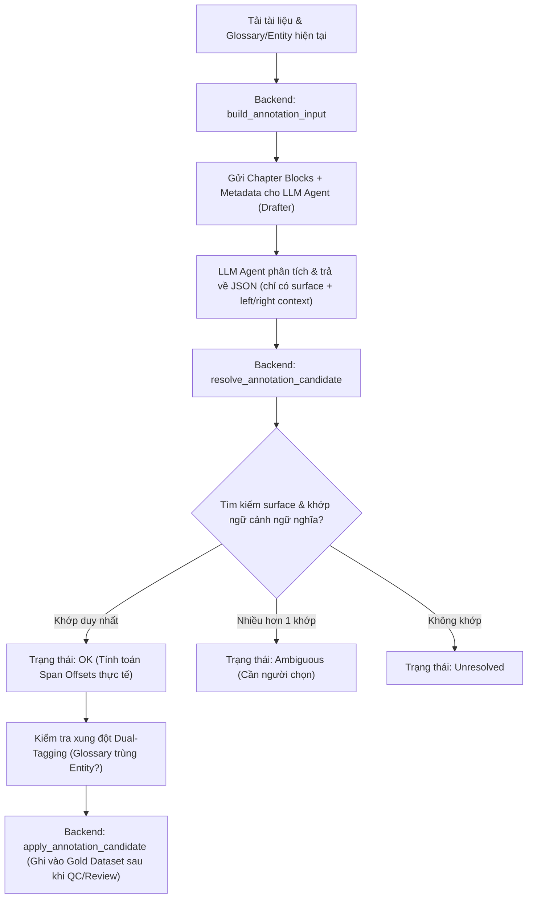
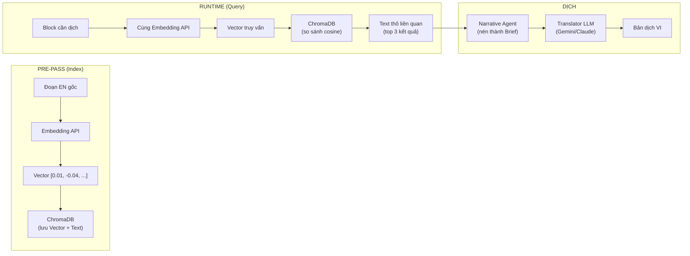

# TECH LEAD REVIEW SESSION — Agent-Based Long-Document EN→VI Translation

> **Ngày:** 2026-06-05
> **Phiên:** Trao đổi kiến trúc hệ thống & luồng Agent toàn diện
> **Mục tiêu:** Làm rõ toàn bộ kiến trúc kỹ thuật của hệ thống dịch máy agent-based, từ lý thuyết nền tảng đến thiết kế triển khai cụ thể.

---

## Mục lục

1. [Tổng quan Codebase & Kiến trúc Dự án](#1-tổng-quan-codebase--kiến-trúc-dự-án)
2. [Agent vs LLM Thông thường — Bản chất khác biệt](#2-agent-vs-llm-thông-thường--bản-chất-khác-biệt)
3. [Cơ chế Vận hành Bên trong Agent — Multi-Call Loop](#3-cơ-chế-vận-hành-bên-trong-agent--multi-call-loop)
4. [Vấn đề Tích lũy Context & Kỹ thuật Tối ưu](#4-vấn-đề-tích-lũy-context--kỹ-thuật-tối-ưu)
5. [Kiến trúc End-to-End Autonomous Pipeline](#5-kiến-trúc-end-to-end-autonomous-pipeline)
6. [Tối ưu Chi phí Token — 5 Đòn bẩy Chính](#6-tối-ưu-chi-phí-token--5-đòn-bẩy-chính)
7. [Cơ chế Cache & Compact cho Pipeline Dịch](#7-cơ-chế-cache--compact-cho-pipeline-dịch)
8. [Ước tính Token — So sánh Naive vs Optimized](#8-ước-tính-token--so-sánh-naive-vs-optimized)
9. [Vector Database — Vai trò, Lựa chọn & Kiến trúc Lưu trữ](#9-vector-database--vai-trò-lựa-chọn--kiến-trúc-lưu-trữ)
10. [Embedding Model — Cơ chế Hoạt động & Tương thích Chéo](#10-embedding-model--cơ-chế-hoạt-động--tương-thích-chéo)
11. [Lựa chọn Embedding Model — text-embedding-3-large & Đối thủ](#11-lựa-chọn-embedding-model--text-embedding-3-large--đối-thủ)
12. [Xu hướng RAG 2026 — Phân tích từ Milvus Blog](#12-xu-hướng-rag-2026--phân-tích-từ-milvus-blog)
13. [Thiết kế Bộ Công cụ (Tools) cho Agent](#13-thiết-kế-bộ-công-cụ-tools-cho-agent)
14. [Kiến trúc Điều phối — Code vs LLM Coordinator](#14-kiến-trúc-điều-phối--code-vs-llm-coordinator)
15. [Kiến trúc Prompt cho Translator Agent](#15-kiến-trúc-prompt-cho-translator-agent)
16. [Kết luận Tổng thể & Khuyến nghị](#16-kết-luận-tổng-thể--khuyến-nghị)

---

## 1. Tổng quan Codebase & Kiến trúc Dự án

### 1.1. Phân vùng Dự án

Hệ thống hiện tại được chia thành **hai phân vùng** rõ rệt với mục tiêu và cơ chế vận hành độc lập:

#### Phân vùng 1: Nghiên cứu Dịch máy (Thesis / Research Side)
Phần cốt lõi của khóa luận, tập trung vào mô hình dịch máy tự động có trạng thái (Stateful Translation). Hiện tại chủ yếu nằm ở mức **tài liệu thiết kế chi tiết, prompt contract và kế hoạch thực nghiệm**, chưa được viết code Python chạy runtime.

**Các file chính:**
- `RESEARCH_PLAN_V3.md`: Source of Truth của nghiên cứu. Định nghĩa 4 LLM Agents chính, bộ nhớ 7 lớp, cơ chế freeze memory (V1) và hệ thống so sánh (S0 → S3 → S3d).
- `PROMPT_DESIGN.md`: Đặc tả prompt chi tiết cho từng Agent (Summary, Narrative, Translator, Critic, Repair) và các template JSON đầu ra.
- `DATASET_DESIGN.md`: Thiết kế các bộ dữ liệu thử nghiệm (D1 - D6), metrics đánh giá (TAR, ECS, MHP, BLP) và quy trình gán nhãn độc lập.
- `SCHEMA_AGENT_FILL_POLICY.md`: Quy định những trường dữ liệu nào Agent được điền ở runtime để kiểm soát chi phí token (siết chặt Tier D - block annotations).
- `RETRIEVAL_ARCHITECTURE.md`: Kiến trúc retrieval/context chi tiết, phân tầng hard/soft, token budget, logging schema.

#### Phân vùng 2: Gói Handoff Công cụ (AI-LAB / Tooling Side)
Nằm trong thư mục `AILAB_HANDOFF/`. Đây là codebase đã được triển khai thực tế (gồm Python Flask Backend & React Frontend) với nhiệm vụ hỗ trợ con người xây dựng, chuẩn hóa cấu trúc sách và gán nhãn tập dữ liệu vàng (Gold Dataset) để làm tài liệu đối chiếu (Evaluation Only).

**Services cốt lõi:**
- `annotation_flow.py`: Quản lý luồng gán nhãn (tạo dữ liệu đầu vào cho AI draft, tiếp nhận ứng viên từ AI, resolve tọa độ span và apply vào file JSONL).
- `normalize_flow.py` & `structure_normalizer.py`: Phân tích cấu trúc sách thô (EPUB, TXT, PDF) thành các block văn bản chuẩn hóa.
- Frontend Prototype: Nằm ở `AILAB_HANDOFF/app/prototype/` giúp duyệt danh mục sách, xem trước cấu trúc sau khi normalize và duyệt/chốt nhãn thực tế.

### 1.2. Luồng Agent Hiện tại (AI-Assisted Annotation Flow)

Trong codebase triển khai ở gói AI-LAB, Agent đóng vai trò **Drafter (Người nháp)** và hệ thống Python đóng vai trò **Validator/Resolver (Bộ kiểm định và định vị)**.



**Điểm sáng kỹ thuật:**
- **Cơ chế chống trôi Span (Span Drift Prevention):** LLM thường rất kém trong việc đếm và tính toán index/offset ký tự. Thiết kế bắt Agent chỉ trả về `surface` + `left_context` + `right_context`. Backend Python sẽ tự động dò tìm vị trí chính xác bằng hàm `_resolve_surface` trong `annotation_flow.py`.
- **Chống gán nhãn kép (Dual-Tagging Check):** Tại hàm `_resolve_glossary_candidate`, hệ thống kiểm tra chéo xem một thuật ngữ glossary có bị gán đè lên một thực thể entity hay không.

### 1.3. Gaps & Hướng đi tiếp theo

1. **Sự cách ly dữ liệu (Data Isolation):** Thiết kế Directional Lock trong V3 đã đảm bảo toàn bộ tập dữ liệu gán nhãn thủ công (AI-LAB Gold) chỉ dùng để Evaluation, tuyệt đối không nạp vào bộ nhớ runtime.
2. **Thiếu hụt Code Runtime:** Các thành phần dịch như `retrieval/vector.py`, `critic_agent/`, `narrative_understanding_agent/`, và `translation_agent/` chưa được hiện thực hóa bằng mã nguồn Python.
3. **Khoảng cách thiết kế ↔ triển khai:** Tài liệu thiết kế rất chi tiết (PROMPT_DESIGN, RETRIEVAL_ARCHITECTURE) nhưng chưa có bridge code nào chuyển đổi từ spec sang implementation. Cần module `prompt_builder.py` để đóng gói prompt theo đúng spec đã viết.

---

## 2. Agent vs LLM Thông thường — Bản chất Khác biệt

### 2.1. Định nghĩa cốt lõi

- **LLM thông thường:** Là một mô hình xử lý ngôn ngữ **stateless** (không trạng thái) hoạt động theo cơ chế `Input Prompt → Output Text`. Mỗi lần gọi là một phiên độc lập, không nhớ gì từ phiên trước.
- **Agent (Tác tử):** Là một **hệ thống phần mềm (System)** có mục tiêu rõ ràng, sử dụng LLM làm bộ não tư duy trung tâm, nhưng được trang bị thêm các cơ chế: **Cảm nhận (Perceive) → Tư duy (Reason) → Hành động (Act) → Ghi nhớ (Learn/Remember)**.

> [!IMPORTANT]
> Điểm mấu chốt: Agent **KHÔNG** phải là một loại model khác. Nó vẫn gọi đến **cùng API, cùng model** như chatbot thông thường. Sự khác biệt nằm ở **hệ thống code bao bọc bên ngoài** model đó.

### 2.2. Bốn trụ cột phân biệt

#### Trụ cột 1: Khả năng Lập kế hoạch và Tư duy (Reasoning & Planning)
- **LLM thông thường:** Nhận block văn bản → lập tức sinh bản dịch dựa trên xác suất từ ngữ tiếp theo. Không có bước "dừng lại để suy nghĩ".
- **Agent:** Có khả năng phân rã nhiệm vụ phức tạp thành chuỗi các bước nhỏ và lập kế hoạch trước khi hành động.
- *Ví dụ trong dự án:* Narrative Understanding Agent không dịch ngay mà đọc đoạn nguồn, đối chiếu ngữ cảnh dài hạn (motif, nhân vật, quan hệ xưng hô) để lập ra Interpretation Brief trước khi chuyển cho Translator. Đây là bước "dừng lại suy nghĩ" có chủ đích.

#### Trụ cột 2: Sử dụng Công cụ (Tool Execution / Action)
- **LLM thông thường:** Bị cô lập trong không gian sinh text, không thể tương tác với môi trường bên ngoài (database, filesystem, API bên thứ 3).
- **Agent:** Biết cách sử dụng công cụ — gọi API, truy vấn database, chạy code, ghi file.
- *Ví dụ trong dự án:* Hybrid Retriever kết hợp SQL Exact Match cho glossary/entity (T1, T2), BM25/FTS cho lịch sử dịch (T5), và Vector search cho motif cảm xúc (ChromaDB). Agent "yêu cầu" → Code Python "thực thi" công cụ.

#### Trụ cột 3: Bộ nhớ Bền vững (Long-term Memory & State)
- **LLM thông thường:** Chỉ có bộ nhớ ngắn hạn (tương tự RAM) giới hạn trong cửa sổ ngữ cảnh hiện tại (~128K tokens). Kết thúc phiên = quên hết.
- **Agent:** Có bộ nhớ dài hạn bền vững (tương tự Disk) được tổ chức có cấu trúc. Trong dự án này là SQLite 7 lớp (T1-T7) + ChromaDB Vector Store.
- *Ví dụ trong dự án:* Agent dịch xong Block 10 quyết định dịch "queen" là "Nữ Hoàng Đỏ". Thông tin này được ghi vào T2 Entity Card. Đến Block 80, dù đã cách 70 blocks (vượt xa context window), Agent truy vấn lại bộ nhớ T2 để dịch nhất quán — điều mà LLM thông thường không thể làm.

#### Trụ cột 4: Cơ chế Tự phản hồi và Sửa lỗi (Reflective Loop)
- **LLM thông thường:** Sinh kết quả một lần duy nhất. Nếu có lỗi, không tự phát hiện được và cũng không có cơ chế tự sửa.
- **Agent:** Vận hành theo vòng lặp tự đánh giá và sửa lỗi (Critique & Repair). Output của bước trước trở thành input để đánh giá ở bước sau.
- *Ví dụ trong dự án:* CriticAgent kiểm định độc lập bản dịch theo 2 tầng:
  - **Tier 1 (Code thuần, 0 token):** Check glossary adherence (thuật ngữ có dịch đúng không?), forbidden variants (có dùng từ cấm không?), placeholder integrity (có mất tag HTML không?).
  - **Tier 2 (LLM, chỉ khi Tier 1 nghi vấn):** Đánh giá ngữ nghĩa sâu — nghĩa gốc có bị méo không? Giọng văn có phù hợp không?
  - Nếu phát hiện lỗi nghiêm trọng → kích hoạt Repair Mode → Translator nhận feedback cụ thể và dịch lại (max 1 retry).

### 2.3. Bảng So sánh trong bài toán Dịch máy

| Tiêu chí | LLM thông thường (S0 Baseline) | Hệ Tác tử (S3 Full Agent) |
| :--- | :--- | :--- |
| **Trạng thái** | Stateless (Block 2 không nhớ Block 1) | Stateful (SQLite ghi nhận liên tục) |
| **Kiểm soát chất lượng** | Tin tưởng kết quả đầu tiên | Giám sát chéo Translator + Critic |
| **Xử lý ngữ cảnh sâu** | Chỉ đọc từ trong prompt | Vector Retrieval cho motif, ẩn ý |
| **Nhất quán thuật ngữ** | Mỗi block dịch khác nhau | Glossary lock bắt buộc từ T1 |
| **Nhất quán xưng hô** | Lúc "cô" lúc "nàng" tùy hứng | Entity Card quy định cố định |
| **Bản chất kỹ thuật** | Một Model Call duy nhất | Orchestration Pipeline gồm nhiều calls + code |

### 2.4. Hình ảnh hóa sự khác biệt

```
LLM Thông thường:
    User → [Model API] → Response
    (1 lần gọi, không nhớ, không công cụ)

Agent:
    User → [Orchestrator Code]
              ├── Gọi Model lần 1 (Suy nghĩ → Cần tool A)
              ├── Chạy Tool A (Python code)
              ├── Gọi Model lần 2 (Đọc kết quả → Cần tool B)
              ├── Chạy Tool B (Python code)
              ├── Gọi Model lần 3 (Tổng hợp → Sinh kết quả)
              └── Response
    (N lần gọi, có nhớ, có công cụ, code điều phối)
```

---

## 3. Cơ chế Vận hành Bên trong Agent — Multi-Call Loop

### 3.1. Nguyên lý cốt lõi

> **Về mặt hạ tầng, cả Agent và chatbot thông thường đều gọi đến cùng một API của cùng một Model.** Sự khác biệt không nằm ở bản thân model, mà nằm ở **hệ thống code bao bọc bên ngoài model đó** (Orchestration Framework).

Nói cách khác: Nếu model là "bộ não", thì Agent framework là "cơ thể" cho phép bộ não đó có tay chân để hành động, có mắt để quan sát, có bộ nhớ ngoài để ghi chép.

### 3.2. Số lần gọi API

- **LLM thông thường:** Chỉ là **1 lần gọi (Single Call)**. Gửi prompt → nhận text → xong.
- **Agent:** Là một chuỗi **NHIỀU lần gọi (Multi-Call Loop)** xen kẽ với code chạy công cụ. Mỗi lần gọi, model đọc toàn bộ lịch sử trước đó + kết quả công cụ mới nhất, rồi quyết định bước tiếp theo.

### 3.3. Cơ chế ReAct (Reason + Act)

Kiến trúc cơ bản của Agent là một vòng lặp ReAct chạy bằng code Python/Node.js bên ngoài:

1. **Call 1 (Reason):** Gửi Prompt → Model suy nghĩ và trả về: *"Tôi cần gọi công cụ `list_dir`."* (Model dừng sinh chữ tại đây, không sinh thêm).
2. **Chuyển tiếp (Execution):** Framework code đọc yêu cầu tool call từ response JSON → Chạy hàm `list_dir` thực tế trên filesystem → Lấy kết quả trả về.
3. **Call 2 (Reason/Act):** Framework gửi kết quả quay lại API kèm toàn bộ lịch sử: *"Đây là kết quả của list_dir. Hãy làm bước tiếp."* → Model đọc kết quả và quyết định bước tiếp theo.
4. Vòng lặp lặp lại N lần cho đến khi model trả về kết quả cuối cùng (không yêu cầu gọi tool nữa).

### 3.4. Pseudocode Python minh họa vòng lặp Agent

```python
import openai

def run_agent(user_prompt: str, tools: list, max_iterations: int = 10):
    """Vòng lặp ReAct cơ bản của một Agent."""

    # Khởi tạo lịch sử hội thoại
    messages = [
        {"role": "system", "content": SYSTEM_PROMPT},
        {"role": "user", "content": user_prompt}
    ]

    for i in range(max_iterations):
        # ===== GỌI API MODEL (Mỗi lần gọi = 1 API call, tính tiền) =====
        response = openai.chat.completions.create(
            model="gpt-4o",
            messages=messages,    # <-- Gửi TOÀN BỘ lịch sử mỗi lần
            tools=tools           # <-- Danh sách công cụ Agent được dùng
        )

        assistant_msg = response.choices[0].message

        # Lưu câu trả lời của model vào lịch sử
        messages.append(assistant_msg)

        # ===== KIỂM TRA: Model muốn gọi tool hay đã xong? =====
        if assistant_msg.tool_calls is None:
            # Model trả về text thuần → ĐÃ XONG, thoát vòng lặp
            return assistant_msg.content

        # ===== THỰC THI CÔNG CỤ (Code Python chạy, KHÔNG tốn token) =====
        for tool_call in assistant_msg.tool_calls:
            func_name = tool_call.function.name       # Ví dụ: "search_glossary"
            func_args = json.loads(tool_call.function.arguments)

            # Gọi hàm Python thực tế
            result = execute_tool(func_name, func_args)

            # Đưa kết quả tool vào lịch sử để gửi cho model ở vòng sau
            messages.append({
                "role": "tool",
                "tool_call_id": tool_call.id,
                "content": json.dumps(result)
            })

        # --- Quay lại đầu vòng lặp, gửi lại TOÀN BỘ messages cho model ---

    return "Agent đã hết số vòng lặp cho phép."
```

> [!NOTE]
> Đoạn code trên cho thấy rõ: `messages` (lịch sử) **phình to sau mỗi vòng lặp** vì mỗi vòng thêm 1 `assistant_msg` + 1 hoặc nhiều `tool_result`. Đây chính là nguồn gốc của vấn đề tích lũy context (xem §4).

### 3.5. Sự chuyển tiếp giữa các lần gọi

Sự chuyển tiếp chính là **Lịch sử hội thoại (Chat History / State)** được lưu trong biến `messages` (RAM) của hệ thống điều phối Agent.

Sau mỗi lượt gọi, mảng `messages` gửi lên Model sẽ phình to ra theo cấu trúc:

```
messages[0]: {"role": "system",    "content": "Bạn là một trợ lý dịch thuật..."}
messages[1]: {"role": "user",      "content": "Hãy dịch block 43..."}
messages[2]: {"role": "assistant", "tool_calls": [{"name": "search_glossary", ...}]}
messages[3]: {"role": "tool",      "content": '{"term": "The Turning", "vi": "Khúc Chuyển"}'}
messages[4]: {"role": "assistant", "tool_calls": [{"name": "search_entity", ...}]}
messages[5]: {"role": "tool",      "content": '{"name": "Alice", "vi_name": "Alice"}'}
messages[6]: {"role": "assistant", "content": "Bản dịch hoàn chỉnh: ..."}
```

- Model ở **Call 3** (messages[6]) đọc được toàn bộ messages[0]→[5] — biết glossary nào đã tra, entity nào đã tìm — nên có đủ context để dịch chính xác.
- **Chi phí:** Mỗi lần gọi phải trả tiền cho TOÀN BỘ token trong messages, không chỉ phần mới.

### 3.6. Sequence Diagram chi tiết

```
Orchestrator (Python)          LLM API (Cloud)           Tools (Local)
      │                             │                         │
      │──── messages[0,1] ─────────►│                         │
      │                             │ (Suy nghĩ...)           │
      │◄── tool_call: glossary ─────│                         │
      │                             │                         │
      │─────────────────────────────────── search_glossary ──►│
      │◄─────────────────────────────────── result JSON ──────│
      │                             │                         │
      │──── messages[0,1,2,3] ─────►│                         │
      │                             │ (Đọc kết quả, suy nghĩ)│
      │◄── tool_call: entity  ─────│                         │
      │                             │                         │
      │─────────────────────────────────── search_entity ────►│
      │◄─────────────────────────────────── result JSON ──────│
      │                             │                         │
      │──── messages[0,1,2,3,4,5] ─►│                         │
      │                             │ (Tổng hợp, dịch)       │
      │◄── final_text ─────────────│                         │
      │                             │                         │
      ▼ DONE                        │                         │
```

> **Kết luận:** Agent không phải là 1 cú gọi thần kỳ. Agent là **một vòng lặp lập trình truyền thống (while loop)**, trong đó **LLM đóng vai trò "máy ra quyết định" (Decision Maker)** ở mỗi bước, còn **code Python đóng vai trò "tay chân" (Executor)** thực thi quyết định đó. Sự "thông minh" của Agent không đến từ model mạnh hơn, mà đến từ **kiến trúc code xung quanh** cho phép model truy cập thông tin và hành động.

---

## 4. Vấn đề Tích lũy Context & Kỹ thuật Tối ưu

### 4.1. Vấn đề

> Ở lần gọi thứ 8, hệ thống **bắt buộc phải đóng gói toàn bộ lịch sử** của 7 lần gọi trước để gửi lên cho model. Nếu không gửi, model sẽ bị "mất trí nhớ" — không biết mình đã tra glossary gì, tìm entity nào.

**3 hệ quả lớn:**

1. **Chi phí tăng vọt:** Phải trả tiền cho toàn bộ token gửi đi mỗi lần. Nếu lịch sử dài 5,000 tokens, Call 8 sẽ gửi 5,000 + phần mới. Chi phí tích lũy theo cấp số cộng.
2. **Độ trễ (Latency) cao:** Model mất nhiều thời gian xử lý prompt dài. Prompt 10K tokens xử lý nhanh hơn đáng kể so với prompt 50K tokens.
3. **Bị loãng thông tin (Lost in the middle):** Nghiên cứu chỉ ra model dễ bỏ sót chi tiết nằm ở giữa prompt dài. Thông tin đầu và cuối được chú ý hơn. Với context 50K tokens, thông tin ở vị trí 20K-30K dễ bị "quên".

**Minh họa bằng số liệu:**

```
Call 1: Gửi  1,000 tokens → Trả tiền  1,000 tokens
Call 2: Gửi  2,500 tokens → Trả tiền  2,500 tokens (1,000 cũ + 1,500 mới)
Call 3: Gửi  4,000 tokens → Trả tiền  4,000 tokens
...
Call 8: Gửi 12,000 tokens → Trả tiền 12,000 tokens

Tổng token trả tiền: 1,000 + 2,500 + 4,000 + ... + 12,000 = ~45,000 tokens
(Trong khi thông tin thực sự mới chỉ có ~8,000 tokens)
```

### 4.2. Bốn kỹ thuật tối ưu hóa bộ nhớ

#### Kỹ thuật 1: Prompt Caching (Bộ nhớ đệm trên Cloud)

**Cách hoạt động:** Server của Google/Anthropic/OpenAI nhận ra rằng phần đầu prompt (System Prompt + Context cố định) giống hệt lần gọi trước → Cache lại trên GPU memory → Lần gọi sau chỉ cần xử lý phần mới.

**Hiệu quả thực tế:**
- Gemini API: Phần cache được tính giá **giảm 75%** (0.25x).
- Claude API: Phần cache **giảm 90%** (0.1x) + tốc độ phản hồi nhanh gấp 2x.

**Điều kiện bắt buộc:** Prompt phải sắp xếp **Tĩnh → Động** (phần không đổi ở đầu, phần thay đổi ở cuối). Nếu phần tĩnh nằm xen kẽ → cache bị phá vỡ.

```
✅ ĐÚNG: [System Prompt][Glossary cố định][Entity cố định] | [Sliding Window][Source Block]
                   ▲ CACHE (rẻ)                              ▲ KHÔNG CACHE (đắt, nhưng ngắn)

❌ SAI:  [System Prompt][Source Block][Glossary][Entity][Sliding Window]
                                ▲ Phần động xen giữa → Phá vỡ cache cho toàn bộ phía sau
```

#### Kỹ thuật 2: Cắt tỉa Context (Context Pruning / Trimming)

**Cách hoạt động:** Hệ thống không gửi toàn bộ dữ liệu thô từ mỗi bước. Thay vào đó, giữ lại bản tóm tắt hoặc chỉ giữ phần quan trọng.

**Ví dụ trong dự án:**
```
Trước khi cắt tỉa (thô):
  Tool result: {"glossary": [... 50 entries, 2000 tokens ...]}

Sau khi cắt tỉa:
  Tool result: {"glossary_relevant": [
    {"en": "The Turning", "vi": "Khúc Chuyển"},
    {"en": "Wonderland", "vi": "Xứ Thần Tiên"}
  ]}  ← Chỉ 2 entries liên quan đến block hiện tại, ~100 tokens
```

#### Kỹ thuật 3: Quản lý Trạng thái Có cấu trúc (Structured State Manager)

**Cách hoạt động:** Thay vì gửi toàn bộ lịch sử chat thô (conversation history), hệ thống lưu thông tin dưới dạng bảng trạng thái (State Object) JSON ngắn gọn.

**Ví dụ:**
```python
# Thay vì gửi toàn bộ 8 vòng lặp chat history:
state = {
    "current_block": "block_043",
    "chapter": "ch003",
    "glossary_hits": ["The Turning → Khúc Chuyển", "Wonderland → Xứ Thần Tiên"],
    "entity_hits": ["Alice (protagonist)", "Queen of Hearts (antagonist)"],
    "narrative_brief": "Cảnh đối đầu, tone căng thẳng...",
    "previous_translations": ["Block 41: ...", "Block 42: ..."]
}
# State này chỉ ~300 tokens thay vì 5,000+ tokens lịch sử thô
```

#### Kỹ thuật 4: Tóm tắt Định kỳ (Conversation Summarization)

**Cách hoạt động:** Khi cuộc hội thoại quá dài, một Agent phụ (hoặc cùng model) được gọi ngầm để đọc toàn bộ lịch sử cũ → viết thành đoạn tóm tắt ngắn → thay thế lịch sử thô.

**Ứng dụng trong dự án:**
Kỹ thuật này được dùng chính tại **Narrative Agent**: Thay vì gửi toàn bộ kết quả Vector Search thô (có thể dài 2,000+ tokens) cho Translator, Narrative Agent đọc kết quả đó → nén thành Interpretation Brief chỉ 150-300 tokens. Đây chính là một dạng Conversation Summarization ứng dụng cho context, không phải cho lịch sử chat.

### 4.3. Áp dụng vào dự án: Tại sao chọn Deterministic Context Feeding

Vì pipeline dịch của dự án **không dùng ReAct loop** cho Translator (xem §13.1 Cách 2), nên:
- Không có vấn đề tích lũy context từ nhiều vòng lặp Agent.
- Code Python tự chạy retrieval → đóng gói Context Pack → gửi 1 lần duy nhất cho Translator.
- Kỹ thuật 1 (Prompt Caching) + Kỹ thuật 2 (Pruning) + Kỹ thuật 3 (Structured State) được áp dụng trực tiếp vào cách đóng gói Context Pack.
- Kỹ thuật 4 (Summarization) được áp dụng qua Narrative Agent nén dữ liệu Vector Search.

---

## 5. Kiến trúc End-to-End Autonomous Pipeline

### 5.1. Tổng quan Pipeline

Hệ thống nhận đầu vào là cuốn sách thô → nhả ra bản dịch hoàn chỉnh mà không cần con người can thiệp. Kiến trúc gồm **6 Agents chuyên biệt** chia làm 2 giai đoạn (Pre-pass và Runtime), kết hợp với **2 Module Code thuần túy**.

```
Quyển sách thô (EPUB/TXT) 
   │
   ▼ [Module 1: Document Analyzer (Code)] ───► Phân rã block & chapter
   │
┌──┴──────────────────────────────────────────────────────────────┐
│ PHASE 1: WHOLE-BOOK PRE-PASS                                      │
│ (Mục tiêu: Hoàn thành Database Schema tự động từ con số 0)        │
│                                                                   │
│   ├── [Agent 1: Glossary Extractor] ──► Thuật ngữ quan trọng (T1)│
│   ├── [Agent 2: Entity Extractor]   ──► Nhân vật, địa danh (T2)  │
│   ├── [Agent 3: Relation Agent]     ──► Xưng hô, quan hệ (1.5.0) │
│   └── [Agent 4: Summary & Motif]    ──► Tóm tắt & Motif (T4)     │
└──┬──────────────────────────────────────────────────────────────┘
   │
   ▼ [Module 2: Span Resolver (Code)] ──► Tính Span Offsets thực tế
   │
   ▼ ═══════ ĐÓNG BĂNG BỘ NHỚ (FREEZE MEMORY V1) ═══════
   │
┌──┴──────────────────────────────────────────────────────────────┐
│ PHASE 2: RUNTIME TRANSLATION                                      │
│                                                                   │
│   ├── [Agent 5: Narrative Understanding] ──► Interpretation Brief │
│   ├── [Agent 6: Translator]              ──► Dịch Block văn bản  │
│   └── [Agent 7/Code: Critic & Repair]    ──► Đánh giá & sửa lỗi  │
└──┬──────────────────────────────────────────────────────────────┘
   │
   ▼
Bản dịch hoàn chỉnh + Báo cáo chất lượng (T7 QA Memory)
```

### 5.2. Bộ nhớ 7 Lớp (T1-T7 Schema)

Hệ thống sử dụng 7 bảng dữ liệu (Tables) trong SQLite + ChromaDB, mỗi bảng phục vụ một mục đích khác nhau:

| Lớp | Tên | Nội dung | Giai đoạn tạo | Ghi bởi |
|:---|:---|:---|:---|:---|
| **T1** | Terminology / Glossary | Thuật ngữ khóa + bản dịch chốt (locked) | Pre-pass | Agent 1 |
| **T2** | Entity Registry | Nhân vật, địa danh + Entity Card (tên VI, xưng hô, mô tả) | Pre-pass | Agent 2 |
| **T3** | Dialogue State | Speaker/Addressee, xưng hô trong từng đoạn hội thoại | Pre-pass | Agent 3 |
| **T4** | Chapter Summaries & Motifs | Tóm tắt chương, motif cốt truyện, arc nhân vật | Pre-pass | Agent 4 |
| **T5** | Translation Memory | Cặp câu song ngữ EN-VI đã dịch (lịch sử dịch) | Runtime | Agent 6 |
| **T6** | Narrative Context (ChromaDB) | Vector embeddings cho motif, similar passages | Pre-pass + Runtime | Code + Agent 5 |
| **T7** | QA Issue Log | Lỗi phát hiện, uncertain spans, repair history | Runtime | Agent 7 + Code |

> [!IMPORTANT]
> **Freeze Memory V1:** Sau khi Pre-pass hoàn thành, T1-T4 được **đóng băng** — không Agent nào ở Runtime được phép sửa đổi. Điều này đảm bảo Glossary/Entity/Relation nhất quán 100% trong suốt quá trình dịch. Chỉ T5, T6, T7 tiếp tục được ghi thêm ở Runtime.

### 5.3. Chi tiết các Bước xử lý

**Giai đoạn 1: Chuẩn hóa cấu trúc sách (Code thuần)**
- Đọc file EPUB/TXT, tách chương (`chapter_id`), tách đoạn (`block_id`).
- Gán ID block duy nhất theo format `book_001/ch003/blk_042`.
- Tạo `document.json` chứa cấu trúc phân cấp toàn bộ sách.
- Tuyệt đối không dùng LLM ở bước này — code regex/parser thuần túy.

**Giai đoạn 2: Whole-Book Pre-pass (Agents 1-4)**
- **Agent 1 (Glossary Extractor):** Quét toàn bộ sách, trích xuất thuật ngữ lặp lại nhiều lần hoặc có tính chuyên biệt → tạo `glossary.jsonl` với trường `en`, `vi`, `lock`, `note`.
- **Agent 2 (Entity Extractor):** Tìm nhân vật, địa danh, tổ chức → tạo `entities.jsonl` với Entity Card (tên VI, type, xưng hô, mô tả tính cách).
- **Agent 3 (Relation Agent):** Phân tích quan hệ giữa entities (ai gọi ai là gì, quan hệ gia đình, đồng minh/kẻ thù) → tạo `entity_relations.jsonl`.
- **Agent 4 (Summary & Motif):** Tóm tắt từng chương (~100 từ), rút motif xuyên suốt (biểu tượng, ẩn dụ lặp lại) → tạo `chapter_summaries.jsonl`.
- **Module Span Resolver (Code):** Dùng string matching để tính toán chính xác vị trí (start_offset, end_offset) của mỗi glossary/entity trong từng block. LLM không tham gia bước này.
- **ĐÓNG BĂNG (FREEZE):** Toàn bộ T1-T4 được ghi nhãn `frozen_at` timestamp. Mọi ghi dữ liệu sau thời điểm này bị từ chối bởi DB middleware.

**Giai đoạn 3: Runtime Translation (Agents 5-7)**
- **Agent 5 (Narrative Understanding):** Đọc block nguồn + kết quả Vector Search từ ChromaDB → Viết Interpretation Brief (150-300 tokens) gồm: Scene (bối cảnh), Tone (giọng), Motif (biểu tượng), Strategy (chiến lược dịch cụ thể).
- **Agent 6 (Translator):** Nhận Context Pack đã đóng gói (xem §7.1) → Dịch block → Trả về bản dịch + META (glossary_used, entities_used, uncertain_spans).
- **Agent 7 (CriticAgent):** Tier 1 (Code): kiểm tra glossary adherence, forbidden variants, sentence count. Tier 2 (LLM, conditional): kiểm tra ngữ nghĩa sâu. Nếu lỗi nghiêm trọng → Repair Mode (gửi feedback cụ thể cho Translator, max 1 retry).

### 5.4. Ba lý do Pipeline này không cần Con người Can thiệp

1. **Thay thế Annotate thủ công bằng Pre-pass Agents:** Glossary/Entity/Relation được trích xuất tự động thay vì phải gán nhãn bằng tay qua UI.
2. **Khắc phục điểm yếu toán học của LLM bằng Python Code:** Tính Span Offsets, check schema validation, count sentences — những việc LLM làm rất tệ nhưng code Python làm chính xác 100%.
3. **Tự sửa sai (Self-Correction):** CriticAgent tạo vòng phản hồi tự động. Lỗi được phát hiện và sửa mà không cần reviewer con người.

---

## 6. Tối ưu Chi phí Token — 5 Đòn bẩy Chính

### Đòn bẩy 1: Không dịch cả cuốn sách để thử nghiệm (MVP Subset)
- Cuốn sách 100,000 từ có ~1,000 blocks. Chạy thực nghiệm trên toàn bộ = cực kỳ tốn kém.
- **Giải pháp:** Chỉ chọn tập MVP 80-120 blocks đại diện (bao gồm: blocks có dialogue, blocks có motif, blocks thuần tường thuật, blocks có entity mới xuất hiện).
- **Tiết kiệm ~90%** token cho runtime. Pre-pass vẫn phải chạy trên toàn sách vì cần xây database đầy đủ.
- Ablation (S3 vs S3a vs S3b vs S3d) chạy trên cùng tập MVP để so sánh sạch.

### Đòn bẩy 2: Gộp các Agent ở bước Pre-pass (Agent Consolidation)
- Naive: 4 Agents riêng biệt → 4 lần gọi API per chapter → mỗi lần gửi lại toàn bộ chapter text.
- **Giải pháp:** Gộp 4 Agents (Glossary, Entity, Relation, Summary) thành 1 Agent duy nhất (World Builder Agent). Một lần đọc chapter → trích xuất đồng thời tất cả.
- **Giảm 4 lần** số API calls ở Pre-pass. Chapter text chỉ gửi 1 lần thay vì 4 lần.
- **Trade-off:** Output phức tạp hơn, cần JSON schema chặt chẽ hơn. Nhưng model lớn (Gemini Pro, GPT-4o) xử lý tốt.

### Đòn bẩy 3: Chính sách gọi Narrative Agent có chọn lọc (JIT Trigger)
- Naive: Gọi Narrative Agent cho MỌI block → 1,000 lần gọi API.
- **Giải pháp:** Chỉ gọi khi block thỏa mãn ít nhất 1 điều kiện:
  - Có dialogue (dấu hiệu: `"`, `said`, `whispered`).
  - Có entity mới xuất hiện lần đầu trong chương.
  - Vector relevance score vượt ngưỡng 0.75 (có motif phức tạp).
- **Tiết kiệm ~70%** token của Narrative Understanding. Chỉ ~300 blocks cần Narrative Agent.
- **Lưu ý cho benchmark:** Khi chạy ablation chính thức, phải dùng **Uniform mode** (gọi Narrative cho mọi block) để kết quả S3 vs S3d so sánh sạch. JIT Trigger chỉ dùng cho prototype/production.

### Đòn bẩy 4: Early Exit cho CriticAgent
- Naive: Mọi block đều qua Tier 2 LLM Critic → 1,000 lần gọi API nữa.
- **Giải pháp:** Tier 1 Code (0 token) chạy trước, kiểm tra:
  - Glossary adherence: "The Turning" có được dịch thành "Khúc Chuyển" không?
  - Forbidden variants: Có dùng từ cấm ("Cuộc Ngoặt" thay vì "Khúc Chuyển") không?
  - Sentence count: Số câu EN = số câu VI?
  - Placeholder integrity: Tag HTML (`<em>`, `<br>`) có giữ nguyên không?
- Nếu Tier 1 pass hoàn hảo (ước tính ~50-60% blocks) → Accept ngay, **KHÔNG gọi Tier 2 LLM**.
- **Tiết kiệm ~50%** token kiểm duyệt.

### Đòn bẩy 5: Prompt Caching (Gemini API)
- Context tĩnh (System Prompt + Glossary + Entity đã Freeze) chiếm 80-90% dung lượng prompt.
- Sắp xếp phần tĩnh ở đầu prompt → Google auto-cache → phần cũ chỉ tính phí **25%** (Gemini) hoặc **10%** (Claude).
- **Hiệu quả:** Với 1,000 blocks, System Prompt + Glossary + Entity gửi lại 1,000 lần nhưng chỉ trả tiền đầy đủ 1 lần, 999 lần còn lại được cache.

---

## 7. Cơ chế Cache & Compact cho Pipeline Dịch

### 7.1. Compact — Nén Ngữ cảnh qua 4 Tầng Thông Tin

Context Pack gửi cho Translator được đóng gói thành 4 tầng, sắp xếp từ tổng quát đến cụ thể:

```
┌────────────────────────────────────────────────────────────────┐
│ PROMPT GỬI TRANSLATOR AGENT                                      │
├────────────────────────────────────────────────────────────────┤
│ 1. GLOBAL CORE (≤ 400-600 tokens)                                 │
│    - Tóm tắt cốt truyện toàn cục (1-2 đoạn)                     │
│    - Style card (Tông giọng: văn học, hài hước, u ám, v.v.)      │
│    ► Vai trò: Giúp Translator hiểu BỐI CẢNH LỚN                │
├────────────────────────────────────────────────────────────────┤
│ 2. HARD CONSTRAINTS (~200-400 tokens)                              │
│    - Glossary entries liên quan block hiện tại (chỉ entries       │
│      có mặt trong source text, không phải toàn bộ glossary)      │
│    - Entity cards (tên VI, xưng hô, mô tả tính cách)            │
│    ► Vai trò: Bắt buộc Translator KHÔNG ĐƯỢC dịch sai            │
├────────────────────────────────────────────────────────────────┤
│ 3. SLIDING WINDOW (~300-500 tokens)                                │
│    - Bản dịch VI của 3-5 blocks liền trước                        │
│    ► Vai trò: Giữ NHẤT QUÁN giọng văn và mạch truyện            │
├────────────────────────────────────────────────────────────────┤
│ 4. INTERPRETATION BRIEF (~150-300 tokens)                          │
│    - Scene: Bối cảnh cảnh hiện tại                                │
│    - Tone: Giọng điệu (căng thẳng, vui vẻ, u buồn)              │
│    - Motif: Biểu tượng/ẩn dụ cần lưu ý                           │
│    - Strategy: Chiến lược dịch cụ thể cho block này               │
│    ► Vai trò: Nén từ Narrative Agent, thay thế dữ liệu thô      │
└────────────────────────────────────────────────────────────────┘
Tổng: ~1,050-1,800 tokens context (so với 5,000-10,000 nếu gửi thô)
```

**Vai trò của Narrative Agent trong Compact:**
- Kết quả tìm kiếm từ Vector DB thường rất dài (3 đoạn tương đồng × 300 từ mỗi đoạn = 900 từ ≈ 1,200 tokens) và chứa nhiều nhiễu (đoạn tương đồng nhưng không thực sự liên quan đến context cần dịch).
- Narrative Agent đọc kết quả Vector DB thô → chắt lọc và viết ra Interpretation Brief siêu ngắn (150-300 tokens).
- Translator chỉ đọc bản Brief, không bao giờ nhìn thấy dữ liệu thô Vector DB. Đây là cơ chế **nén thông tin có chọn lọc**.

### 7.2. Cache — Gemini-Level Prompt Caching

Cấu trúc Prompt phải xếp từ **Tĩnh → Động** để tối ưu cache:

```
[PHẦN CỐ ĐỊNH - ĐƯỢC CACHE TRÊN CLOUD]
1. System Prompt (Không đổi suốt cả cuốn sách)
2. Global Core (Không đổi trong cùng 1 chương)
3. Toàn bộ Glossary & Entity đã Freeze
─────────────── RANH GIỚI CACHE ───────────────
[PHẦN ĐỘNG - KHÔNG CACHE, thay đổi mỗi block]
4. Sliding Window (3 block trước — thay đổi)
5. Interpretation Brief (mới mỗi block)
6. Block nguồn tiếng Anh (mới mỗi block)
```

**Phép toán hiệu quả:**
- Phần 1+2+3: ~2,000 tokens × 1,000 blocks = 2,000,000 tokens gửi đi.
  - Không cache: trả tiền 2,000,000 tokens.
  - Có cache: trả tiền 2,000 tokens đầy đủ + 1,998,000 tokens × 0.25 = **501,500 tokens equivalent**. Tiết kiệm **75%**.
- Phần 4+5+6: ~800 tokens × 1,000 blocks = 800,000 tokens. Trả đầy đủ.

### 7.3. Gatekeeper — Chốt chặn Chống Agent Dịch ẩu

#### Chốt chặn 1: Coverage Checker (Trước khi dịch)
- **Input:** Block nguồn + danh sách Glossary/Entity đã retrieve.
- **Logic:** Quét block nguồn tìm tất cả Anchor (tên riêng viết hoa, thuật ngữ trong T1, dialogue signals). So khớp với danh sách đã retrieve.
- **Hành động khi thiếu:**
  1. Re-retrieve: Mở rộng phạm vi tìm kiếm (thêm 2 chương trước/sau).
  2. Nếu vẫn thiếu: Đánh dấu block là `low_context` + ghi log T7.
  3. Translator vẫn dịch nhưng Critic sẽ kiểm tra kỹ hơn.

#### Chốt chặn 2: Early Exit cho CriticAgent (Sau khi dịch)
- Critic Tier 1 (Code, 0 token) chạy kiểm tra trước.
- Nếu pass hoàn hảo (all checks green) → Accept ngay, **bỏ qua Tier 2 LLM**.
- Chỉ gọi Tier 2 LLM Critic khi Tier 1 phát hiện nghi vấn (glossary mismatch, sentence count sai, v.v.).
- **Hiệu quả:** ~50-60% blocks pass Tier 1 ngay → tiết kiệm 50%+ chi phí Critic.

---

## 8. Ước tính Token — So sánh Naive vs Optimized

### 8.1. Giả định đầu vào

- Cuốn sách: 100,000 từ EN (~130,000 tokens EN)
- Số blocks: 1,000 (mỗi block ~100 từ ≈ 130 tokens)
- Số chương: 20 (mỗi chương ~50 blocks)
- Glossary: ~200 entries
- Entities: ~50 entries

### 8.2. Bảng phân tích chi tiết

| Công đoạn | Naive: Cách tính | Naive (M tokens) | Optimized: Cách tính | Optimized (M tokens) | Tiết kiệm |
| :--- | :--- | :--- | :--- | :--- | :--- |
| **Pre-pass** | 4 agents × 20 ch × 10K tokens/ch | 0.80 | 1 World Builder × 20 ch × 7K | 0.14 | 82% |
| **Narrative Agent** | 1,000 blocks × (2K context + 3.3K source) | 5.30 | 300 blocks (JIT) × (1.5K) | 0.40 | 92% |
| **Translator** | 1,000 × (5K full context + 130 source + ~6K cache miss) | 11.38 | 1,000 × (800 dynamic + 200 cache-discounted) | 1.08 | 90% |
| **Critic & Repair** | 1,000 × (5K context + 5K source+translation) + 200 repairs | 10.40 | 500 Tier2 × 600 | 0.30 | 97% |
| **TỔNG** | | **~27.88** | | **~1.92** | **~93%** |

### 8.3. Chi phí tiền thực tế (ước tính trên Gemini 2.0 Flash)

| Hạng mục | Token count | Đơn giá | Chi phí (USD) | Chi phí (VNĐ) |
| :--- | :--- | :--- | :--- | :--- |
| Input tokens (cached) | ~1.2M | $0.0375/1M | $0.045 | ~1,100 |
| Input tokens (uncached) | ~0.5M | $0.15/1M | $0.075 | ~1,900 |
| Output tokens | ~0.2M | $0.60/1M | $0.120 | ~3,000 |
| Embedding (OpenAI) | ~0.13M | $0.13/1M | $0.017 | ~420 |
| **TỔNG** | | | **~$0.26** | **~6,400** |

> [!NOTE]
> Con số trên là ước tính lạc quan cho Gemini Flash (model rẻ nhất). Nếu dùng Gemini Pro hoặc GPT-4o, chi phí sẽ cao hơn 5-10 lần (~35,000-70,000 VNĐ). Số liệu thực tế có thể dao động ±30% tùy vào độ phức tạp văn bản và tỷ lệ Repair.

---

## 9. Vector Database — Vai trò, Lựa chọn & Kiến trúc Lưu trữ

### 9.1. Vector Database có giúp ích gì?

**Không giúp ích cho (và KHÔNG NÊN dùng):**
- **Glossary (T1):** Phải dùng Exact Match / FTS trên SQLite. Dùng Vector DB cho Glossary sẽ gây dịch sai thuật ngữ do nhận diện "gần đúng". Ví dụ: Vector search cho "turning" có thể trả về "rotating" → dịch sai "Khúc Chuyển" thành "Sự Xoay Vòng".
- **Entity (T2):** Tương tự, tên riêng phải khớp chính xác. "Alice" phải trả về đúng Entity Card của Alice, không phải một nhân vật có tên gần giống.

**Cực kỳ hữu ích cho (những thứ Exact Match không làm được):**
- **Truy vết Motif:** Tìm các block có motif/cảm xúc tương tự dù dùng từ ngữ khác nhau. Ví dụ: "painting the roses red" (Ch.3) ↔ "hiding the truth beneath bright colors" (Ch.7) — hai câu dùng từ hoàn toàn khác nhưng motif giống nhau (sự che đậy).
- **Tìm kiếm ẩn ý (Implicit Meaning) & Foreshadowing:** "the old promise" (Ch.2) có thể liên quan đến "the covenant of the ancients" (Ch.15) — Vector search nhận ra mối liên hệ ngữ nghĩa.
- **Translation Memory dạng văn phong:** Truy xuất câu đã dịch tốt có giọng điệu tương đồng để Translator tham khảo.

### 9.2. Đề xuất Công nghệ: ChromaDB (Local/Persistent Mode)

**Lý do chọn ChromaDB thay vì Milvus/Pinecone/Weaviate:**

| Tiêu chí | ChromaDB | Milvus | Pinecone |
|:---|:---|:---|:---|
| Cài đặt | `pip install chromadb` | Docker required | Cloud-only |
| Lưu trữ | File cục bộ | Server-based | Cloud |
| Tái lập (Reproducible) | Copy folder = xong | Phức tạp | Không thể |
| Metadata Filter | ✅ Mạnh | ✅ Rất mạnh | ✅ |
| Scale | <1M vectors | >1B vectors | >1B vectors |
| Phù hợp dự án nghiên cứu | ✅ Lý tưởng | ❌ Overkill | ❌ Cloud-locked |

Cuốn sách 1,000 blocks = ~3,000-5,000 vectors (block + chunk + summary). ChromaDB xử lý thoải mái.

### 9.3. Kiến trúc Lưu trữ: Hybrid Storage (SQLite + ChromaDB)

```
          ┌─────────────────────────────────────────────┐
          │             Coordinating Code (Python)        │
          └────────┬─────────────────────────────┬────────┘
                   │ Ghi Dữ liệu Cứng            │ Ghi Text + Embeddings
                   ▼                              ▼
        ╔══════════════════════╗    ╔══════════════════════╗
        ║    SQLITE DB         ║    ║    CHROMADB (Vector) ║
        ╠══════════════════════╣    ╠══════════════════════╣
        ║ - T1 Terminology     ║    ║ - similar_passages   ║
        ║ - T2 Entities        ║    ║   (block text + emb) ║
        ║ - T3 Dialogue states ║    ║ - narrative_motifs   ║
        ║ - T5 Translation Mem ║    ║   (motif text + emb) ║
        ║ - T7 QA Issue Logs   ║    ║ - translation_memory ║
        ╚══════════════════════╝    ║   (VI text + emb)    ║
                                    ╚══════════════════════╝
```

- **SQLite:** Single Source of Truth cho dữ liệu có cấu trúc. Exact Match, FTS5 full-text search, JOIN queries, ACID transactions.
- **ChromaDB:** Lưu trữ text + embedding vector cho tìm kiếm ngữ nghĩa. Mỗi document lưu kèm metadata (chapter_id, block_id, type) để filter.
- **Khóa liên kết:** `id` trong ChromaDB trùng với `block_id` hoặc `chapter_id` trong SQLite. Cho phép cross-reference: tìm vector gần nhất → lấy `block_id` → tra SQLite lấy thông tin bổ sung.

### 9.4. Code Ví dụ ChromaDB Hoàn chỉnh

```python
import chromadb
from openai import OpenAI

# ===== KHỞI TẠO =====
chroma_client = chromadb.PersistentClient(path="./chroma_db")
openai_client = OpenAI()

# Tạo 3 Collections riêng biệt
passage_collection = chroma_client.get_or_create_collection(
    name="similar_passages",
    metadata={"hnsw:space": "cosine"}  # Dùng cosine similarity
)
motif_collection = chroma_client.get_or_create_collection(
    name="narrative_motifs",
    metadata={"hnsw:space": "cosine"}
)
translation_memory = chroma_client.get_or_create_collection(
    name="translation_memory",
    metadata={"hnsw:space": "cosine"}
)

# ===== HÀM EMBEDDING (gọi OpenAI API) =====
def embed_text(text: str) -> list[float]:
    response = openai_client.embeddings.create(
        model="text-embedding-3-large",
        input=text,
        dimensions=1536  # MRL: rút từ 3072 xuống 1536
    )
    return response.data[0].embedding

# ===== INDEX: Nạp dữ liệu vào ChromaDB (chạy 1 lần ở Pre-pass) =====
def index_block(block_id: str, chapter_id: str, text: str):
    vector = embed_text(text)
    passage_collection.add(
        ids=[block_id],
        embeddings=[vector],
        documents=[text],  # Lưu text thô kèm vector
        metadatas=[{
            "chapter_id": chapter_id,
            "block_id": block_id,
            "type": "source_passage"
        }]
    )

# ===== QUERY: Tìm kiếm ngữ nghĩa (chạy mỗi block ở Runtime) =====
def search_similar(query_text: str, current_chapter: str, top_k: int = 3):
    query_vector = embed_text(query_text)

    # Metadata Filtering: chỉ tìm trong 3 chương gần nhất
    ch_num = int(current_chapter.replace("ch", ""))
    nearby_chapters = [f"ch{str(i).zfill(3)}" for i in range(max(1, ch_num-2), ch_num+1)]

    results = passage_collection.query(
        query_embeddings=[query_vector],
        n_results=top_k,
        where={"chapter_id": {"$in": nearby_chapters}},
        include=["documents", "metadatas", "distances"]
    )
    return results

# ===== SỬ DỤNG =====
# Pre-pass: nạp toàn bộ blocks
for block in all_blocks:
    index_block(block["id"], block["chapter_id"], block["text"])

# Runtime: tìm đoạn tương đồng
results = search_similar(
    "The Turning was near, and she knew that running would only make it worse.",
    current_chapter="ch003",
    top_k=3
)
# results["documents"] → ["đoạn 1 tương đồng", "đoạn 2", "đoạn 3"]
# Gửi cho Narrative Agent nén thành Brief
```

---

## 10. Embedding Model — Cơ chế Hoạt động & Tương thích Chéo

### 10.1. Embedding Model là gì?

Embedding Model là một mô hình AI chuyên biệt (khác với Chat Model) nhận đầu vào là chuỗi văn bản (Text) và trả ra một mảng số thực (Vector), ví dụ:

```
Input:  "Alice fell down the rabbit hole"
Output: [0.012, -0.045, 0.981, -0.234, 0.567, ..., 0.089]
         ▲ Mảng 1536 hoặc 3072 số thực (float)
```

Mảng số này đại diện cho "tọa độ ngữ nghĩa" của đoạn văn trong không gian đa chiều. Hai đoạn văn có ý nghĩa gần nhau sẽ có vector gần nhau (cosine similarity cao).

**Khác biệt với Chat Model:**
- Chat Model (GPT-4o, Gemini Pro): Nhận text → sinh text mới.
- Embedding Model (text-embedding-3-large): Nhận text → trả vector số. **Không sinh text.**

### 10.2. Hai Nguyên tắc Vàng

#### Nguyên tắc 1: Đồng nhất Hệ tọa độ (Embedding Alignment)
- Nếu xây kho dữ liệu bằng **Mô hình A**, **bắt buộc** phải tìm kiếm bằng **Mô hình A**.
- Mỗi hãng (OpenAI, Google, Cohere) có không gian Vector riêng với số chiều và phân bố khác nhau.
- **Không thể** lấy Vector của OpenAI so sánh với Vector của Gemini — giống như so sánh tọa độ GPS với tọa độ trên bản đồ sao Hỏa.

```
❌ SAI:
   Index bằng OpenAI embedding → Query bằng Gemini embedding → Kết quả vô nghĩa

✅ ĐÚNG:
   Index bằng OpenAI embedding → Query bằng OpenAI embedding → Kết quả chính xác
```

#### Nguyên tắc 2: Tách biệt Tìm kiếm và Xử lý (Decoupling Search & Synthesis)
- Embedding Model chỉ làm nhiệm vụ **tìm kiếm** (search). Nó trả về text thô.
- Mô hình dịch cuối cùng (Gemini/Claude) chỉ đọc **chữ thô (Text)**, hoàn toàn không quan tâm chữ thô đó được tìm ra bằng embedding model nào.
- **Có thể** dùng OpenAI Embedding để tìm kiếm trong ChromaDB, nhưng gửi văn bản tìm được cho Gemini Pro dịch. Hai model này hoạt động ở hai tầng khác nhau.

```
Tầng 1 (Tìm kiếm):   OpenAI Embedding → ChromaDB → "text thô liên quan"
                           ▲ Quyết định embedding model nào
                           
Tầng 2 (Xử lý):      "text thô liên quan" → Gemini Pro → "bản dịch VI"
                           ▲ Quyết định chat/translation model nào
                           (Hoàn toàn độc lập với Tầng 1)
```

### 10.3. Luồng Chạy Hoàn chỉnh



1. **Index (Pre-pass):** Đoạn EN → qua Embedding API → Vector → Lưu vào ChromaDB kèm Text gốc.
2. **Query (Runtime):** Block cần dịch → qua **cùng Embedding API** → Vector truy vấn → ChromaDB so sánh cosine similarity → Trả về Text thô (top 3 đoạn gần nhất).
3. **Translate:** Text thô → Narrative Agent nén thành Brief → Brief + Source → Translator LLM → Bản dịch VI.

### 10.4. Chi phí Embedding

Chi phí Embedding cực kỳ rẻ (gần như miễn phí), rẻ hơn từ 10 đến 100 lần so với API Chat/Dịch thuật.

**Phép toán cho cuốn sách 100,000 từ (~130,000 tokens):**
- OpenAI `text-embedding-3-small` ($0.02/1M tokens): ~130K tokens × $0.02/1M = **$0.003 ≈ 65 VNĐ**
- OpenAI `text-embedding-3-large` ($0.13/1M tokens): ~130K tokens × $0.13/1M = **$0.017 ≈ 420 VNĐ**
- Google Gemini `text-embedding-004`: **~80 VNĐ** (hoặc miễn phí trong Free Tier 1,500 RPD)

**So sánh tương đối:**
| | Embedding toàn bộ sách | Dịch 1 block bằng Gemini Pro |
|:---|:---|:---|
| Token count | ~130,000 | ~2,000 |
| Chi phí | ~420 VNĐ | ~50 VNĐ |
| Nhận xét | Rẻ không đáng kể | 1,000 blocks = ~50,000 VNĐ |

**Chi phí thực sự nằm ở:** Đầu vào của LLM Dịch (Translator) khi prompt bị dài ra do nhét kết quả RAG. Đó là lý do cần Narrative Agent nén dữ liệu trước khi đưa cho Translator. Giảm 1,000 tokens context = tiết kiệm 1,000 × 1,000 blocks = 1M tokens ≈ $0.15 trên Gemini Flash.

---

## 11. Lựa chọn Embedding Model — text-embedding-3-large & Đối thủ

### 11.1. text-embedding-3-large (OpenAI) — Lựa chọn chính

**Giá:** $0.13 / 1 triệu tokens (chi phí nạp cả cuốn sách ≈ 420 VNĐ).

**3 lợi thế vượt trội cho dịch văn học:**

1. **Không gian biểu diễn 3072 Dimensions:** Càng nhiều chiều, càng nắm bắt được sắc thái ngữ nghĩa tinh vi (sự mỉa mai, ẩn ý, tone giọng). Đặc biệt quan trọng cho văn học có motif phức tạp.
2. **Cross-lingual tốt:** Huấn luyện trên tập dữ liệu đa ngôn ngữ lớn, nhận diện tương đồng ý nghĩa giữa EN-VI. Ví dụ: "brave" ↔ "dũng cảm" sẽ có vector gần nhau dù khác ngôn ngữ.
3. **Matryoshka Representation Learning (MRL):** Có thể rút số chiều xuống 1536 hoặc 1024 tại thời điểm gọi API mà vẫn giữ hầu hết sức mạnh biểu diễn. Giúp ChromaDB tìm kiếm nhanh hơn, dùng ít RAM hơn.

**Cấu hình khuyến nghị cho dự án:**
```python
response = client.embeddings.create(
    model="text-embedding-3-large",
    input="Đoạn văn cần nhúng...",
    dimensions=1536  # MRL: rút từ 3072 xuống 1536 để tối ưu RAM
                     # Giữ ~95% chất lượng so với 3072
)
```

### 11.2. Các Đối thủ Đáng cân nhắc

| Mô hình | Hãng | Dims | Ưu điểm | Nhược điểm | Chi phí |
| :--- | :--- | :--- | :--- | :--- | :--- |
| **text-embedding-3-large** | OpenAI | 3072 | Tốt toàn diện, MRL, cross-lingual | Đắt nhất trong nhóm API | $0.13/1M |
| **embed-multilingual-v3.0** | Cohere | 1024 | Cross-lingual EN-VI rất mạnh, tối ưu cho retrieval | Ít chiều hơn → sắc thái kém hơn | $0.10/1M |
| **text-embedding-004** | Google | 768 | All-rounder, hệ sinh thái Gemini, rẻ | Ít chiều nhất → motif phức tạp có thể bị mất | ~$0.025/1M |
| **Gemini Embedding 2** | Google | 3072 | MRL, hàng đầu RAG 2026 (theo Milvus) | Mới, chưa nhiều benchmark độc lập | ~$0.025/1M |
| **BGE-M3** | BAAI | 1024 | Miễn phí, 8192 tokens context, hybrid dense+sparse | Cần GPU local để chạy | Miễn phí |
| **Multilingual-E5-large** | Microsoft | 1024 | Miễn phí, nhẹ, chính xác cho multilingual | Cần host local, không có MRL | Miễn phí |

### 11.3. Khuyến nghị

Chốt `text-embedding-3-large` làm baseline, nhưng chạy benchmark D6 so sánh với `text-embedding-004` (Google) và `BGE-M3` (miễn phí). Nếu `text-embedding-004` cho kết quả Recall@K gần tương đương → chuyển sang Google để tận dụng Free Tier và tính nhất quán hệ sinh thái (Gemini embedding + Gemini translate).

---

## 12. Xu hướng RAG 2026 — Phân tích từ Milvus Blog

> Nguồn: https://milvus.io/blog/choose-embedding-model-rag-2026.md

### 12.1. MTEB đã lỗi thời — Không dùng làm tiêu chí duy nhất

- **MTEB (Massive Text Embedding Benchmark)** vẫn là benchmark phổ biến nhất, nhưng có 3 hạn chế lớn:
  - Chỉ đánh giá trên câu đơn lẻ (không phải đoạn văn dài).
  - Chủ yếu tiếng Anh (không phản ánh chất lượng đa ngôn ngữ EN-VI).
  - Dễ bị overfit (các hãng tối ưu model cho MTEB mà không tối ưu cho use case thực tế).
- **Năm 2026, cần benchmark bổ sung:** CCKM (Cross-language Contextual Knowledge Matching), MIRACL (Multilingual Information Retrieval), hoặc benchmark tự xây cho domain cụ thể.

**Đối chiếu dự án:** Thiết kế D6 (Retrieval Relevance Queries) trong `DATASET_DESIGN.md` đã đi đúng xu hướng — dùng benchmark riêng cho motif văn học và câu tương đồng EN-VI, không phụ thuộc vào MTEB.

### 12.2. Matryoshka (MRL) — Nén chiều Vector không mất chất lượng

- **Nguyên lý:** Model được huấn luyện sao cho N chiều đầu tiên của vector chứa nhiều thông tin nhất. Có thể cắt bỏ phần đuôi mà không mất nhiều chất lượng.
- **Ứng dụng:** `text-embedding-3-large` có 3072 chiều. Rút xuống 1536 → giảm 50% RAM, giảm 50% thời gian search, chỉ mất ~3-5% chất lượng.
- **Các model hỗ trợ MRL (2026):** text-embedding-3-large (OpenAI), Gemini Embedding 2 (Google), Jina Embeddings v4, Voyage 3.5.

### 12.3. Late Chunking — Chia đoạn thông minh hơn

- **Chunking truyền thống:** Chia văn bản thành đoạn cố định (500 từ) trước khi embedding → mất ngữ cảnh liên đoạn.
- **Late Chunking:** Embedding toàn bộ đoạn dài trước (long-context embedding) → chia nhỏ vector sau → giữ nguyên ngữ cảnh.
- **Áp dụng cho dự án:** Mỗi chapter (~5,000 từ) có thể được embedding toàn bộ trước, sau đó chia thành sub-vectors per block. Nhưng cần model hỗ trợ long context (BGE-M3: 8192 tokens, Jina v4: 8192 tokens).

### 12.4. Gemini Embedding 2 — All-rounder hàng đầu

- Được Milvus blog đánh giá là **"all-rounder" hàng đầu cho general RAG 2026**.
- **Specs:** 3072 dimensions, MRL support, multilingual, long context.
- **Chi phí:** ~$0.025/1M tokens (rẻ hơn OpenAI Large 5x).
- **Đáng để so sánh song song** với OpenAI Large trên benchmark D6 của dự án.

### 12.5. Agentic RAG — Kết hợp Agent với RAG

- Xu hướng 2026: Agent tự quyết định khi nào cần RAG, tìm kiếm gì, với thông số nào (top-k, filter gì).
- **Đối chiếu dự án:** Kiến trúc hiện tại đã áp dụng phần "tất định" của Agentic RAG — Query Planner (code) quyết định tìm gì, Coverage Checker xác nhận đủ chưa. Phần "dynamic" (LLM tự quyết định) được giữ lại cho Narrative Agent khi cần xử lý edge cases.

### 12.6. Đề xuất Quy trình Chọn Model RAG Cuối cùng

Chạy D6 benchmark trên 3 mô hình, đo **Recall@K** (tìm được bao nhiêu kết quả đúng) và **NDCG@K** (kết quả đúng có nằm ở vị trí cao không):

1. `text-embedding-3-large` (OpenAI) — baseline, chất lượng cao nhất nhưng đắt nhất
2. `text-embedding-004` hoặc `Gemini Embedding 2` (Google) — rẻ hơn 5x, có thể đủ tốt
3. `multilingual-e5-large` (Microsoft) hoặc `BGE-M3` (BAAI) — miễn phí, cần GPU local

Mô hình có điểm cao nhất trên dữ liệu truyện thực tế của dự án sẽ được chốt. Nếu 2 model cho điểm gần nhau → chọn model rẻ hơn.

---

## 13. Thiết kế Bộ Công cụ (Tools) cho Agent

### 13.1. Hai Cách Agent Sử dụng Công cụ

#### Cách 1: Động (Dynamic Tool-Calling / ReAct)
Agent tự suy nghĩ → tự gọi tool → nhận kết quả → lại suy nghĩ → gọi tool tiếp. Đây là kiến trúc ReAct cổ điển (xem §3).

**Ưu điểm:**
- Linh hoạt: Agent tự quyết định cần thông tin gì.
- Xử lý edge cases tốt: Nếu thiếu thông tin, Agent tự gọi thêm tool.

**Nhược điểm:**
- Tốn 3-4 lần API calls per block (mỗi call = token + latency + tiền).
- Chậm hơn 3-5x so với Cách 2.
- Mất tính tái lập: Mỗi lần chạy, Agent có thể gọi tool khác nhau → kết quả khác nhau.

#### Cách 2: Tất định (Deterministic Context Feeding) — KHUYÊN DÙNG cho dự án

Hạ tầng Python chạy trước → tự động quét block → gọi tất cả tools cần thiết → lấy dữ liệu → đóng gói Context Pack → nhét thẳng vào Prompt → gửi cho Translator 1 lần duy nhất.

**Ưu điểm:**
- 1 lần gọi API duy nhất per block → nhanh, rẻ.
- Tái lập 100%: Cùng input → cùng Context Pack → cùng output.
- Đo ablation sạch: Tắt module nào thì module đó biến mất hoàn toàn.

**Nhược điểm:**
- Cần thiết kế Query Planner và Coverage Checker cẩn thận để đảm bảo đủ context.
- Không linh hoạt bằng Cách 1 cho edge cases → giải quyết bằng cơ chế fallback (xem §14.3).

### 13.2. Năm Công cụ Cốt lõi

#### Tool 1: ExactMatchRetriever (Truy vấn cứng — SQLite)
```
Đầu vào:  block_id, source_text
Xử lý:   1. Regex/string match quét source_text tìm tên riêng (viết hoa),
             thuật ngữ (so khớp với T1), dialogue signals ("said", "whispered").
          2. Tra SQLite: SELECT * FROM glossary WHERE term IN (found_terms)
          3. Tra SQLite: SELECT * FROM entities WHERE name IN (found_names)
Đầu ra:   {
             "glossary": [{"en": "The Turning", "vi": "Khúc Chuyển", "lock": true}],
             "entities": [{"name": "Alice", "vi_name": "Alice", "type": "protagonist",
                           "pronoun": "cô bé", "note": "..."}],
             "dialogue": [{"speaker": "Queen", "addressee": "Alice"}]
           }
```

#### Tool 2: SemanticRetriever (Truy vấn mềm — ChromaDB)
```
Đầu vào:  block_id, source_text, top_k=3
Xử lý:   1. Gọi OpenAI Embedding API: embed(source_text) → query_vector
          2. ChromaDB query với metadata filter (chapter_id trong 3 chương gần nhất)
          3. Trả về top_k đoạn có cosine similarity cao nhất
Đầu ra:   {
             "similar_passages": [
               {"block_id": "blk_012", "text": "...", "score": 0.87},
               {"block_id": "blk_005", "text": "...", "score": 0.82}
             ],
             "motifs": ["deception", "transformation"]
           }
```

#### Tool 3: CoverageChecker (Chốt chặn ngữ cảnh)
```
Đầu vào:  source_text, retrieved_glossary, retrieved_entities
Xử lý:   1. NER đơn giản (regex viết hoa) quét source_text → tìm tất cả tên riêng
          2. So khớp với retrieved_entities: tên nào chưa có?
          3. Quét thuật ngữ: thuật ngữ nào có trong T1 nhưng chưa có trong retrieved_glossary?
Đầu ra:   {
             "is_covered": false,
             "missing_entities": ["Cheshire Cat"],
             "missing_glossary": [],
             "recommendation": "Re-retrieve with expanded scope"
           }
```

#### Tool 4: RuleBasedCritic (Kiểm duyệt Tier 1 — Code thuần, 0 token)
```
Đầu vào:  source_text, target_translation, glossary_constraints
Xử lý:   1. Glossary adherence: "The Turning" phải xuất hiện dưới dạng "Khúc Chuyển"
          2. Forbidden variants: "Cuộc Ngoặt" → bị cấm (variant không cho phép)
          3. Sentence count: đếm dấu chấm EN vs VI → phải bằng nhau
          4. Placeholder integrity: <em>, <br/> phải giữ nguyên
          5. Length ratio: len(VI) / len(EN) phải trong khoảng [0.8, 1.5]
Đầu ra:   {
             "passed": false,
             "errors": [
               {"type": "glossary_miss", "severity": "HIGH",
                "detail": "'The Turning' dịch thành 'Cuộc Ngoặt' thay vì 'Khúc Chuyển'"}
             ]
           }
```

#### Tool 5: log_translation_issue (Ghi nhận lỗi vào T7)
```
Đầu vào:  block_id, issue_type, severity, description
Xử lý:   INSERT INTO qa_issues (block_id, issue_type, severity, description, timestamp)
Đầu ra:   {"status": "logged", "issue_id": "qa_0042"}
```

### 13.3. Cơ chế Function Calling — Khai báo và Vận hành

**Bước 1: Khai báo công cụ** — Gửi JSON Schema khi gọi API:

```python
tools = [
    {
        "type": "function",
        "function": {
            "name": "search_glossary",
            "description": "Tìm kiếm thuật ngữ trong bảng Glossary (T1). "
                           "Trả về bản dịch chốt và ghi chú sử dụng.",
            "parameters": {
                "type": "object",
                "properties": {
                    "term": {
                        "type": "string",
                        "description": "Thuật ngữ tiếng Anh cần tra cứu"
                    }
                },
                "required": ["term"]
            }
        }
    },
    {
        "type": "function",
        "function": {
            "name": "search_entity",
            "description": "Tra cứu thông tin nhân vật/địa danh trong Entity Registry (T2). "
                           "Trả về Entity Card gồm tên VI, xưng hô, mô tả.",
            "parameters": {
                "type": "object",
                "properties": {
                    "entity_name": {
                        "type": "string",
                        "description": "Tên nhân vật/địa danh tiếng Anh"
                    }
                },
                "required": ["entity_name"]
            }
        }
    }
]

# Gửi API call kèm tools
response = openai.chat.completions.create(
    model="gpt-4o",
    messages=messages,
    tools=tools,         # <-- Danh sách tools dạng JSON Schema
    tool_choice="auto"   # <-- Model tự quyết định có gọi tool hay không
)
```

**Bước 2: Model trả về yêu cầu gọi tool** (thay vì text):

```json
{
  "role": "assistant",
  "content": null,
  "tool_calls": [
    {
      "id": "call_abc123",
      "type": "function",
      "function": {
        "name": "search_glossary",
        "arguments": "{\"term\": \"The Turning\"}"
      }
    }
  ]
}
```

**Bước 3: Code Python thực thi và trả kết quả:**

```python
# Python đọc tool_calls → chạy hàm thực tế
result = search_glossary(term="The Turning")
# result = {"en": "The Turning", "vi": "Khúc Chuyển", "lock": true}

# Đưa kết quả vào messages
messages.append({
    "role": "tool",
    "tool_call_id": "call_abc123",
    "content": json.dumps(result)
})

# Gọi API lần nữa (model đọc kết quả tool và tiếp tục)
response = openai.chat.completions.create(
    model="gpt-4o",
    messages=messages,
    tools=tools
)
```

> [!NOTE]
> Trong dự án này, Translator Agent dùng **Cách 2 (Deterministic)** nên không dùng Function Calling trực tiếp. Thay vào đó, Code Python gọi tất cả tools trước → đóng gói kết quả vào Context Pack → gửi cho Translator trong 1 prompt duy nhất. Function Calling chỉ dùng nếu muốn chuyển sang Cách 1 (Dynamic) cho các Agent khác (ví dụ: Narrative Agent ở chế độ fallback).

---

## 14. Kiến trúc Điều phối — Code vs LLM Coordinator

### 14.1. Tại sao KHÔNG nên dùng LLM Agent làm Coordinator

#### Vấn đề 1: Mất tính Tái lập (Reproducibility)
- Cùng block 47, lần chạy 1: LLM Coordinator quyết định gọi Narrative Agent.
- Cùng block 47, lần chạy 2: LLM Coordinator lại quyết định **không cần** gọi Narrative Agent (LLM có tính ngẫu nhiên, dù temperature = 0 vẫn có thể khác do floating-point arithmetic và sampling).
- Kết quả: Ablation S3 vs S3d bị nhiễu, không thể trả lời chính xác cho hội đồng: *"Cải thiện bao nhiêu phần trăm?"*

#### Vấn đề 2: Không đo được Ablation
- Khi tắt một thành phần (ví dụ: tắt Narrative Agent cho S3d), LLM Coordinator **có thể tự bù đắp** bằng cách viết thêm context vào prompt → kết quả S3d tốt hơn thực tế → làm nhiễu kết quả đo lường.
- Với Code tất định: Tắt module nào = module đó biến mất hoàn toàn khỏi pipeline. Kết quả đo được phản ánh đúng đóng góp của module đó.

#### Vấn đề 3: Chi phí và Tốc độ

| | Code Coordinator | LLM Coordinator |
| :--- | :--- | :--- |
| Chi phí per block | 0 token | ~500-1,000 tokens (đọc block + ra quyết định) |
| Chi phí 1,000 blocks | 0 | ~500K-1M tokens ≈ 12,000-25,000 VNĐ |
| Độ trễ per block | < 50ms | +2-5 giây (chờ API response) |
| Tổng thời gian dịch sách | Nhanh hơn ~30% | Chậm hơn đáng kể |

### 14.2. Ưu điểm duy nhất của LLM Coordinator
Khả năng xử lý tình huống bất ngờ (Edge Cases) mà regex không nhận diện được. Ví dụ: đoạn văn dùng metaphor cực kỳ lạ, không có entity/glossary nào nhưng ngữ cảnh cực kỳ quan trọng. LLM Coordinator có thể "đọc hiểu" và nhận ra cần bổ sung context.

Tuy nhiên trong bài toán dịch văn học có cấu trúc chương/block rõ ràng, edge cases này **rất hiếm** (dưới 5% tổng số blocks). Và đã có cơ chế `uncertain_spans` + Coverage Checker để bắt lại.

### 14.3. Đề xuất: Kiến trúc Lai (Code-first, LLM-fallback)

```
Block nguồn
    │
    ▼
[Query Planner (Code)] ──► Quét Anchor bằng regex/string match
    │
    ▼
[Hybrid Retriever (Code)] ──► SQLite + ChromaDB
    │
    ▼
[Coverage Checker (Code)] ──► Đủ context?
    │
    ├── ĐỦ (95% blocks) ──► Đóng gói Context Pack ──► Translator dịch
    │
    └── THIẾU (5% blocks) ──► Gọi Narrative Agent phân tích sâu hơn
                               ──► Bổ sung thông tin vào Context Pack
                               ──► Translator dịch
```

- **95% blocks:** Chạy hoàn toàn bằng code tất định. Nhanh, rẻ, tái lập được.
- **5% blocks khó:** Narrative Agent (LLM) được kích hoạt để phân tích sâu hơn. Đây là thiết kế JIT Trigger.
- **Lưu ý benchmark:** Khi chạy ablation chính thức (S3 vs S3d), phải chạy **uniform** (Narrative Agent cho mọi block) để kết quả so sánh sạch. Kiến trúc lai chỉ dùng cho prototype/production.

### 14.4. Luồng Xử lý qua 4 Tầng Lọc

Dữ liệu phải đi qua 4 tầng lọc trước khi chạm Translator. Mục đích: đảm bảo Translator nhận được context **đầy đủ nhưng gọn gàng**, không thừa không thiếu.

**Tầng 1 — Query Planner (Code):**
Quét block nguồn, chỉ trích ra các **Anchor** thực sự cần tìm kiếm:

| Loại Anchor | Cách phát hiện | Ví dụ |
|:---|:---|:---|
| Entity (Tên riêng) | Regex viết hoa + NER đơn giản | "Alice", "the Queen" |
| Glossary term | String match với T1 | "The Turning" |
| Dialogue signal | Regex cho dấu ngoặc kép, "said", "whispered" | `"Off with her head!"` |
| Motif keyword | String match với T4 motif list | "roses", "rabbit hole" |

Câu thường như *"It was a fine day"* → **không tạo Anchor nào** → không gây truy vấn vô nghĩa.

**Tầng 2 — Hybrid Retriever (Code):**
- Anchor cứng (Entity, Glossary) → **SQLite Exact Match** → Trả về Entity Card + Glossary entry chính xác.
- Anchor mềm (Motif keyword) → **ChromaDB Vector top-k** → Trả về 3 đoạn có motif tương đồng.

**Tầng 3 — Reranker + Token Budget (Code):**
Từ ~20 kết quả trả về từ cả 2 nguồn → loại trùng lặp → sắp xếp theo relevance score → cắt xuống còn 5-8 kết quả theo giới hạn token budget (~400 tokens cho hard constraints).

**Tầng 4 — Coverage Checker (Code):**
Kiểm tra: Mọi Anchor đã có context chưa?
- Alice ✅ → có Entity Card.
- Queen ✅ → có Entity Card.
- The Turning ✅ → có Glossary entry.
- Nếu có Anchor thiếu → re-retrieve 1 lần với scope mở rộng.
- Nếu vẫn thiếu → đánh dấu block là `low_context`, ghi log T7.

### 14.5. Cơ chế Khi Translator Cảm thấy Thiếu Thông tin

Translator **không tự gọi thêm công cụ**. Thay vào đó, hệ thống có 2 cơ chế phòng vệ:

**Cơ chế A — Coverage Checker chặn TRƯỚC khi dịch:**
Nếu phát hiện Anchor thiếu → hệ thống tự bổ sung (re-retrieve) → rồi mới cho Translator dịch. Translator không bao giờ biết có chuyện gì xảy ra ở tầng dưới.

**Cơ chế B — META báo cáo SAU khi dịch:**
Translator trả về trường `uncertain_spans` trong META output:
```json
{
  "glossary_used": ["The Turning → Khúc Chuyển"],
  "entities_used": ["Alice", "Queen"],
  "uncertain_spans": [
    {
      "source": "the old promise",
      "reason": "Không tìm thấy motif liên quan trong memory, có thể là foreshadowing chưa được ghi nhận"
    }
  ]
}
```

Hệ thống Python đọc META:
1. Ghi `uncertain_spans` vào T7 QA Memory.
2. Critic Agent sẽ tập trung kiểm tra kỹ những span này.
3. Nếu Critic xác nhận lỗi nghiêm trọng → Repair Mode.

**Tại sao không cho Translator tự gọi tool?**

| Cho Translator tự gọi tool | Dùng META + Critic |
| :--- | :--- |
| Tốn thêm 2-3 vòng API call per block | Chỉ cần 1 vòng call |
| Mất tính tái lập (mỗi lần Agent gọi tool khác) | Tái lập 100% |
| Agent có thể "lạc trôi" gọi lung tung | Hệ thống kiểm soát hoàn toàn |
| Chi phí: +500-1500 tokens per block | Chi phí: 0 thêm |

### 14.6. Xử lý Database Phình to

Khi dịch xong 500 blocks, Translation Memory (T5) phình ra. ChromaDB chứa ngày càng nhiều vectors.

**Giải pháp 1: ChromaDB Metadata Filtering:**
```python
results = collection.query(
    query_texts=["The Turning has begun"],
    n_results=3,
    where={
        "chapter_id": {"$in": ["ch003", "ch002", "ch001"]}
    }
)
# Chỉ tìm trong 3 chương gần nhất → scope thu hẹp từ 1000 xuống ~150 vectors
```

**Giải pháp 2: Phân collection theo mục đích:**
- `similar_passages`: Chỉ chứa source text gốc (cố định sau Pre-pass).
- `narrative_motifs`: Chỉ chứa motif/theme (cố định sau Pre-pass).
- `translation_memory`: Tăng dần khi dịch → cần filter `chapter_id` để thu hẹp.

**Giải pháp 3: TTL (Time-to-Live) cho Translation Memory:**
- Chỉ giữ bản dịch của 5 chương gần nhất trong ChromaDB active collection.
- Bản dịch cũ hơn → archive ra cold collection (vẫn truy vấn được nhưng không nằm trong default search scope).

---

## 15. Kiến trúc Prompt cho Translator Agent

### 15.1. LLM có "thích" Markdown không?

**Đúng, nhưng cần hiểu đúng lý do:**

LLM không "thích" markdown vì thẩm mỹ. Nó "thích" markdown vì trong dữ liệu huấn luyện (GitHub, StackOverflow, documentation), markdown xuất hiện **hàng tỷ lần** kèm theo nội dung có cấu trúc rõ ràng. Vì vậy khi thấy markdown, model tự động chuyển sang "chế độ xử lý có cấu trúc" — nắm bắt phân cấp thông tin tốt hơn, tuân thủ hướng dẫn chính xác hơn.

**Tuy nhiên, không phải markdown cho tất cả.** Mỗi phần của prompt nên dùng **định dạng phù hợp nhất** với bản chất thông tin:

| Loại thông tin | Định dạng tốt nhất | Lý do |
|:---|:---|:---|
| Hướng dẫn hành vi (System Prompt) | **Markdown** (`#`, `##`, `-`, `**bold**`) | Phân cấp rõ ràng, model quen đọc từ training data |
| Dữ liệu có cấu trúc (Glossary, Entity) | **JSON** hoặc **YAML** | Parse chính xác từng trường, không nhập nhằng |
| Phân tách các khối lớn | **XML tags** (`<source>`, `<context>`) | Ranh giới rõ ràng, không lẫn với nội dung |
| Văn bản nguồn cần dịch | **Plain text** (thô, không markup) | Giữ nguyên bản gốc, không thêm ký tự lạ |
| Output delimiters | **Custom ký tự** (`<<<TRANSLATION>>>`) | Dễ parse bằng regex, không xuất hiện trong văn bản |

### 15.2. Kiến trúc 3 Phần của Prompt

Prompt gửi cho Translator gồm **3 phần lớn**, xếp theo thứ tự **Tĩnh → Động** để tối ưu Prompt Caching:

```
╔══════════════════════════════════════════════════════════════╗
║  PHẦN 1: SYSTEM PROMPT (Tĩnh 100% — Cache vĩnh viễn)       ║
║  Định dạng: Markdown                                        ║
║  Gửi qua: system role                                       ║
║  Cache: ✅ Luôn được cache (không đổi suốt cả cuốn sách)   ║
╠══════════════════════════════════════════════════════════════╣
║  PHẦN 2: CONTEXT PACK (Bán tĩnh — Cache theo chương)        ║
║  Định dạng: XML tags bọc ngoài + JSON bên trong             ║
║  Gửi qua: user role (message đầu tiên)                      ║
║  Cache: ✅ Phần Glossary/Entity cache; Sliding Window không  ║
╠══════════════════════════════════════════════════════════════╣
║  PHẦN 3: TASK (Động 100% — Thay đổi mỗi block)             ║
║  Định dạng: XML tags bọc + Plain text bên trong             ║
║  Gửi qua: user role (message cuối cùng)                     ║
║  Cache: ❌ Không cache (mỗi block khác nhau)                ║
╚══════════════════════════════════════════════════════════════╝
```

### 15.3. PHẦN 1: System Prompt (Markdown)

```markdown
# Role
You are a literary translator specializing in English → Vietnamese fiction.
Your task is to translate a single text block while maintaining narrative
consistency with the surrounding context.

## Core Principles
- **Accuracy**: Preserve the original meaning, tone, and intent.
- **Consistency**: Always use the provided glossary terms and entity names
  exactly as specified. Never invent alternative translations.
- **Literary Quality**: Produce natural, fluent Vietnamese prose appropriate
  for published fiction.

## Constraints
- Do NOT translate proper nouns unless a translation is provided in the
  glossary or entity cards below.
- Do NOT add, remove, or reorder sentences.
- Do NOT explain your translation. Output the translation only.
- Maintain all HTML tags (<em>, <br/>) exactly as they appear.

## Output Format
Respond with EXACTLY this structure:

<<<TRANSLATION>>>
(Bản dịch tiếng Việt)
<<<END_TRANSLATION>>>
<<<META>>>
{
  "glossary_used": ["term → translation", ...],
  "entities_used": ["name", ...],
  "uncertain_spans": [
    {"source": "original phrase", "reason": "why uncertain"}
  ]
}
<<<END_META>>>
```

**Tại sao Markdown ở đây?**
- `#` và `##` tạo phân cấp rõ ràng giữa Role → Principles → Constraints → Output Format. Model đọc và tuân thủ theo thứ tự ưu tiên.
- `-` (bullet list) giúp model hiểu mỗi dòng là một quy tắc độc lập.
- `**bold**` giúp model "neo" vào từ khóa quan trọng: **Accuracy**, **Consistency**, **Literary Quality**.
- Output Format dùng ký hiệu `<<<>>>` thay vì markdown — vì đây là delimiter cho code Python parse kết quả bằng regex, cần ký tự đặc biệt không xuất hiện trong văn bản bình thường.

### 15.4. PHẦN 2: Context Pack (XML + JSON + Plain text)

```xml
<context>

<global_summary>
Cuốn sách kể về Alice, một cô gái rơi vào xứ sở thần tiên nơi mọi
thứ đều phi logic. Tông giọng: Huyền ảo, nhẹ nhàng, pha hài hước
châm biếm xã hội.
Chương hiện tại (Ch.3): Alice gặp Queen of Hearts lần đầu trong vườn
hồng. Bầu không khí căng thẳng.
</global_summary>

<glossary>
[
  {"en": "The Turning", "vi": "Khúc Chuyển", "lock": true,
   "note": "Sự kiện then chốt trong cốt truyện, luôn viết hoa"},
  {"en": "Wonderland", "vi": "Xứ Thần Tiên", "lock": true},
  {"en": "grinning", "vi": "cười toe toét",
   "note": "Chỉ dùng cho Cheshire Cat, tránh 'nhe răng cười'"}
]
</glossary>

<entities>
[
  {"name": "Alice", "vi_name": "Alice", "type": "protagonist",
   "pronoun_self": "cô bé / tôi", "pronoun_other": "nàng / cô bé",
   "note": "Xưng 'tôi' khi nói chuyện, tả bằng 'cô bé' hoặc 'nàng'"},
  {"name": "Queen of Hearts", "vi_name": "Nữ Hoàng Đỏ",
   "type": "antagonist",
   "pronoun_self": "ta", "pronoun_other": "Nữ Hoàng / bà",
   "note": "Xưng 'ta'. Gọi Alice: 'con bé'. Giọng: quyền uy, nóng nảy"}
]
</entities>

<recent_translations>
[Block 41]
EN: "Alice felt her heart sink as the garden grew darker."
VI: "Alice cảm thấy lòng chùng xuống khi khu vườn dần chìm vào bóng tối."

[Block 42]
EN: "'Who are you?' demanded the Queen, her voice sharp as a blade."
VI: "'Ngươi là ai?' Nữ Hoàng Đỏ quát, giọng bà sắc như lưỡi dao."
</recent_translations>

<interpretation_brief>
Scene: Confrontation — Alice bị Nữ Hoàng chất vấn giữa vườn hồng.
Tone: Căng thẳng leo thang. Alice sợ hãi nhưng cố tỏ ra bình tĩnh.
Motif: "painting the roses red" — biểu tượng sự giả dối, che đậy sự thật.
Strategy: Giữ nhịp câu ngắn, gấp gáp cho dialogue của Queen.
           Câu tả cảnh/nội tâm của Alice nên dài hơn, chậm rãi, thể hiện
           sự đấu tranh bên trong.
</interpretation_brief>

</context>
```

**Tại sao XML bọc ngoài + JSON bên trong?**

- **XML tags** (`<glossary>`, `<entities>`, `<recent_translations>`) hoạt động như **hàng rào phân cách** cực kỳ rõ ràng. Model biết chính xác đâu là glossary, đâu là entity, đâu là lịch sử dịch. Nếu dùng markdown heading (`## Glossary`), ranh giới dễ bị lẫn khi nội dung bên trong cũng có markdown formatting.
- **JSON bên trong `<glossary>` và `<entities>`** giúp model parse chính xác từng trường (`en`, `vi`, `lock`, `note`). Nếu dùng markdown table, model có thể bỏ sót cột `note` hoặc đọc sai hàng khi table dài.
- **`<global_summary>` và `<interpretation_brief>`** dùng **plain text** vì đây là văn bản tự nhiên, không cần cấu trúc cứng. Dùng JSON cho brief sẽ khiến nó khó đọc và mất tự nhiên.
- **`<recent_translations>`** dùng **plain text có label** (`[Block 41]`, `EN:`, `VI:`) — đủ cấu trúc để model phân biệt nhưng không cần JSON (vì chỉ cần đọc, không cần parse trường).

### 15.5. PHẦN 3: Task — Block nguồn cần dịch (XML + Plain text)

```xml
<task>
<block_id>block_043</block_id>
<source_text>
"Off with her head!" the Queen shouted, her face turning the colour
of her crown. Alice stood very still. She had read about this moment
in the old prophecy — the Turning was near, and she knew that running
would only make it worse.
</source_text>
</task>
```

**Tại sao XML ở đây?**
- `<source_text>` đảm bảo model biết **chính xác** đâu là đoạn cần dịch, không lẫn với context ở trên.
- `<block_id>` giúp model ghi đúng ID vào META output (để hệ thống Python parse và ghi T5/T7).
- Plain text bên trong `<source_text>` giữ nguyên bản gốc — không thêm markdown formatting nào vào văn bản nguồn.

### 15.6. Tổng kết: Quy tắc "Ai ở đâu"

```
┌──────────────────────────────────────────────────┐
│              SYSTEM PROMPT                        │
│  ► Markdown (#, ##, -, **bold**)                 │
│  ► Lý do: Phân cấp hướng dẫn rõ ràng            │
│  ► Cache: ✅ Tĩnh 100%                          │
├──────────────────────────────────────────────────┤
│              CONTEXT PACK                         │
│  ► XML tags bọc ngoài (<glossary>, <entities>)   │
│  ► JSON bên trong (dữ liệu có cấu trúc)         │
│  ► Plain text cho global_summary & brief          │
│  ► Lý do: Ranh giới rõ, parse chính xác          │
│  ► Cache: ✅ Glossary/Entity tĩnh;               │
│           ❌ Sliding Window + Brief thay đổi      │
├──────────────────────────────────────────────────┤
│              TASK (Source Block)                   │
│  ► XML tags bọc (<source_text>)                  │
│  ► Plain text bên trong (giữ nguyên bản gốc)    │
│  ► Lý do: Không thêm markup vào văn bản dịch     │
│  ► Cache: ❌ Động 100%                           │
├──────────────────────────────────────────────────┤
│              OUTPUT (Model trả về)                │
│  ► Custom delimiters (<<<TRANSLATION>>>)         │
│  ► JSON cho META block                            │
│  ► Lý do: Dễ parse bằng regex/json.loads          │
│           trong Python                            │
╘══════════════════════════════════════════════════╛
```

> [!IMPORTANT]
> **Nguyên tắc chung:** Markdown cho *hướng dẫn con người đọc* (instructions), XML cho *ranh giới máy đọc* (boundaries), JSON cho *dữ liệu có trường* (structured data), Plain text cho *nội dung nguyên bản* (content). **Không bao giờ dùng 1 định dạng cho tất cả.**

### 15.7. Python Code: Đóng gói Prompt hoàn chỉnh

```python
def build_translator_prompt(
    block: dict,
    glossary_hits: list,
    entity_hits: list,
    recent_blocks: list,
    interpretation_brief: str,
    global_summary: str
) -> list[dict]:
    """Đóng gói prompt 3 phần cho Translator Agent."""

    # PHẦN 1: System Prompt (Markdown)
    system_prompt = """# Role
You are a literary translator specializing in English → Vietnamese fiction.
...
"""

    # PHẦN 2: Context Pack (XML + JSON)
    context_pack = f"""<context>

<global_summary>
{global_summary}
</global_summary>

<glossary>
{json.dumps(glossary_hits, ensure_ascii=False, indent=2)}
</glossary>

<entities>
{json.dumps(entity_hits, ensure_ascii=False, indent=2)}
</entities>

<recent_translations>
{format_recent_translations(recent_blocks)}
</recent_translations>

<interpretation_brief>
{interpretation_brief}
</interpretation_brief>

</context>"""

    # PHẦN 3: Task (XML + Plain text)
    task = f"""<task>
<block_id>{block['id']}</block_id>
<source_text>
{block['source_text']}
</source_text>
</task>"""

    # Ghép thành messages array cho API call
    return [
        {"role": "system", "content": system_prompt},
        {"role": "user", "content": context_pack + "\n\n" + task}
    ]
```

---

## 16. Kết luận Tổng thể & Khuyến nghị

### 16.1. Các Quyết định Kiến trúc Đã Chốt

| Quyết định | Lựa chọn | Lý do |
| :--- | :--- | :--- |
| Coordinator | **Code tất định** (Python) | Tái lập 100%, 0 token, đo ablation sạch |
| Lưu trữ cứng | **SQLite** (Glossary, Entity, QA) | Exact match, cross-reference chính xác |
| Lưu trữ mềm | **ChromaDB** (Motif, Similar passages) | Local-first, metadata filter, dễ tái lập |
| Embedding Model | **text-embedding-3-large** (OpenAI) | Chất lượng hàng đầu, MRL, cross-lingual tốt |
| Prompt Format | **Markdown + XML + JSON + Plain text** | Mỗi loại thông tin dùng format phù hợp nhất |
| Prompt Strategy | **Phân tầng (Stratified Context)** | Global Core + Hard + Sliding Window + Brief |
| Caching | **Gemini/Claude Prompt Caching** | Sắp xếp Tĩnh→Động để cache 80-90% prompt |
| Retrieval | **Hybrid (Exact + FTS + Vector)** | Hard đè Soft, 4 tầng lọc, Coverage gate |
| Narrative Agent | **JIT Trigger** (prototype), **Uniform** (benchmark) | Tiết kiệm token / Đảm bảo ablation sạch |
| CriticAgent | **Code Tier 1 + LLM Tier 2 (early exit)** | 0 token cho 50% blocks pass nhanh |
| Tool strategy | **Deterministic Context Feeding** (Cách 2) | 1 API call per block, tái lập 100% |

### 16.2. Ước tính Tổng chi phí Dịch 1 Cuốn sách (100,000 từ)

| Hạng mục | Chi phí ước tính |
| :--- | :--- |
| Embedding toàn bộ sách (text-embedding-3-large) | ~420 VNĐ |
| Pre-pass / Memory Building (World Builder Agent) | ~3,500 VNĐ |
| Runtime Translation - Optimized (Gemini Flash) | ~3,000-6,000 VNĐ |
| Runtime Translation - Optimized (Gemini Pro / GPT-4o) | ~25,000-65,000 VNĐ |
| **TỔNG (Gemini Flash)** | **~7,000 - 10,000 VNĐ** |
| **TỔNG (Gemini Pro)** | **~30,000 - 70,000 VNĐ** |

### 16.3. Nguyên tắc Thiết kế Xuyên suốt

1. **Code Coordinator = Nhà khoa học** (chính xác, tái lập, đo được). **LLM Coordinator = Nghệ sĩ** (linh hoạt, sáng tạo, nhưng khó kiểm soát). Với mục tiêu bảo vệ khóa luận: **Ưu tiên làm nhà khoa học trước.**

2. **Embedding Model quyết định chất lượng tìm kiếm, nhưng Chiến lược Chia đoạn (Chunking) và Kiến trúc Retrieval Kết hợp (Hybrid) mới là yếu tố quyết định RAG tốt hay không.**

3. **Agent không phải 1 cú gọi thần kỳ.** Agent là vòng lặp lập trình truyền thống (`while loop`), trong đó LLM là "máy ra quyết định" (`decision maker`), code Python là "tay chân" (`executor`) thực thi.

4. **Không dùng LLM cho những gì code truyền thống làm tốt hơn:** tính span offset, check regex, validate JSON schema, query SQLite, đếm câu. LLM tệ ở toán và đếm → để code Python xử lý.

5. **Translator là "dịch giả chuyên nghiệp" được phục vụ tận răng:** Ngồi vào bàn thì đã có đầy đủ tài liệu tham khảo được chuẩn bị sẵn (Glossary, Entity Card, Recent Translations, Interpretation Brief), chỉ việc dịch và ghi chú lại những chỗ không chắc chắn qua META.

6. **Mỗi định dạng có chỗ đứng riêng:** Markdown cho hướng dẫn, XML cho ranh giới, JSON cho dữ liệu có cấu trúc, Plain text cho nội dung nguyên bản. Không dùng 1 format cho tất cả.

---

> *Tài liệu này ghi lại toàn bộ nội dung trao đổi giữa chủ dự án và Tech Lead team trong phiên review kiến trúc ngày 2026-06-05. Phiên bản 2 đã bổ sung: §3 pseudocode Agent loop, §5 bảng T1-T7, §8 chi tiết tính token, §9 code ChromaDB, §12 Late Chunking + Agentic RAG, §13 Function Calling JSON Schema, §15 (MỚI) Kiến trúc Prompt Translator. Mọi quyết định kiến trúc ở đây là khuyến nghị và có thể được điều chỉnh trong quá trình triển khai thực tế.*
